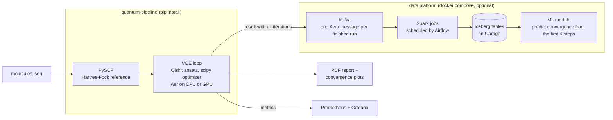

<p align="center">
  
</p>

<div align="center">

[Documentation](https://docs.qp.piotrkrzysztof.dev) &middot; [Quick Start](https://docs.qp.piotrkrzysztof.dev/getting-started/quick-start/) &middot; [Examples](https://docs.qp.piotrkrzysztof.dev/usage/examples/)

[](https://pypi.org/project/quantum-pipeline/)
[](https://pypi.org/project/quantum-pipeline/)
[](https://hub.docker.com/r/straightchlorine/quantum-pipeline)
[](https://github.com/straightchlorine/quantum-pipeline/pkgs/container/quantum-pipeline)

Ground-state energies of molecules with the Variational Quantum Eigensolver - and the infrastructure
to keep every iteration it takes to get there.

</div>

## Architecture



Point `quantum-pipeline` at a JSON file of molecules and it runs VQE for each one. PySCF supplies the Hartree-Fock starting point, Qiskit builds the ansatz, a scipy optimizer drives it, and Aer simulates the circuit on CPU or on an NVIDIA GPU. A run ends with a PDF report and a convergence plot per molecule.

Everything to the right of the solver is optional. With Kafka on, the finished result of each molecule, with every iteration in it, leaves the solver as one Avro message, and Spark jobs scheduled by Airflow land those messages in Iceberg tables.

Prometheus metrics and a Grafana dashboard with alert rules watch the run. The ML module, which reads the tables to predict from the first iterations whether a run will converge, is in progress and not part of a normal run.

## What it does

- Runs VQE for every molecule in a JSON file, in `sto3g`, `6-31g` or `cc-pvdz`
- Lets you pick the classical optimizer (L-BFGS-B, COBYLA, SLSQP, Nelder-Mead, Powell, BFGS, CG, TNC), the ansatz depth, the iteration cap and the convergence threshold
- Simulates with Qiskit Aer on CPU, or on a GPU through cuStateVec with the `:gpu` image ([Docker Hub](https://hub.docker.com/r/straightchlorine/quantum-pipeline/tags?name=gpu) &middot; [GHCR](https://github.com/straightchlorine/quantum-pipeline/pkgs/container/quantum-pipeline))
- Writes a PDF report and PNG convergence plots to `gen/`
- Streams each finished run, with all its iterations, to Kafka as Avro, with a schema registry
- Turns the stream into Iceberg tables with Spark and Airflow
- Exports Prometheus metrics and ships a Grafana dashboard
- Work in progress: models that predict convergence and final energy from the first iterations of a run

## Quick Start

```bash
pip install quantum-pipeline
quantum-pipeline -f molecules.json -b sto3g --max-iterations 100 --optimizer L-BFGS-B --report
```

Or with Docker:

```bash
docker pull straightchlorine/quantum-pipeline:cpu
docker run --rm straightchlorine/quantum-pipeline:cpu -f data/molecules.json -b sto3g --max-iterations 100
```

Both images are on [Docker Hub](https://hub.docker.com/r/straightchlorine/quantum-pipeline/tags) as `straightchlorine/quantum-pipeline:cpu` and `:gpu`, and on [GHCR](https://github.com/straightchlorine/quantum-pipeline/pkgs/container/quantum-pipeline) as `ghcr.io/straightchlorine/quantum-pipeline` with the same tags.

The GPU image is built for one CUDA architecture (Ampere by default). For another GPU, rebuild it with the `CUDA_ARCH` build argument - see the [GPU acceleration page](https://docs.qp.piotrkrzysztof.dev/deployment/gpu-acceleration/).

The [installation guide](https://docs.qp.piotrkrzysztof.dev/getting-started/installation/) covers GPU acceleration; the [deployment guide](https://docs.qp.piotrkrzysztof.dev/deployment/) brings up the full platform with `docker compose`.

## Documentation

Full docs at <https://docs.qp.piotrkrzysztof.dev>. Build them locally with:

```bash
pdm run mkdocs serve
```

Started as an engineering thesis, continued through a master's. Source on [GitHub](https://github.com/straightchlorine/quantum-pipeline), mirrored on [Codeberg](https://codeberg.org/piotrkrzysztof/quantum-pipeline).

## License

MIT License. See [LICENSE](LICENSE) for details.
