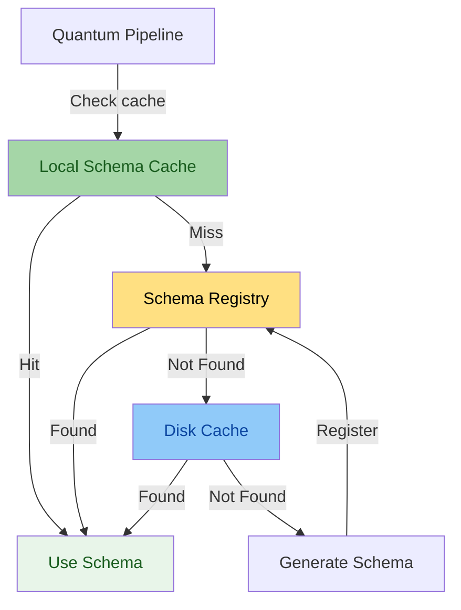
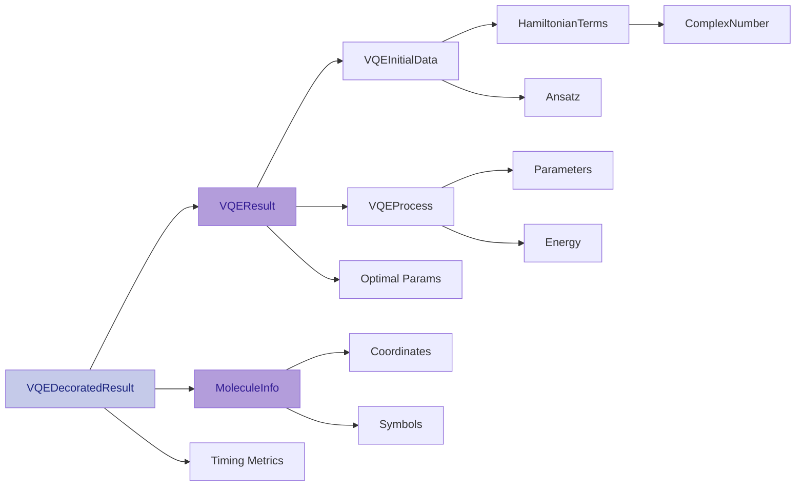
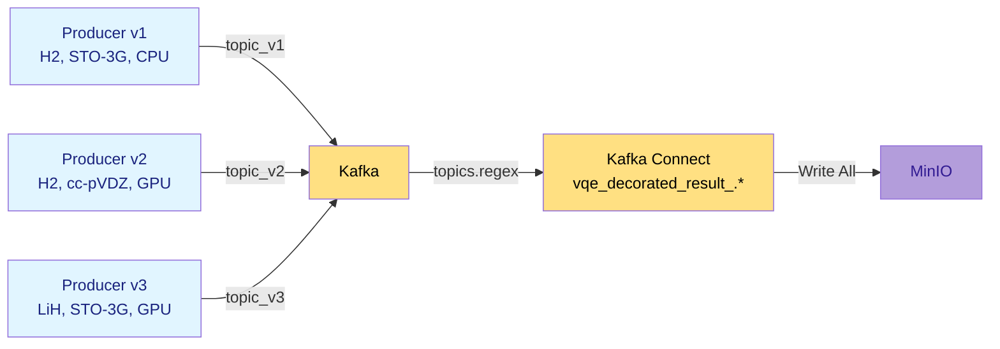

# Avro Serialization and Schema Management

This page covers the Avro serialization pattern used throughout the Quantum Pipeline,
including schema registry integration, versioning strategies, and the nested schema architecture.

---

## Overview

Apache Avro was chosen for all data interchange between pipeline services for its compact binary format, native Kafka/Schema Registry integration, and schema evolution support. Avro provides a compact binary format, smaller than JSON, while enforcing strict type safety and supporting the nested data structures required by quantum simulation output.

For general Avro concepts, see the [Apache Avro specification](https://avro.apache.org/docs/current/specification/).

---

## Schema Registry Architecture

The Schema Registry implements a caching strategy to minimize network calls:



Schemas are resolved through a three-tier lookup: in-memory cache, Confluent Schema Registry, and local disk fallback. If no schema is found, a new one is generated and registered. See the [Confluent Schema Registry documentation](https://docs.confluent.io/platform/current/schema-registry/) for details on the registry API.

---

## Nested Schema Architecture

The Quantum Pipeline uses a **compositional schema design** where complex types are built from simpler nested schemas.

### Schema Hierarchy



### Schema Composition Pattern

Instead of defining everything in one massive schema, smaller, reusable schemas are composed:

```python
class VQEDecoratedResultInterface(AvroInterfaceBase[VQEDecoratedResult]):
    """Top-level schema composed from nested interfaces."""

    def __init__(self, registry):
        super().__init__(registry)
        # Compose from nested schemas
        self.result_interface = VQEResultInterface(self.registry)
        self.molecule_interface = MoleculeInfoInterface(self.registry)
        self.schema_name = 'vqe_decorated_result'

    @property
    def schema(self) -> dict:
        """Build schema by composing nested schemas."""
        return {
            'type': 'record',
            'name': 'VQEDecoratedResult',
            'fields': [
                {
                    'name': 'vqe_result',
                    'type': self.result_interface.schema  # Nested schema
                },
                {
                    'name': 'molecule',
                    'type': self.molecule_interface.schema  # Nested schema
                },
                {'name': 'basis_set', 'type': 'string'},
                {'name': 'hamiltonian_time', 'type': 'double'},
                {'name': 'mapping_time', 'type': 'double'},
                {'name': 'vqe_time', 'type': 'double'},
                {'name': 'total_time', 'type': 'double'},
                {'name': 'molecule_id', 'type': 'int'},
                {'name': 'performance_start', 'type': ['null', 'string'], 'default': None},
                {'name': 'performance_end', 'type': ['null', 'string'], 'default': None},
            ],
        }
```

**Benefits of Composition:**

- **Modularity** - Each schema can evolve independently
- **Reusability** - Schemas like `MoleculeInfo` used in multiple contexts
- **Testability** - Test each schema component in isolation
- **Maintainability** - Changes localized to specific interfaces

---

## Complete Schema Definitions

### Top-Level: VQEDecoratedResult

```json
{
  "type": "record",
  "name": "VQEDecoratedResult",
  "namespace": "quantum_pipeline.schemas",
  "fields": [
    {
      "name": "vqe_result",
      "type": {
        "type": "record",
        "name": "VQEResult",
        "fields": [...]
      }
    },
    {
      "name": "molecule",
      "type": {
        "type": "record",
        "name": "MoleculeInfo",
        "fields": [...]
      }
    },
    {"name": "basis_set", "type": "string"},
    {"name": "hamiltonian_time", "type": "double"},
    {"name": "mapping_time", "type": "double"},
    {"name": "vqe_time", "type": "double"},
    {"name": "total_time", "type": "double"},
    {"name": "molecule_id", "type": "int"},
    {"name": "performance_start", "type": ["null", "string"], "default": null},
    {"name": "performance_end", "type": ["null", "string"], "default": null}
  ]
}
```

### VQEResult Schema

```json
{
  "type": "record",
  "name": "VQEResult",
  "fields": [
    {
      "name": "initial_data",
      "type": {
        "type": "record",
        "name": "VQEInitialData",
        "fields": [
          {"name": "backend", "type": "string"},
          {"name": "num_qubits", "type": "int"},
          {
            "name": "hamiltonian",
            "type": {
              "type": "array",
              "items": {
                "type": "record",
                "name": "HamiltonianTerm",
                "fields": [
                  {"name": "label", "type": "string"},
                  {
                    "name": "coefficients",
                    "type": {
                      "type": "record",
                      "name": "ComplexNumber",
                      "fields": [
                        {"name": "real", "type": "double"},
                        {"name": "imaginary", "type": "double"}
                      ]
                    }
                  }
                ]
              }
            }
          },
          {"name": "num_parameters", "type": "int"},
          {"name": "initial_parameters", "type": {"type": "array", "items": "double"}},
          {"name": "optimizer", "type": "string"},
          {"name": "ansatz", "type": "string"},
          {"name": "ansatz_reps", "type": "int"},
          {"name": "noise_backend", "type": ["null", "string"], "default": null},
          {"name": "default_shots", "type": "int"}
        ]
      }
    },
    {
      "name": "iteration_list",
      "type": {
        "type": "array",
        "items": {
          "type": "record",
          "name": "VQEProcess",
          "fields": [
            {"name": "iteration", "type": "int"},
            {"name": "parameters", "type": {"type": "array", "items": "double"}},
            {"name": "result", "type": "double"},
            {"name": "std", "type": "double"}
          ]
        }
      }
    },
    {"name": "minimum", "type": "double"},
    {"name": "optimal_parameters", "type": {"type": "array", "items": "double"}},
    {"name": "maxcv", "type": ["null", "double"], "default": null},
    {"name": "minimization_time", "type": "double"}
  ]
}
```

### MoleculeInfo Schema

```json
{
  "type": "record",
  "name": "MoleculeInfo",
  "namespace": "quantum_pipeline",
  "fields": [
    {
      "name": "molecule_data",
      "type": {
        "type": "record",
        "name": "MoleculeData",
        "fields": [
          {"name": "symbols", "type": {"type": "array", "items": "string"}},
          {
            "name": "coords",
            "type": {
              "type": "array",
              "items": {"type": "array", "items": "double"}
            }
          },
          {"name": "multiplicity", "type": "int"},
          {"name": "charge", "type": "int"},
          {"name": "units", "type": "string"},
          {
            "name": "masses",
            "type": ["null", {"type": "array", "items": "double"}],
            "default": null
          }
        ]
      }
    }
  ]
}
```

---

## Schema Evolution

The project uses **NONE** compatibility mode during development in the Kafka Connect [sink config](https://codeberg.org/piotrkrzysztof/quantum-pipeline/src/branch/master/docker/connectors/minio-sink-config.json#L23):

```json
{
  "schema.compatibility": "NONE"
}
```

This allows unrestricted schema changes but requires:

1. New topic for each incompatible change
2. Kafka Connect `topics.regex` pattern to consume all versions
3. Spark jobs handle multiple schema versions

**Production Recommendation:** Use `BACKWARD` or `FULL` compatibility. For details on schema evolution strategies (backward, forward, and full compatibility), see the [Confluent Schema Evolution documentation](https://docs.confluent.io/platform/current/schema-registry/fundamentals/schema-evolution.html).

---

## Schema Versioning and Topic Naming

### Automatic Topic Suffix Generation

```python
def get_schema_suffix(self) -> str:
    """Generate unique schema suffix encoding simulation parameters."""
    mol_str = ''.join(self.molecule.symbols)
    basis_set_formatted = self.basis_set.replace('-', '')
    backend_formatted = self.backend.replace('-', '_')

    return (
        f'_mol{self.molecule_id}'
        f'_{mol_str}'
        f'_it{len(self.vqe_result.iteration_list)}'
        f'_bs_{basis_set_formatted}'
        f'_bk_{backend_formatted}'
    )

# Example usage
suffix = result.get_schema_suffix()
# Returns: "_mol0_HH_it150_bs_sto3g_bk_aer_simulator_statevector_gpu"

topic_name = f"vqe_decorated_result{suffix}"
# Returns: "vqe_decorated_result_mol0_HH_it150_bs_sto3g_bk_aer_simulator_statevector_gpu"
```

### Topic Naming Benefits



**Benefits:**

1. **Self-Documenting** - Topic name reveals simulation configuration
2. **Schema Isolation** - Different configurations -> different topics
3. **Parallel Processing** - Multiple versions coexist without conflicts
4. **Easy Debugging** - Identify problematic configurations from topic name
5. **Zero Downtime** - Deploy new schemas without stopping old producers

---

## Serialization Process

Avro data in Kafka follows the [Confluent Wire Format](https://docs.confluent.io/platform/current/schema-registry/fundamentals/serdes-develop/index.html#wire-format): a magic byte (`0x00`), a 4-byte schema ID, followed by the Avro binary payload. The pipeline serializes `VQEDecoratedResult` objects into this format for Kafka production and deserializes them on consumption by looking up the schema ID from the registry.

---

## Type Conversion for Quantum Data

### Python/NumPy to Avro

```python
def _convert_to_primitives(self, obj: Any) -> Any:
    """Convert Python/NumPy types to Avro-compatible primitives."""
    if isinstance(obj, np.ndarray):
        return obj.tolist()  # ndarray -> list
    elif isinstance(obj, (np.int8, np.int16, np.int32, np.int64)):
        return int(obj)  # numpy int -> Python int
    elif isinstance(obj, (np.float16, np.float32, np.float64)):
        return float(obj)  # numpy float -> Python float
    elif isinstance(obj, complex):
        return {'real': obj.real, 'imaginary': obj.imag}  # complex -> record
    elif isinstance(obj, dict):
        return {k: self._convert_to_primitives(v) for k, v in obj.items()}
    elif isinstance(obj, (list, tuple)):
        return [self._convert_to_primitives(item) for item in obj]
    else:
        return obj
```

### Avro to Python/NumPy

```python
def _convert_from_primitives(self, obj: Any, target_type: type) -> Any:
    """Convert Avro primitives back to Python/NumPy types."""
    if target_type == np.ndarray and isinstance(obj, list):
        return np.array(obj)
    elif target_type == complex and isinstance(obj, dict):
        return complex(obj['real'], obj['imag'])
    elif hasattr(target_type, '__origin__'):  # Generic type (List, Dict, etc.)
        return self._handle_generic_type(obj, target_type)
    else:
        return target_type(obj)
```

### Complex Number Handling

```python
# Avro schema for complex numbers
{
  "type": "record",
  "name": "ComplexNumber",
  "fields": [
    {"name": "real", "type": "double"},
    {"name": "imaginary", "type": "double"}
  ]
}

# Python serialization
def serialize_complex(c: complex) -> dict:
    return {'real': c.real, 'imaginary': c.imag}

# Python deserialization
def deserialize_complex(data: dict) -> complex:
    return complex(data['real'], data['imaginary'])
```

---

## Next Steps

- **[Data Flow](data-flow.md)** - See how Avro data flows through the pipeline
- **[System Design](system-design.md)** - Understand component integration
- **[Kafka Streaming](../data-platform/kafka-streaming.md)** - Kafka + Avro details

## References

- [Apache Avro Specification](https://avro.apache.org/docs/current/specification/)
- [Confluent Schema Registry](https://docs.confluent.io/platform/current/schema-registry/)
- [Schema Evolution and Compatibility](https://docs.confluent.io/platform/current/schema-registry/fundamentals/schema-evolution.html)
- [Confluent Wire Format](https://docs.confluent.io/platform/current/schema-registry/fundamentals/serdes-develop/index.html#wire-format)
