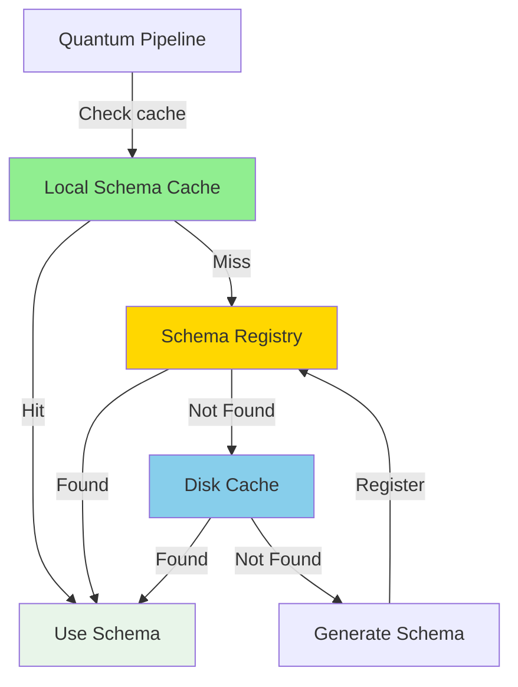
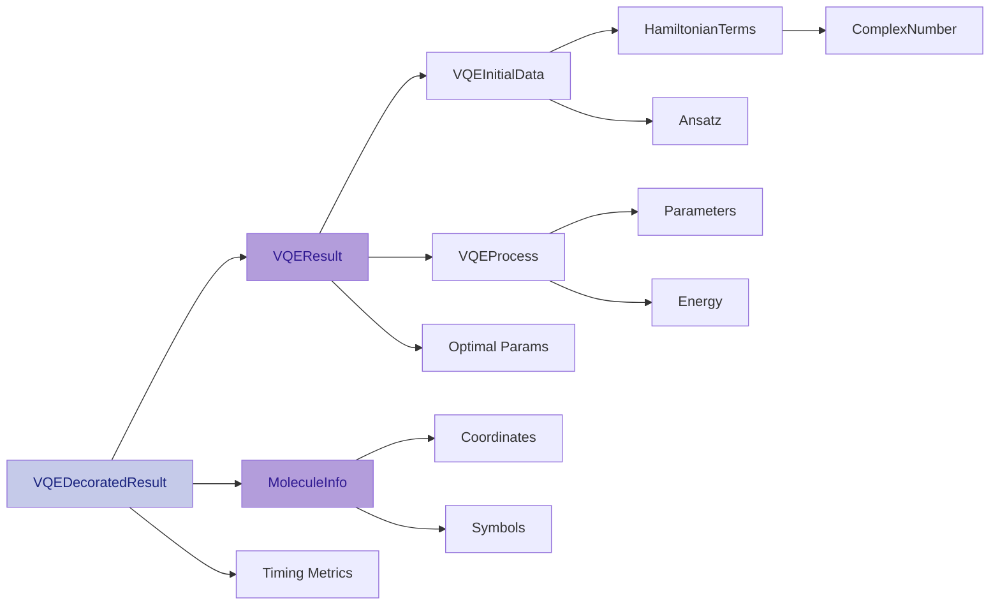
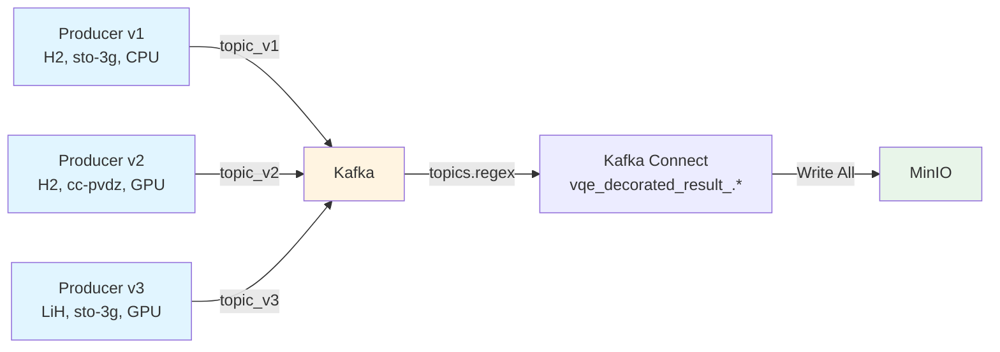

# Avro Serialization and Schema Management

This page provides an in-depth exploration of the Avro serialization pattern used throughout the Quantum Pipeline,
including schema registry integration, versioning strategies, and the nested schema architecture.

---

## Overview

Apache Avro is a **data serialization framework** that provides:

- **Compact binary format** - Efficient storage and network transmission
- **Schema evolution** - Add, remove, or modify fields without breaking compatibility
- **Language independence** - Schemas defined in JSON, usable across languages
- **Self-describing data** - Schema embedded with data for reliable deserialization

The Quantum Pipeline uses Avro for all data interchange between services, ensuring type safety and compatibility.

---

## Why Avro?

### Comparison with Alternatives

| Feature | Avro | JSON | Protocol Buffers | Parquet |
|---------|------|------|------------------|---------|
| **Binary Format** | Yes | No | Yes | Yes |
| **Schema Evolution** | Excellent | No | Good | Excellent |
| **Compression** | Good | Poor | Good | Excellent |
| **Splittable** | Yes | No | No | Yes |
| **Complex Types** | Yes | Limited | Yes | Yes |
| **Schema Registry** | Native | Yes | Yes | No[^1] |

[^1]: Parquet has no native Schema Registry support - it is a columnar storage format, not a message serialization format.

**Why Avro for Quantum Pipeline:**

1. **Native Kafka Integration** - Confluent Schema Registry built for Avro
2. **Schema Evolution** - Backward/forward compatibility during development
3. **Compact Size** - 60-80% smaller than JSON for VQE results
4. **Type Safety** - Strict typing prevents data corruption
5. **Nested Schemas** -  For hierarchical VQE data structures

---

## Schema Registry Architecture

### Three-Tier Lookup System

The Schema Registry implements a caching strategy to minimize network calls:



### Lookup Flow

**Step 1: Check Local Cache**
```python
def get_schema(self, schema_name: str) -> dict:
    """Retrieve schema with three-tier lookup."""
    # Check in-memory cache first
    if schema_name in self.schema_cache:
        return self.schema_cache[schema_name]

    # Cache miss, proceed to registry
    return self._fetch_from_registry(schema_name)
```

**Step 2: Query Schema Registry**
```python
def _fetch_from_registry(self, schema_name: str) -> dict:
    """Fetch schema from Confluent Schema Registry."""
    url = f"{self.registry_url}/subjects/{schema_name}/versions/latest"

    try:
        response = requests.get(url)
        response.raise_for_status()
        schema_data = response.json()

        # Cache the schema
        self.schema_cache[schema_name] = schema_data['schema']
        self.id_cache[schema_name] = schema_data['id']

        return schema_data['schema']
    except requests.HTTPError as e:
        if e.response.status_code == 404:
            return self._load_from_disk(schema_name)
        raise
```

**Step 3: Fallback to Disk**
```python
def _load_from_disk(self, schema_name: str) -> dict:
    """Load schema from local disk cache."""
    cache_dir = Path.home() / '.cache' / 'quantum_pipeline' / 'schemas'
    schema_file = cache_dir / f'{schema_name}.avsc'

    if schema_file.exists():
        with open(schema_file, 'r') as f:
            schema = json.load(f)
            self.schema_cache[schema_name] = schema
            return schema

    # Schema not found anywhere, will be created
    raise FileNotFoundError(f"Schema {schema_name} not found")
```

**Step 4: Register New Schema**
```python
def save_schema(self, schema_name: str, schema: dict) -> int:
    """Register new schema with Schema Registry."""
    url = f"{self.registry_url}/subjects/{schema_name}/versions"

    payload = {'schema': json.dumps(schema)}
    response = requests.post(url, json=payload)
    response.raise_for_status()

    schema_id = response.json()['id']

    # Update caches
    self.schema_cache[schema_name] = schema
    self.id_cache[schema_name] = schema_id

    # Save to disk for offline use
    self._save_to_disk(schema_name, schema)

    return schema_id
```

---

## Nested Schema Architecture

The Quantum Pipeline uses a **compositional schema design** where complex types are built from simpler nested schemas.

### Schema Hierarchy



### Schema Composition Pattern

Instead of defining everything in one massive schema, smaller, reusable schemas are composed:

```python
class VQEDecoratedResultInterface(AvroInterfaceBase[VQEDecoratedResult]):
    """Top-level schema composed from nested interfaces."""

    def __init__(self, registry):
        super().__init__(registry)
        # Compose from nested schemas
        self.result_interface = VQEResultInterface(self.registry)
        self.molecule_interface = MoleculeInfoInterface(self.registry)
        self.schema_name = 'vqe_decorated_result'

    @property
    def schema(self) -> dict:
        """Build schema by composing nested schemas."""
        return {
            'type': 'record',
            'name': 'VQEDecoratedResult',
            'fields': [
                {
                    'name': 'vqe_result',
                    'type': self.result_interface.schema  # Nested schema
                },
                {
                    'name': 'molecule',
                    'type': self.molecule_interface.schema  # Nested schema
                },
                {'name': 'basis_set', 'type': 'string'},
                {'name': 'hamiltonian_time', 'type': 'double'},
                {'name': 'mapping_time', 'type': 'double'},
                {'name': 'vqe_time', 'type': 'double'},
                {'name': 'total_time', 'type': 'double'},
                {'name': 'molecule_id', 'type': 'int'},
            ],
        }
```

**Benefits of Composition:**

- **Modularity** - Each schema can evolve independently
- **Reusability** - Schemas like `MoleculeInfo` used in multiple contexts
- **Testability** - Test each schema component in isolation
- **Maintainability** - Changes localized to specific interfaces

---

## Complete Schema Definitions

### Top-Level: VQEDecoratedResult

```json
{
  "type": "record",
  "name": "VQEDecoratedResult",
  "namespace": "quantum_pipeline.schemas",
  "fields": [
    {
      "name": "vqe_result",
      "type": {
        "type": "record",
        "name": "VQEResult",
        "fields": [...]
      }
    },
    {
      "name": "molecule",
      "type": {
        "type": "record",
        "name": "MoleculeInfo",
        "fields": [...]
      }
    },
    {"name": "basis_set", "type": "string"},
    {"name": "hamiltonian_time", "type": "double"},
    {"name": "mapping_time", "type": "double"},
    {"name": "vqe_time", "type": "double"},
    {"name": "total_time", "type": "double"},
    {"name": "molecule_id", "type": "int"}
  ]
}
```

### VQEResult Schema

```json
{
  "type": "record",
  "name": "VQEResult",
  "fields": [
    {
      "name": "initial_data",
      "type": {
        "type": "record",
        "name": "VQEInitialData",
        "fields": [
          {"name": "backend", "type": "string"},
          {"name": "num_qubits", "type": "int"},
          {
            "name": "hamiltonian",
            "type": {
              "type": "array",
              "items": {
                "type": "record",
                "name": "HamiltonianTerm",
                "fields": [
                  {"name": "label", "type": "string"},
                  {
                    "name": "coefficients",
                    "type": {
                      "type": "record",
                      "name": "ComplexNumber",
                      "fields": [
                        {"name": "real", "type": "double"},
                        {"name": "imaginary", "type": "double"}
                      ]
                    }
                  }
                ]
              }
            }
          },
          {"name": "num_parameters", "type": "int"},
          {"name": "initial_parameters", "type": {"type": "array", "items": "double"}},
          {"name": "optimizer", "type": "string"},
          {"name": "ansatz", "type": "string"},
          {"name": "ansatz_reps", "type": "int"},
          {"name": "noise_backend", "type": ["null", "string"], "default": null},
          {"name": "default_shots", "type": "int"}
        ]
      }
    },
    {
      "name": "iteration_list",
      "type": {
        "type": "array",
        "items": {
          "type": "record",
          "name": "VQEProcess",
          "fields": [
            {"name": "iteration", "type": "int"},
            {"name": "parameters", "type": {"type": "array", "items": "double"}},
            {"name": "result", "type": "double"},
            {"name": "std", "type": "double"}
          ]
        }
      }
    },
    {"name": "minimum", "type": "double"},
    {"name": "optimal_parameters", "type": {"type": "array", "items": "double"}},
    {"name": "maxcv", "type": ["null", "double"], "default": null},
    {"name": "minimization_time", "type": "double"}
  ]
}
```

### MoleculeInfo Schema

```json
{
  "type": "record",
  "name": "MoleculeInfo",
  "fields": [
    {"name": "symbols", "type": {"type": "array", "items": "string"}},
    {
      "name": "coords",
      "type": {
        "type": "array",
        "items": {"type": "array", "items": "double"}
      }
    },
    {"name": "multiplicity", "type": "int"},
    {"name": "charge", "type": "int"},
    {"name": "units", "type": "string"},
    {
      "name": "masses",
      "type": ["null", {"type": "array", "items": "double"}],
      "default": null
    }
  ]
}
```

---

## Schema Evolution Strategies

### Backward Compatibility

**Definition:** New schema can read data written with old schema.

```python
# Old schema (v1)
{
  "type": "record",
  "name": "VQEResult",
  "fields": [
    {"name": "minimum", "type": "double"},
    {"name": "optimal_parameters", "type": {"type": "array", "items": "double"}}
  ]
}

# New schema (v2) - Backward compatible
{
  "type": "record",
  "name": "VQEResult",
  "fields": [
    {"name": "minimum", "type": "double"},
    {"name": "optimal_parameters", "type": {"type": "array", "items": "double"}},
    {"name": "convergence_tolerance", "type": "double", "default": 1e-6}  # New field with default
  ]
}
```

**Rules for Backward Compatibility:**

- **Permitted:** Add fields with default values
- **Permitted:** Remove fields (readers ignore unknown fields)
- **Permitted:** Promote types (int -> long, float -> double)
- **Not permitted:** Remove fields without defaults
- **Not permitted:** Change field types incompatibly
- **Not permitted:** Rename fields without aliases

### Forward Compatibility

**Definition:** Old schema can read data written with new schema.

```python
# Schema v2 writes extra field
data_v2 = {
    "minimum": -1.137,
    "optimal_parameters": [0.1, 0.2, 0.3],
    "convergence_tolerance": 1e-8  # New field
}

# Schema v1 reader ignores unknown field
data_v1 = reader_v1.deserialize(data_v2)
# Result: {"minimum": -1.137, "optimal_parameters": [0.1, 0.2, 0.3]}
```

**Rules for Forward Compatibility:**

- **Permitted:** Old readers ignore new fields
- **Permitted:** New fields must have defaults for old writers
- **Not permitted:** New required fields break forward compatibility

### Full Compatibility

**Both backward and forward compatible:**

```python
# Strategy: Only add optional fields with defaults

# v1
{"name": "experiment_id", "type": "string"}

# v2 (fully compatible)
{
  "fields": [
    {"name": "experiment_id", "type": "string"},
    {"name": "processing_timestamp", "type": "long", "default": 0}
  ]
}

# v3 (fully compatible)
{
  "fields": [
    {"name": "experiment_id", "type": "string"},
    {"name": "processing_timestamp", "type": "long", "default": 0},
    {"name": "processing_version", "type": "string", "default": "unknown"}
  ]
}
```

### Quantum Pipeline Strategy

The project uses **NONE** compatibility mode during development in the Kafka Connect [sink config](https://codeberg.org/piotrkrzysztof/quantum-pipeline/src/branch/master/docker/connectors/minio-sink-config.json#L23):

```json
{
  "schema.compatibility": "NONE"
}
```


This allows unrestricted schema changes but requires:

1. New topic for each incompatible change
2. Kafka Connect `topics.regex` pattern to consume all versions
3. Spark jobs handle multiple schema versions

**Production Recommendation:** Use `BACKWARD` or `FULL` compatibility.

---

## Schema Versioning and Topic Naming

### Automatic Topic Suffix Generation

```python
def get_schema_suffix(self) -> str:
    """Generate unique schema suffix encoding simulation parameters."""
    mol_str = ''.join(self.molecule.symbols)
    basis_set_formatted = self.basis_set.replace('-', '')
    backend_formatted = self.backend.replace('-', '_')

    return (
        f'_mol{self.molecule_id}'
        f'_{mol_str}'
        f'_it{len(self.vqe_result.iteration_list)}'
        f'_bs_{basis_set_formatted}'
        f'_bk_{backend_formatted}'
    )

# Example usage
suffix = result.get_schema_suffix()
# Returns: "_mol0_HH_it150_bs_sto3g_bk_aer_simulator_statevector_gpu"

topic_name = f"vqe_decorated_result{suffix}"
# Returns: "vqe_decorated_result_mol0_HH_it150_bs_sto3g_bk_aer_simulator_statevector_gpu"
```

### Topic Naming Benefits



**Benefits:**

1. **Self-Documenting** - Topic name reveals simulation configuration
2. **Schema Isolation** - Different configurations -> different topics
3. **Parallel Processing** - Multiple versions coexist without conflicts
4. **Easy Debugging** - Identify problematic configurations from topic name
5. **Zero Downtime** - Deploy new schemas without stopping old producers

---

## Serialization Process

### Binary Encoding with Schema ID

Avro data in Kafka follows the **Confluent Wire Format**:

```
[Magic Byte] [Schema ID] [Avro Binary Data]
    0x00       4 bytes      Variable length
```

```python
def to_avro_bytes(self, obj: VQEDecoratedResult) -> bytes:
    """Serialize object to Confluent Wire Format."""
    # 1. Get or register schema
    schema = self.schema
    schema_id = self.registry.get_or_register_schema(self.schema_name, schema)

    # 2. Serialize object using Avro
    parsed_schema = avro.schema.parse(json.dumps(schema))
    writer = DatumWriter(parsed_schema)
    bytes_writer = io.BytesIO()

    # 3. Write Confluent header
    bytes_writer.write(bytes([0]))  # Magic byte
    bytes_writer.write(schema_id.to_bytes(4, byteorder='big'))  # Schema ID

    # 4. Write Avro data
    encoder = BinaryEncoder(bytes_writer)
    writer.write(self.serialize(obj), encoder)

    return bytes_writer.getvalue()
```

### Deserialization Process

```python
def from_avro_bytes(self, data: bytes) -> VQEDecoratedResult:
    """Deserialize from Confluent Wire Format."""
    bytes_reader = io.BytesIO(data)

    # 1. Read header
    magic_byte = bytes_reader.read(1)
    if magic_byte != b'\x00':
        raise ValueError(f"Invalid magic byte: {magic_byte}")

    schema_id_bytes = bytes_reader.read(4)
    schema_id = int.from_bytes(schema_id_bytes, byteorder='big')

    # 2. Fetch schema by ID
    schema = self.registry.get_schema_by_id(schema_id)

    # 3. Deserialize Avro data
    parsed_schema = avro.schema.parse(json.dumps(schema))
    reader = DatumReader(parsed_schema)
    decoder = BinaryDecoder(bytes_reader)
    avro_data = reader.read(decoder)

    # 4. Convert to Python object
    return self.deserialize(avro_data)
```

---

## Type Conversion Strategies

### Python/NumPy to Avro

```python
def _convert_to_primitives(self, obj: Any) -> Any:
    """Convert Python/NumPy types to Avro-compatible primitives."""
    if isinstance(obj, np.ndarray):
        return obj.tolist()  # ndarray -> list
    elif isinstance(obj, (np.int8, np.int16, np.int32, np.int64)):
        return int(obj)  # numpy int -> Python int
    elif isinstance(obj, (np.float16, np.float32, np.float64)):
        return float(obj)  # numpy float -> Python float
    elif isinstance(obj, complex):
        return {'real': obj.real, 'imaginary': obj.imag}  # complex -> record
    elif isinstance(obj, dict):
        return {k: self._convert_to_primitives(v) for k, v in obj.items()}
    elif isinstance(obj, (list, tuple)):
        return [self._convert_to_primitives(item) for item in obj]
    else:
        return obj
```

### Avro to Python/NumPy

```python
def _convert_from_primitives(self, obj: Any, target_type: type) -> Any:
    """Convert Avro primitives back to Python/NumPy types."""
    if target_type == np.ndarray and isinstance(obj, list):
        return np.array(obj)
    elif target_type == complex and isinstance(obj, dict):
        return complex(obj['real'], obj['imag'])
    elif hasattr(target_type, '__origin__'):  # Generic type (List, Dict, etc.)
        return self._handle_generic_type(obj, target_type)
    else:
        return target_type(obj)
```

### Complex Number Handling

```python
# Avro schema for complex numbers
{
  "type": "record",
  "name": "ComplexNumber",
  "fields": [
    {"name": "real", "type": "double"},
    {"name": "imaginary", "type": "double"}
  ]
}

# Python serialization
def serialize_complex(c: complex) -> dict:
    return {'real': c.real, 'imaginary': c.imag}

# Python deserialization
def deserialize_complex(data: dict) -> complex:
    return complex(data['real'], data['imaginary'])
```

---

## Performance Optimization

### Schema Caching

```python
class SchemaRegistry:
    def __init__(self, registry_url: str):
        self.registry_url = registry_url
        self.schema_cache: Dict[str, dict] = {}  # Name -> Schema
        self.id_cache: Dict[str, int] = {}  # Name -> Schema ID
        self.id_to_schema: Dict[int, dict] = {}  # Schema ID -> Schema

    def get_or_register_schema(self, name: str, schema: dict) -> int:
        """Get existing schema ID or register new schema."""
        if name in self.id_cache:
            return self.id_cache[name]  # Cache hit

        # Check registry
        schema_id = self._register_schema(name, schema)

        # Update caches
        self.schema_cache[name] = schema
        self.id_cache[name] = schema_id
        self.id_to_schema[schema_id] = schema

        return schema_id
```

---

### Schema Evolution

```python
# GOOD: Backward compatible change
{
  "fields": [
    {"name": "energy", "type": "double"},
    {"name": "iterations", "type": "int", "default": 0}  # New field with default
  ]
}

# BAD: Breaking change
{
  "fields": [
    {"name": "energy_value", "type": "double"},  # Renamed field
    {"name": "iteration_count", "type": "int"}  # Required new field
  ]
}
```

---

## Next Steps

- **[Data Flow](data-flow.md)** - See how Avro data flows through the pipeline
- **[System Design](system-design.md)** - Understand component integration
- **[Kafka Streaming](../data-platform/kafka-streaming.md)** - Kafka + Avro details
