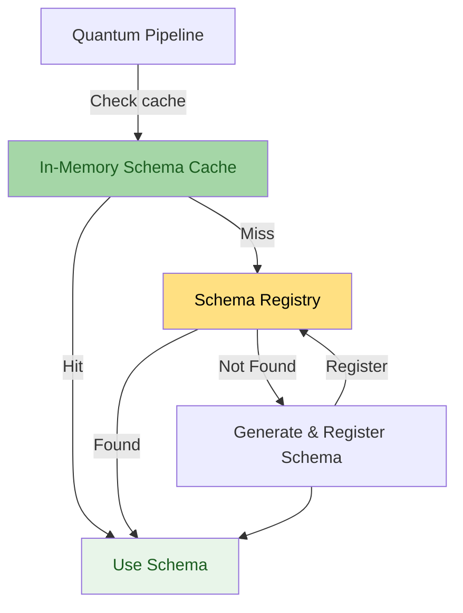
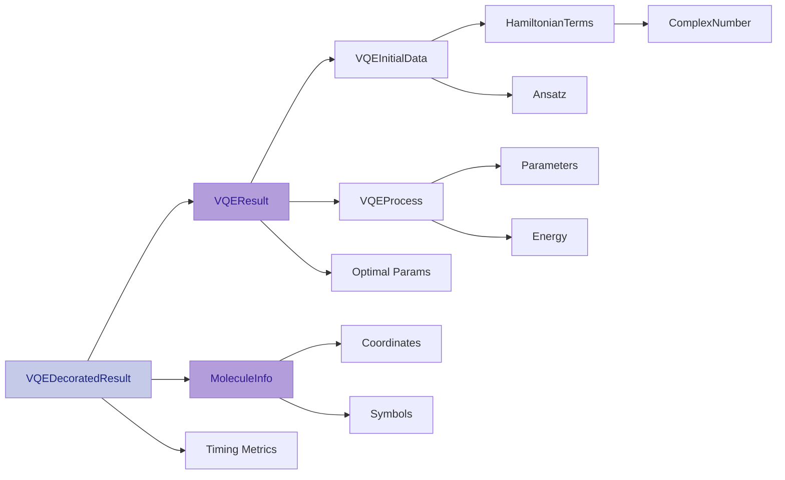

# Avro Serialization and Schema Management

This page covers the Avro serialization pattern used throughout the project,
including schema registry integration, versioning strategies, and the nested
schema architecture.

## Overview

Quantum Pipeline uses Apache Avro for **wire serialization** between the
Python producer and Kafka. This is an important distinction from v1.x, where
Avro was treated as the end-to-end data format. In the current architecture:

- **On the wire** (Python producer -> Kafka): Avro, using the Confluent wire
  format with Schema Registry for serialization and deserialization.
- **At rest** (Garage S3): depends on which connector writes the data.
  Redpanda Connect (default) decodes Avro via `schema_registry_decode` and
  writes JSON. Kafka Connect with `AvroConverter` writes Avro directly.
- **Spark reads**: both formats. `read_experiments_by_topic()` in the
  incremental processing script tries Avro first (`*.avro` glob), then falls
  back to JSON (`*.json`), so it works regardless of which connector produced
  the files.

The default setup uses Redpanda Connect, which decodes to JSON at rest. If you
need Avro end-to-end (for example, to take advantage of schema evolution on the
storage layer), swap in the Kafka Connect alternative by running the compose
stack with `docker-compose.ml.kafka-connect.yaml` and `--scale redpanda-connect=0`.
That config uses the Confluent S3 sink with `AvroConverter`. The Spark processing
scripts handle both formats, so no downstream changes are needed.

For general Avro concepts, see the [Apache Avro specification](https://avro.apache.org/docs/current/specification/).

## Schema Registry Architecture

The Schema Registry implements a two-tier lookup with runtime generation as a fallback:


```mermaid
graph TD
    APP[Quantum Pipeline] -->| Check cache | CACHE[In-Memory Schema Cache]
    CACHE -->|Hit| USE[Use Schema]
    CACHE -->|Miss| SR[Schema Registry]
    SR -->|Found| USE
    SR -->|Not Found| GEN[Generate & Register Schema]
    GEN -->|Register| SR
    GEN --> USE

    style CACHE fill:#a5d6a7,color:#1b5e20
    style SR fill:#ffe082,color:#000
    style USE fill:#e8f5e9,color:#1b5e20
```

Schemas are resolved through a two-tier lookup: in-memory cache and Confluent
Schema Registry. If no schema is found in either location, the interface classes
generate a new schema at runtime and register it with the registry via
`SchemaRegistry.register_schema()`.

See the [Confluent Schema Registry documentation](https://docs.confluent.io/platform/current/schema-registry/) for details on the registry API.

## Nested Schema Architecture

The project uses a compositional schema design. More complex types are built
from simpler nested schemas.

### Schema Hierarchy


```mermaid
graph LR
    VQE[VQEDecoratedResult] --> RESULT[VQEResult]
    VQE --> MOL[MoleculeInfo]
    VQE --> TIM[Timing Metrics]

    RESULT --> INIT[VQEInitialData]
    RESULT --> ITER[VQEProcess]
    RESULT --> OPT[Optimal Params]

    INIT --> HAM[HamiltonianTerms]
    INIT --> ANS[Ansatz]
    HAM --> COEFF[ComplexNumber]

    MOL --> COORD[Coordinates]
    MOL --> SYM[Symbols]

    ITER --> IP[Parameters]
    ITER --> IE[Energy]

    style VQE fill:#c5cae9,color:#1a237e
    style RESULT fill:#b39ddb,color:#311b92
    style MOL fill:#b39ddb,color:#311b92
```

### Schema Composition Pattern

```python
class VQEDecoratedResultInterface(AvroInterfaceBase[VQEDecoratedResult]):
    """Top-level schema composed from nested interfaces."""

    SCHEMA_NAME = 'experiment.vqe'

    def __init__(self, registry):
        super().__init__(registry)
        self.result_interface = VQEResultInterface(self.registry)
        self.molecule_interface = MoleculeInfoInterface(self.registry)

    @property
    def schema(self) -> dict:
        """Build schema by composing nested schemas."""
        schema = {
            'type': 'record',
            'name': 'VQEDecoratedResult',
            'fields': [
                {'name': 'vqe_result', 'type': self.result_interface.schema},
                {'name': 'molecule', 'type': self.molecule_interface.schema},
                {'name': 'basis_set', 'type': 'string'},
                {'name': 'hamiltonian_time', 'type': 'double'},
                {'name': 'mapping_time', 'type': 'double'},
                {'name': 'vqe_time', 'type': 'double'},
                {'name': 'total_time', 'type': 'double'},
                {'name': 'molecule_id', 'type': 'int'},
                {'name': 'performance_start', 'type': ['null', 'string'], 'default': None},
                {'name': 'performance_end', 'type': ['null', 'string'], 'default': None},
            ],
        }
        self._register_schema(self.SCHEMA_NAME, deepcopy(schema))
        return schema
```

Each interface class defines its own `SCHEMA_NAME` class attribute and calls
`_register_schema()` at the end of the `schema` property. This registers (or updates)
the schema in the Schema Registry whenever the schema is accessed.

## Complete Schema Definitions

### Top-Level: VQEDecoratedResult

```json
{
  "type": "record",
  "name": "VQEDecoratedResult",
  "fields": [
    {
      "name": "vqe_result",
      "type": {
        "type": "record",
        "name": "VQEResult",
        "fields": ["..."]
      }
    },
    {
      "name": "molecule",
      "type": {
        "type": "record",
        "name": "MoleculeInfo",
        "fields": ["..."]
      }
    },
    {"name": "basis_set", "type": "string"},
    {"name": "hamiltonian_time", "type": "double"},
    {"name": "mapping_time", "type": "double"},
    {"name": "vqe_time", "type": "double"},
    {"name": "total_time", "type": "double"},
    {"name": "molecule_id", "type": "int"},
    {"name": "performance_start", "type": ["null", "string"], "default": null},
    {"name": "performance_end", "type": ["null", "string"], "default": null}
  ]
}
```

### VQEResult Schema

```json
{
  "type": "record",
  "name": "VQEResult",
  "fields": [
    {
      "name": "initial_data",
      "type": {
        "type": "record",
        "name": "VQEInitialData",
        "fields": [
          {"name": "backend", "type": "string"},
          {"name": "num_qubits", "type": "int"},
          {
            "name": "hamiltonian",
            "type": {
              "type": "array",
              "items": {
                "type": "record",
                "name": "HamiltonianTerm",
                "fields": [
                  {"name": "label", "type": "string"},
                  {
                    "name": "coefficients",
                    "type": {
                      "type": "record",
                      "name": "ComplexNumber",
                      "fields": [
                        {"name": "real", "type": "double"},
                        {"name": "imaginary", "type": "double"}
                      ]
                    }
                  }
                ]
              }
            }
          },
          {"name": "num_parameters", "type": "int"},
          {"name": "initial_parameters", "type": {"type": "array", "items": "double"}},
          {"name": "optimizer", "type": "string"},
          {"name": "ansatz", "type": "string"},
          {"name": "noise_backend", "type": "string"},
          {"name": "default_shots", "type": "int"},
          {"name": "ansatz_reps", "type": "int"},
          {"name": "init_strategy", "type": ["string", "null"], "default": "random"},
          {"name": "seed", "type": ["null", "int"], "default": null},
          {"name": "ansatz_name", "type": ["null", "string"], "default": null}
        ]
      }
    },
    {
      "name": "iteration_list",
      "type": {
        "type": "array",
        "items": {
          "type": "record",
          "name": "VQEProcess",
          "fields": [
            {"name": "iteration", "type": "int"},
            {"name": "parameters", "type": {"type": "array", "items": "double"}},
            {"name": "result", "type": "double"},
            {"name": "std", "type": "double"},
            {"name": "energy_delta", "type": ["null", "double"], "default": null},
            {"name": "parameter_delta_norm", "type": ["null", "double"], "default": null},
            {"name": "cumulative_min_energy", "type": ["null", "double"], "default": null}
          ]
        }
      }
    },
    {"name": "minimum", "type": "double"},
    {"name": "optimal_parameters", "type": {"type": "array", "items": "double"}},
    {"name": "maxcv", "type": ["null", "double"], "default": null},
    {"name": "minimization_time", "type": "double"},
    {"name": "nuclear_repulsion_energy", "type": ["null", "double"], "default": null},
    {"name": "success", "type": ["null", "boolean"], "default": null},
    {"name": "nfev", "type": ["null", "int"], "default": null},
    {"name": "nit", "type": ["null", "int"], "default": null}
  ]
}
```

### MoleculeInfo Schema

```json
{
  "type": "record",
  "name": "MoleculeInfo",
  "namespace": "quantum_pipeline",
  "fields": [
    {
      "name": "molecule_data",
      "type": {
        "type": "record",
        "name": "MoleculeData",
        "fields": [
          {"name": "symbols", "type": {"type": "array", "items": "string"}},
          {
            "name": "coords",
            "type": {
              "type": "array",
              "items": {"type": "array", "items": "double"}
            }
          },
          {"name": "multiplicity", "type": "int"},
          {"name": "charge", "type": "int"},
          {"name": "units", "type": "string"},
          {
            "name": "masses",
            "type": ["null", {"type": "array", "items": "double"}],
            "default": null
          }
        ]
      }
    }
  ]
}
```

## Schema Evolution

The Schema Registry is set to **NONE** compatibility mode:

```json
{
  "schema.compatibility": "NONE"
}
```

This allows unrestricted schema changes. On the wire, each message carries its
schema ID in the Confluent header, so consumers always know which version to
use for decoding.

When a field is added to a dataclass (e.g., `energy_delta` was added to
`VQEProcess`), the corresponding interface's `schema` property is updated with
a nullable default. This keeps older and newer messages decodable by the same
consumer.

!!! info "Kafka Connect"

    If you switch to the Kafka Connect path with Avro at rest, consider tightening
    compatibility to `BACKWARD` or `FULL` so that Spark can read files written with
    different schema versions without issues. With the default Redpanda Connect
    path (JSON at rest), `NONE` is sufficient. See the
    [Confluent Schema Evolution documentation](https://docs.confluent.io/platform/current/schema-registry/fundamentals/schema-evolution.html)
    for details on compatibility modes.

## Topic and Schema Naming

All VQE results go to a single Kafka topic: `experiment.vqe`. The schema is
registered under the subject `experiment.vqe-value` (the default
TopicNameStrategy).

Versions 1.x generated a separate topic per configuration, encoding molecule ID, basis
set, backend, and iteration count into the topic name. That made consumer setup
and topic management increasingly difficult as configurations grew. The current
single-topic approach keeps all results in one place. Downstream filtering (by
molecule, basis set, optimizer, etc.) happens in Spark during feature extraction,
not at the Kafka topic level.

## Serialization Process

Messages on the wire use the
[Confluent Wire Format](https://docs.confluent.io/platform/current/schema-registry/fundamentals/serdes-develop/index.html#wire-format):
a magic byte (`0x00`), a 4-byte schema ID, then the Avro binary payload.

**Producer side** - `to_avro_bytes()` on `AvroInterfaceBase`:

1. Parses the schema dict into an Avro schema object
2. Writes the Confluent header (magic byte + 4-byte schema ID from the
   registry's `id_cache`)
3. Serializes the object using `DatumWriter` and `BinaryEncoder`

**Consumer side** - depends on the connector:

- **Redpanda Connect** (default): the `schema_registry_decode` processor reads
  the schema ID from each message, fetches the schema from the registry,
  decodes the Avro payload, and writes JSON to Garage.
- **Kafka Connect**: the `AvroConverter` handles decoding internally and the S3
  sink writes Avro files directly.


## Type Conversion for Data

### Python/NumPy to Avro

The base class provides `_convert_to_primitives` for converting NumPy types to Avro-compatible Python primitives:

```python
def _convert_to_primitives(self, obj: Any) -> Any:
    """Convert numpy types to Python native types."""
    if isinstance(obj, np.ndarray):
        return obj.tolist()
    if self._is_numpy_int(obj):
        return int(obj)
    if self._is_numpy_float(obj):
        return float(obj)
    if isinstance(obj, dict):
        return {k: self._convert_to_primitives(v) for k, v in obj.items()}
    if isinstance(obj, list):
        return [self._convert_to_primitives(item) for item in obj]
    return obj
```

### Avro to Python/NumPy

The reverse conversion uses `_convert_to_numpy`:

```python
def _convert_to_numpy(self, obj: Any) -> Any:
    """Convert Python native types to numpy types."""
    if isinstance(obj, list):
        return np.array([self._convert_to_primitives(item) for item in obj])
    if hasattr(obj, 'tolist'):
        return obj.tolist()
    return obj
```

### Complex Number Handling

Complex numbers (used in Hamiltonian coefficients) are represented as Avro records with `real` and `imaginary` fields. The `VQEInitialDataInterface` handles serialization and deserialization of these values directly:

```python
def _serialize_hamiltonian(self, data: ndarray):
    serialized_data = []
    for label, complex_number in data:
        if isinstance(complex_number, (str, np.str_)):
            complex_number = complex(
                complex_number.replace('(', '').replace(')', ''),
            )
        real_part = np.float64(complex_number.real)
        imaginary_part = np.float64(complex_number.imag)
        serialized_data.append(
            {'label': label, 'coefficients': {'real': real_part, 'imaginary': imaginary_part}}
        )
    return serialized_data

def _deserialize_hamiltonian(self, data: list):
    return np.array(
        [
            (
                term['label'],
                complex(term['coefficients']['real'], term['coefficients']['imaginary']),
            )
            for term in data
        ],
        dtype=object,
    )
```

The serializer handles the case where complex numbers may arrive as string representations (e.g., from earlier processing stages) by stripping parentheses and parsing them.

## Next Steps

- **[Data Flow](data-flow.md)** - See how Avro data flows through the pipeline
- **[System Design](system-design.md)** - Understand component integration

## References

- [Apache Avro Specification](https://avro.apache.org/docs/current/specification/)
- [Confluent Schema Registry](https://docs.confluent.io/platform/current/schema-registry/)
- [Schema Evolution and Compatibility](https://docs.confluent.io/platform/current/schema-registry/fundamentals/schema-evolution.html)
- [Confluent Wire Format](https://docs.confluent.io/platform/current/schema-registry/fundamentals/serdes-develop/index.html#wire-format)
