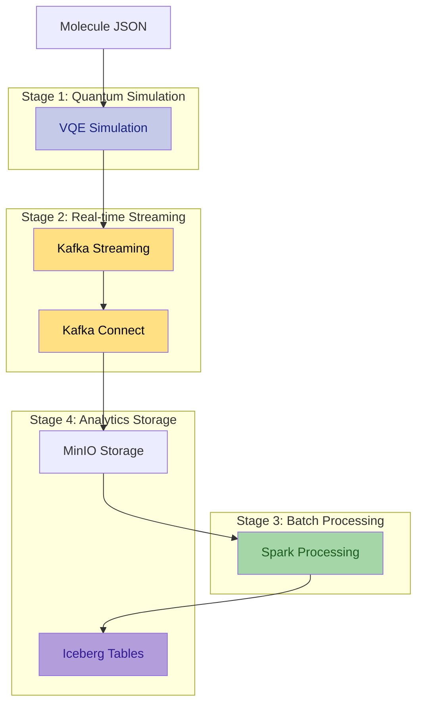
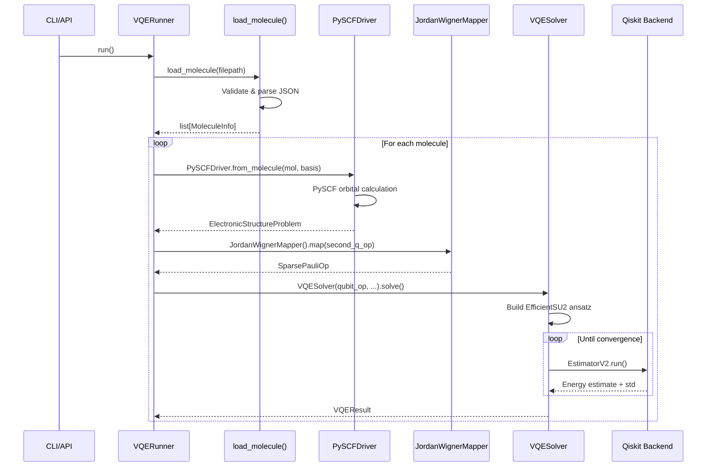
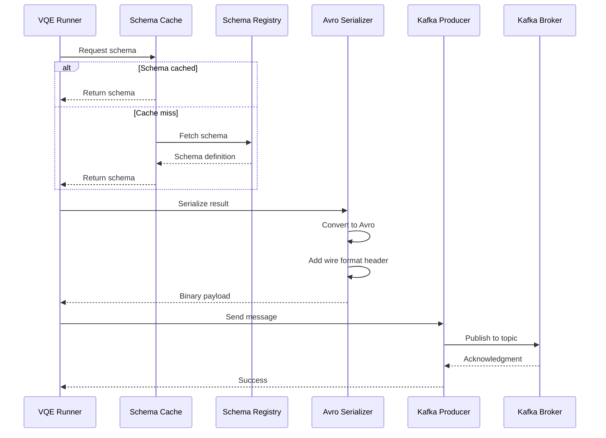
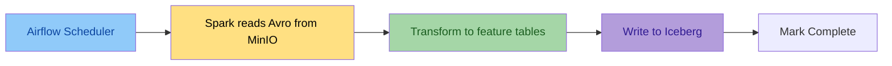
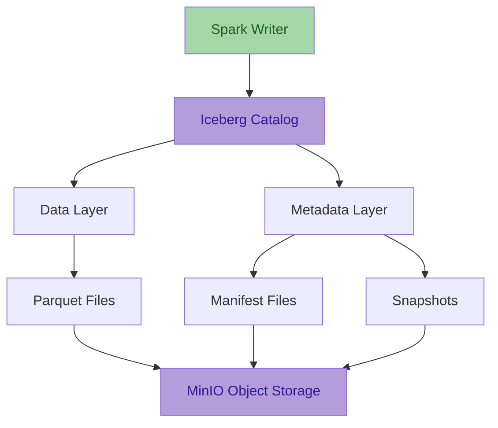
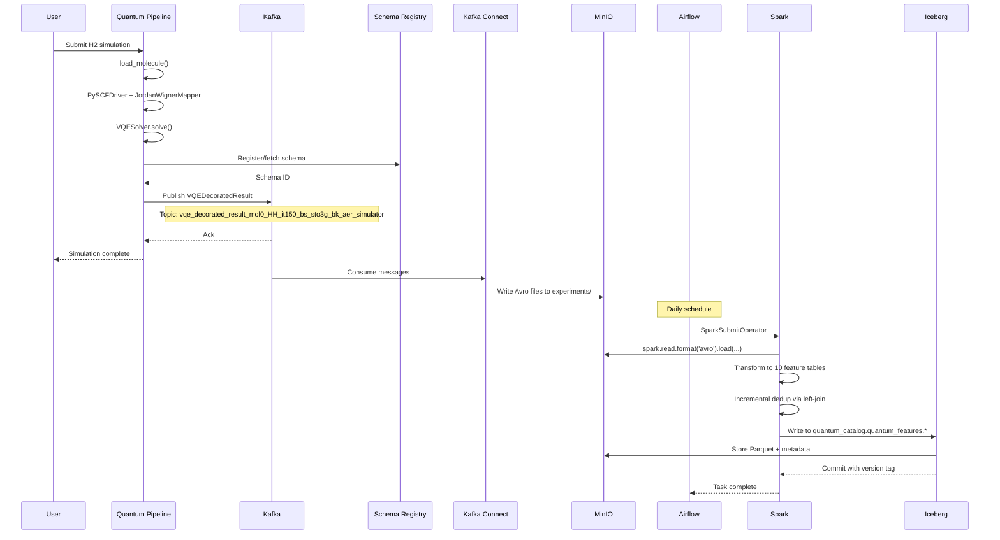

# Data Flow Architecture

This document traces the complete journey of data through the Quantum Pipeline - from molecule specification to ML-ready features in Apache Iceberg tables.

---

## Overview

The Quantum Pipeline implements a **multi-stage data processing architecture** that transforms quantum simulation results into structured analytics data:



---

## Stage 1: Quantum Simulation

### Input: Molecule Specification

VQE simulations begin with molecule data in JSON format:

```json
{
    "symbols": ["H", "H"],
    "coords": [[0.0, 0.0, 0.0], [0.0, 0.0, 0.74]],
    "multiplicity": 1,
    "charge": 0,
    "units": "angstrom"
}
```

### Processing Pipeline

The simulation follows a structured workflow orchestrated by `VQERunner.run()`:



### Simulation Phases

#### Phase 1: Molecule Loading

**Source**: `quantum_pipeline/drivers/molecule_loader.py`

- Loads JSON, validates required fields (`symbols`, `coords`)
- Creates `MoleculeInfo` objects (from `qiskit_nature.second_q.formats.molecule_info`)
- Defaults: `multiplicity=1`, `charge=0`, `units=angstrom`

!!! note
    `MoleculeInfo` is imported from `qiskit_nature`, not defined in this project.

#### Phase 2: Hamiltonian Construction

**Source**: `quantum_pipeline/runners/vqe_runner.py`

- `PySCFDriver.from_molecule()` performs molecular orbital calculation
- `second_q_ops()[0]` produces the second-quantized fermionic operator
- `JordanWignerMapper().map()` transforms to qubit operator (`SparsePauliOp`)

#### Phase 3: Ansatz Creation

**Source**: `quantum_pipeline/solvers/vqe_solver.py`

- Uses `EfficientSU2` ansatz (not UCCSD) from `qiskit.circuit.library`
- Configurable repetitions via `ansatz_reps` parameter
- Random initial parameters: `2 * pi * random(num_parameters)`

#### Phase 4: VQE Optimization

**Source**: `quantum_pipeline/solvers/vqe_solver.py`

- Uses `scipy.optimize.minimize` with configurable optimizer (default: COBYLA)
- `EstimatorV2` from `qiskit_ibm_runtime` estimates expectation values
- Each iteration records: iteration number, parameters, energy, std deviation
- Supports convergence threshold and max iteration limits

### Output: VQEDecoratedResult

**Source**: `quantum_pipeline/structures/vqe_observation.py`

Complete simulation results wrapped in a structured dataclass:

```python
@dataclass
class VQEDecoratedResult:
    vqe_result: VQEResult
    molecule: MoleculeInfo
    basis_set: str
    hamiltonian_time: np.float64
    mapping_time: np.float64
    vqe_time: np.float64
    total_time: np.float64
    molecule_id: int
    performance_start: dict | None = None  # Optional system metrics snapshot
    performance_end: dict | None = None    # Optional system metrics snapshot
```

The nested `VQEResult` contains:

```python
@dataclass
class VQEResult:
    initial_data: VQEInitialData  # backend, num_qubits, hamiltonian, ansatz, etc.
    iteration_list: list[VQEProcess]  # per-iteration energy + parameters
    minimum: np.float64
    optimal_parameters: np.ndarray
    maxcv: np.float64 | None
    minimization_time: np.float64
```

---

## Stage 2: Real-time Streaming

### Kafka Producer Integration

When `--kafka` flag is enabled, results stream to Apache Kafka immediately after each VQE run completes.



### Topic Naming Strategy

Each simulation produces a unique topic based on simulation parameters.

**Pattern**: `vqe_decorated_result_{suffix}`

**Suffix** is generated by `VQEDecoratedResult.get_schema_suffix()` and includes: molecule ID, atomic symbols, iteration count, basis set (sanitized), and backend name (sanitized).

**Example topics**:
```
vqe_decorated_result_mol0_HH_it150_bs_sto3g_bk_aer_simulator
vqe_decorated_result_mol1_LiH_it200_bs_cc_pvdz_bk_aer_simulator
```

### Schema Registration

Schemas are automatically registered with Confluent Schema Registry on first use via `SchemaRegistry.save_schema()`.

**Subject naming**: `{schema_name}-value`

The schema registry client tries three sources in order: in-memory cache, remote registry, local `.avsc` file. If a schema is found locally but not in the registry, it is automatically synchronized.

### Message Format

**Confluent Wire Format**:

```
[Magic Byte: 0x00] [Schema ID: 4 bytes big-endian] [Avro payload: variable length]
```

**Logical payload structure** (actual format is Avro binary):

```json
{
    "vqe_result": {
        "initial_data": {
            "backend": "aer_simulator",
            "num_qubits": 4,
            "hamiltonian": [{"label": "IIII", "coefficients": {"real": -0.81, "imaginary": 0.0}}],
            "num_parameters": 16,
            "initial_parameters": [0.12, -0.34, "..."],
            "optimizer": "COBYLA",
            "ansatz": "<QASM3 string>",
            "noise_backend": "undef",
            "default_shots": 1024,
            "ansatz_reps": 2
        },
        "iteration_list": [
            {"iteration": 1, "parameters": ["..."], "result": -1.0, "std": 0.01}
        ],
        "minimum": -1.137270,
        "optimal_parameters": [0.12, -0.34, "..."],
        "maxcv": null,
        "minimization_time": 45.67
    },
    "molecule": {
        "molecule_data": {
            "symbols": ["H", "H"],
            "coords": [[0.0, 0.0, 0.0], [0.0, 0.0, 0.74]],
            "multiplicity": 1,
            "charge": 0,
            "units": "angstrom",
            "masses": null
        }
    },
    "basis_set": "sto3g",
    "hamiltonian_time": 2.34,
    "mapping_time": 0.45,
    "vqe_time": 45.67,
    "total_time": 48.46,
    "molecule_id": 0,
    "performance_start": null,
    "performance_end": null
}
```

The `performance_start` and `performance_end` fields are nullable strings (`["null", "string"]` in Avro). When present, they contain JSON-serialized system metrics snapshots.

---

## Stage 3: Batch Processing with Spark

### Kafka Connect: Kafka to MinIO

Before Spark processes data, **Kafka Connect** (S3 Sink Connector) writes Avro messages from Kafka topics to MinIO.

**Source**: `docker/connectors/minio-sink-config.json`

- **Topics regex**: `vqe_decorated_result_.*`
- **Bucket**: `local-vqe-results`
- **Directory**: `experiments/{topic}/partition=N/`
- **Format**: Avro
- **Flush size**: 1 (writes each message immediately)

### Airflow Orchestration

Apache Airflow schedules a daily Spark job.



**Source**: `docker/airflow/quantum_processing_dag.py`

**DAG configuration**:

- **DAG ID**: `quantum_feature_processing`
- **Schedule**: `timedelta(days=1)`
- **Single task**: `run_quantum_processing` (`SparkSubmitOperator`)
- **Retries**: 3
- **Retry delay**: 20 minutes
- **Tags**: `quantum`, `ML`, `features`, `processing`, `Apache Spark`

### Reading from MinIO

Spark reads Avro files directly from MinIO in batch mode (not from Kafka):

**Source**: `docker/airflow/scripts/quantum_incremental_processing.py`

```python
topic_path = f'{bucket_path}{topic_name}/partition=*/*.avro'
df = spark.read.format('avro').load(topic_path)
```

The `list_available_topics()` function discovers topic directories under the S3 bucket path, then `read_experiments_by_topic()` loads all Avro files for each topic.

### Feature Engineering

Spark transforms raw VQE results into **10 feature tables**:

#### Table Summary

| Table | Key Columns | Partition Columns |
|---|---|---|
| `molecules` | `experiment_id`, `molecule_id` | `processing_date` |
| `ansatz_info` | `experiment_id`, `molecule_id` | `processing_date`, `basis_set` |
| `performance_metrics` | `experiment_id`, `molecule_id`, `basis_set` | `processing_date`, `basis_set` |
| `vqe_results` | `experiment_id`, `molecule_id`, `basis_set` | `processing_date`, `basis_set`, `backend` |
| `initial_parameters` | `parameter_id` | `processing_date`, `basis_set` |
| `optimal_parameters` | `parameter_id` | `processing_date`, `basis_set` |
| `vqe_iterations` | `iteration_id` | `processing_date`, `basis_set`, `backend` |
| `iteration_parameters` | `parameter_id` | `processing_date`, `basis_set` |
| `hamiltonian_terms` | `term_id` | `processing_date`, `basis_set`, `backend` |
| `processing_metadata` | *(tracking table)* | -- |

#### `vqe_results` Schema

The primary results table contains the following columns:

| Column | Type |
|---|---|
| `experiment_id` | string |
| `molecule_id` | int |
| `basis_set` | string |
| `backend` | string |
| `num_qubits` | int |
| `optimizer` | string |
| `noise_backend` | string |
| `default_shots` | int |
| `ansatz_reps` | int |
| `minimum_energy` | double |
| `maxcv` | double |
| `total_iterations` | int |
| `processing_timestamp` | timestamptz |
| `processing_date` | date |
| `processing_batch_id` | string |
| `processing_name` | string |

#### Other Tables

- **`molecules`** -- Molecular geometry, symbols, masses, charge, multiplicity per experiment.
- **`ansatz_info`** -- Ansatz QASM string and repetition count per experiment.
- **`performance_metrics`** -- Timing breakdown: hamiltonian, mapping, VQE, total, and computed total time.
- **`initial_parameters`** -- Exploded initial ansatz parameters (one row per parameter value).
- **`optimal_parameters`** -- Exploded optimal parameters found by VQE (one row per parameter value).
- **`vqe_iterations`** -- Per-iteration energy and standard deviation for convergence tracking.
- **`iteration_parameters`** -- Exploded parameters at each iteration step (one row per parameter per iteration).
- **`hamiltonian_terms`** -- Individual Pauli operator terms with real and imaginary coefficients.
- **`processing_metadata`** -- Tracks batch IDs, table names, version tags, and record counts per processing run.

For full column details, see `docker/airflow/scripts/quantum_incremental_processing.py`.

### Incremental Processing

The pipeline uses append-only incremental processing to avoid reprocessing existing data.

**Logic** (in `process_incremental_data()`):

1. If the target Iceberg table does not exist, create it with the full dataset.
2. If the table exists, use `identify_new_records()` to left-join on key columns and find records not yet in the table.
3. Only truly new records are appended to the table.
4. Each write is tagged with a version: `v_{batch_id}` for initial loads, `v_incr_{batch_id}` for incremental appends.
5. The `processing_metadata` table tracks all batch processing runs, including table names, versions, and record counts.

---

## Stage 4: Analytics Storage

### Apache Iceberg Tables

All feature tables are stored as Apache Iceberg tables with ACID guarantees.



### Table Organization

**Catalog**: Hadoop catalog with MinIO backend (`quantum_catalog`)

**Database**: `quantum_features`

**Full table paths**:
```
quantum_catalog.quantum_features.molecules
quantum_catalog.quantum_features.ansatz_info
quantum_catalog.quantum_features.performance_metrics
quantum_catalog.quantum_features.vqe_results
quantum_catalog.quantum_features.initial_parameters
quantum_catalog.quantum_features.optimal_parameters
quantum_catalog.quantum_features.vqe_iterations
quantum_catalog.quantum_features.iteration_parameters
quantum_catalog.quantum_features.hamiltonian_terms
quantum_catalog.quantum_features.processing_metadata
```

### Partitioning Strategy

Tables are partitioned for query performance. Partition columns vary by table as shown in the [Table Summary](#table-summary) above. The most common partition columns are:

- **`processing_date`** -- present on all tables, enables time-based filtering
- **`basis_set`** -- present on most tables, enables filtering by quantum chemistry basis set
- **`backend`** -- present on `vqe_results`, `vqe_iterations`, and `hamiltonian_terms`

---

## End-to-End Data Flow Example

### Scenario: H2 Molecule VQE Simulation

**Input**:
```json
{
    "symbols": ["H", "H"],
    "coords": [[0.0, 0.0, 0.0], [0.0, 0.0, 0.74]],
    "multiplicity": 1,
    "charge": 0,
    "units": "angstrom"
}
```

### Complete Flow



---

## Next Steps

- **[Avro Serialization](avro-serialization.md)** - Deep dive into schema management
- **[Kafka Streaming](../data-platform/kafka-streaming.md)** - Producer/consumer configuration
- **[Spark Processing](../data-platform/spark-processing.md)** - Feature engineering details
- **[Iceberg Storage](../data-platform/iceberg-storage.md)** - Table management and queries
- **[Airflow Orchestration](../data-platform/airflow-orchestration.md)** - DAG configuration
