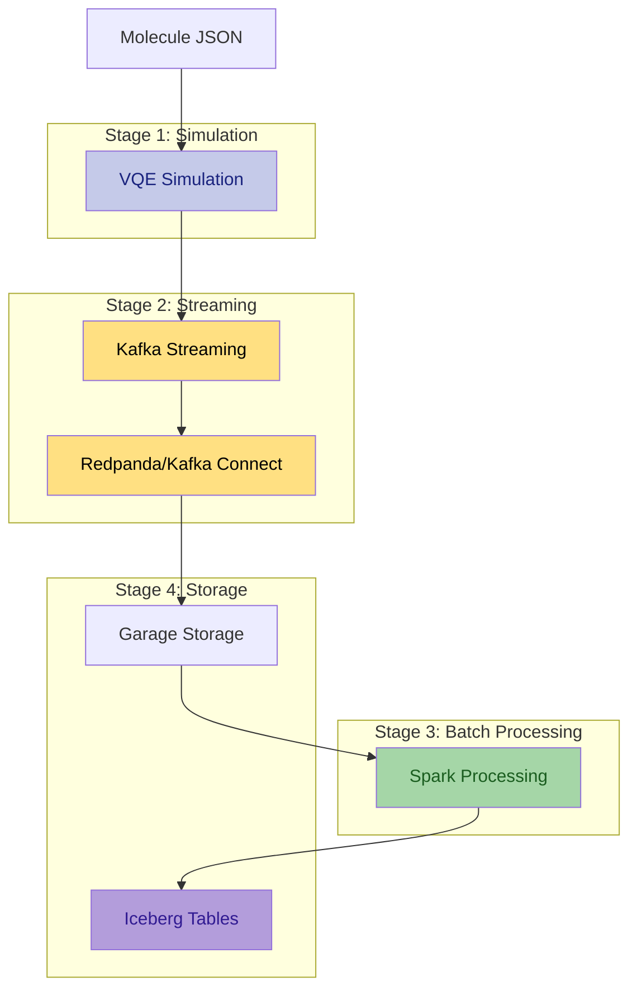
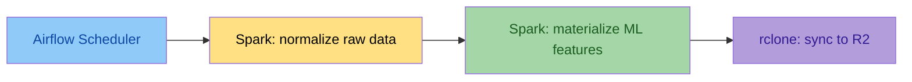
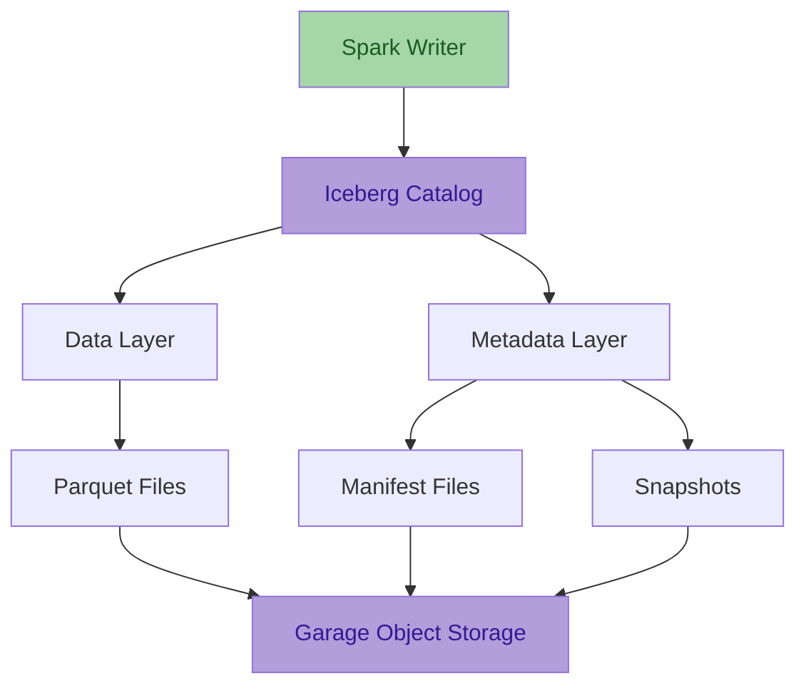
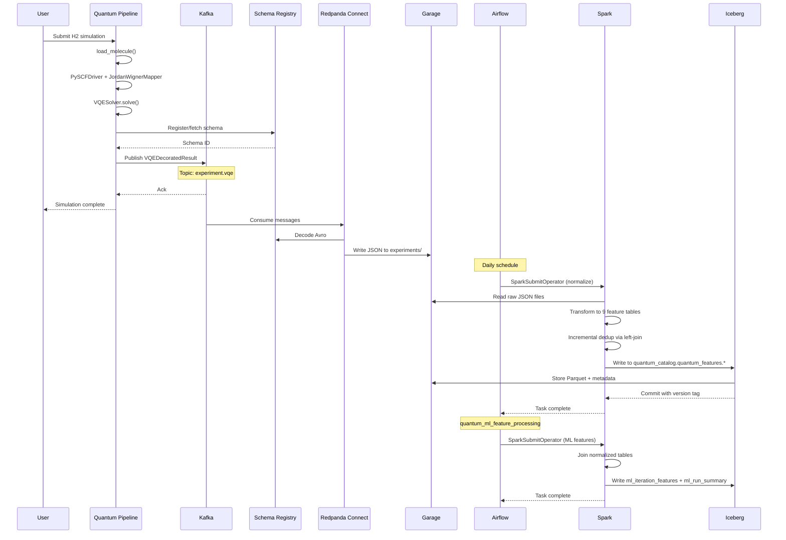

# Data Flow Architecture

Data flow throughout the pipeline. From molecule specification to ML features
within Apache Iceberg tables.

## Overview


```mermaid
graph TB
    INPUT[Molecule JSON] --> VQE[VQE Simulation]
    VQE --> STREAM[Kafka Streaming]
    STREAM --> RC[Redpanda/Kafka Connect]
    RC --> GARAGE[Garage Storage]
    GARAGE --> SPARK[Spark Processing]
    SPARK --> ICEBERG[Iceberg Tables]

    subgraph "Stage 1: Simulation"
        VQE
    end

    subgraph "Stage 2: Streaming"
        STREAM
        RC
    end

    subgraph "Stage 3: Batch Processing"
        SPARK
    end

    subgraph "Stage 4: Storage"
        ICEBERG
        GARAGE
    end

    style VQE fill:#c5cae9,color:#1a237e
    style STREAM fill:#ffe082,color:#000
    style RC fill:#ffe082,color:#000
    style SPARK fill:#a5d6a7,color:#1b5e20
    style ICEBERG fill:#b39ddb,color:#311b92
```


## Stage 1: Quantum Simulation

### Input: Molecule Specification

VQE simulations begin with molecule data in JSON format:

```json
{
    "symbols": ["H", "H"],
    "coords": [[0.0, 0.0, 0.0], [0.0, 0.0, 0.74]],
    "multiplicity": 1,
    "charge": 0,
    "units": "angstrom"
}
```

### Processing Pipeline

`VQERunner.run()` iterates over molecules in the input file, delegating each to
`_process_molecule()`. For each molecule the pipeline runs four phases:

1. **Molecule loading** - parse JSON, validate fields, create `MoleculeInfo`
2. **Hamiltonian construction** - PySCF orbital calculation, Jordan-Wigner mapping to qubit operator
3. **Ansatz creation** - build parameterized circuit, compute initial parameters (random or HF)
4. **VQE optimization** - `scipy.optimize.minimize` with `EstimatorV2`, recording per-iteration energy and parameters

Each molecule produces a `VQEResult` wrapped in a `VQEDecoratedResult` with timing and metadata.

For the full execution sequence and component details, see [System Design](system-design.md#1-quantum-simulation-module).

### Output

Each molecule produces a
[`VQEDecoratedResult`](https://codeberg.org/piotrkrzysztof/quantum-pipeline/src/branch/master/quantum_pipeline/structures/vqe_observation.py#L64)
containing timing data, molecule metadata, and a nested
[`VQEResult`](https://codeberg.org/piotrkrzysztof/quantum-pipeline/src/branch/master/quantum_pipeline/structures/vqe_observation.py#L41)
with initial parameters, the full iteration history, optimal parameters, and
convergence info. This is the unit of data that flows through the rest of the
pipeline.


## Stage 2: Streaming

When the `--kafka` flag is enabled, each `VQEDecoratedResult` is serialized to
Avro and published to the `experiment.vqe` Kafka topic immediately after the
simulation completes.

The producer uses the Confluent wire format (magic byte + schema ID + Avro
binary payload) and registers schemas with the Schema Registry automatically.
For the full serialization process, schema definitions, and wire format details,
see [Serialization](serialization.md).


## Stage 3: Batch Processing with Spark

### Kafka to Garage

Redpanda Connect (default) or Kafka Connect consumes from the `experiment.vqe`
topic and writes files to the `raw-results` bucket in Garage under
`experiments/experiment.vqe/`. With Redpanda Connect the files are JSON; with
Kafka Connect they are Avro. See [Serialization - Overview](serialization.md#overview)
for details on the connector choice.

For the Redpanda Connect configuration, see
[System Design](system-design.md#redpanda-connect-configuration).

### Airflow Orchestration

Apache Airflow orchestrates batch processing through a chain of DAGs.


```mermaid
graph LR
    SCHEDULE[Airflow Scheduler] --> SPARK1[Spark: normalize raw data]
    SPARK1 --> SPARK2[Spark: materialize ML features]
    SPARK2 --> SYNC[rclone: sync to R2]

    style SCHEDULE fill:#90caf9,color:#0d47a1
    style SPARK1 fill:#ffe082,color:#000
    style SPARK2 fill:#a5d6a7,color:#1b5e20
    style SYNC fill:#b39ddb,color:#311b92
```

**DAG chain**:

1. `quantum_feature_processing` -- daily Spark job that reads raw data from Garage, transforms it into 9 normalized Iceberg tables
2. `quantum_ml_feature_processing` -- daily Spark job that joins normalized tables into 2 ML-ready feature tables (waits for upstream DAG via `ExternalTaskSensor`)
3. `r2_sync` -- manual/scheduled rclone sync of ML feature Parquet from Garage to Cloudflare R2

A fourth DAG, `vqe_batch_generation`, handles building simulation Docker images and running batch VQE generation (manual trigger only).

DAGs share configuration through
[`docker/airflow/common/`](https://codeberg.org/piotrkrzysztof/quantum-pipeline/src/branch/master/docker/airflow/common)
(S3 paths, catalog names, default args, Spark session factory).

### Reading from Garage

Spark reads files from Garage via S3A.
[`read_experiments_by_topic()`](https://codeberg.org/piotrkrzysztof/quantum-pipeline/src/branch/master/docker/airflow/scripts/quantum_incremental_processing.py#L75)
tries Avro first, then falls back to JSON, so it works with either connector's
output. [`list_available_topics()`](https://codeberg.org/piotrkrzysztof/quantum-pipeline/src/branch/master/docker/airflow/scripts/quantum_incremental_processing.py#L47)
discovers topic directories under the S3 bucket path.

### Feature Engineering

Spark transforms raw VQE results into **9 normalized feature tables**:

#### Table Summary

| Table | Key Columns | Partition Columns |
|---|---|---|
| `molecules` | `experiment_id`, `molecule_id` | `processing_date` |
| `ansatz_info` | `experiment_id`, `molecule_id` | `processing_date`, `basis_set` |
| `performance_metrics` | `experiment_id`, `molecule_id`, `basis_set` | `processing_date`, `basis_set` |
| `vqe_results` | `experiment_id`, `molecule_id`, `basis_set` | `processing_date`, `basis_set`, `backend` |
| `initial_parameters` | `parameter_id` | `processing_date`, `basis_set` |
| `optimal_parameters` | `parameter_id` | `processing_date`, `basis_set` |
| `vqe_iterations` | `iteration_id` | `processing_date`, `basis_set`, `backend` |
| `iteration_parameters` | `parameter_id` | `processing_date`, `basis_set` |
| `hamiltonian_terms` | `term_id` | `processing_date`, `basis_set`, `backend` |

A second Spark job (`quantum_ml_feature_processing`) joins these into two
ML-ready tables: `ml_iteration_features` (per-iteration feature vectors for
convergence prediction) and `ml_run_summary` (per-run aggregates for energy
estimation).

For full table schemas and column definitions, see
[System Design - Feature Tables](system-design.md#feature-tables-schema).

### Incremental Processing

The pipeline uses append-only incremental processing to avoid reprocessing existing data.

**Logic** (in `process_incremental_data()`):

1. If the target Iceberg table does not exist, create it with the full dataset.
2. If the table exists, use `identify_new_records()` to left-join on key columns and find records not yet in the table.
3. Only new records are appended to the table.
4. Each write is tagged with a version: `v_{batch_id}` for initial loads, `v_incr_{batch_id}` for incremental appends.
5. The `processing_metadata` table tracks all batch processing runs, including table names, versions, and record counts.


## Stage 4: Analytics Storage

### Apache Iceberg Tables

All feature tables are stored as Apache Iceberg tables with ACID guarantees.


```mermaid
graph TB
    SPARK[Spark Writer] --> ICEBERG[Iceberg Catalog]
    ICEBERG --> META[Metadata Layer]
    ICEBERG --> DATA[Data Layer]

    META --> MANIFEST[Manifest Files]
    META --> SNAPSHOT[Snapshots]

    DATA --> PARQUET[Parquet Files]

    PARQUET --> GARAGE[Garage Object Storage]
    MANIFEST --> GARAGE
    SNAPSHOT --> GARAGE

    style SPARK fill:#a5d6a7,color:#1b5e20
    style ICEBERG fill:#b39ddb,color:#311b92
    style GARAGE fill:#b39ddb,color:#311b92
```

### Table Organization

All tables live under `quantum_catalog.quantum_features` (Hadoop catalog backed
by Garage). Tables are partitioned by `processing_date` and, where applicable,
`basis_set` and `backend` - see the [Table Summary](#table-summary) above for
partition columns per table.

## End-to-End Data Flow Example

### Scenario: H2 Molecule VQE Simulation

**Input**:
```json
{
    "symbols": ["H", "H"],
    "coords": [[0.0, 0.0, 0.0], [0.0, 0.0, 0.74]],
    "multiplicity": 1,
    "charge": 0,
    "units": "angstrom"
}
```

### Complete Flow


```mermaid
sequenceDiagram
    participant User
    participant CLI as Quantum Pipeline
    participant Kafka
    participant Registry as Schema Registry
    participant RC as Redpanda Connect
    participant Garage
    participant Airflow
    participant Spark
    participant Iceberg

    User->>CLI: Submit H2 simulation
    CLI->>CLI: load_molecule()
    CLI->>CLI: PySCFDriver + JordanWignerMapper
    CLI->>CLI: VQESolver.solve()

    CLI->>Registry: Register/fetch schema
    Registry-->>CLI: Schema ID

    CLI->>Kafka: Publish VQEDecoratedResult
    Note over Kafka: Topic: experiment.vqe
    Kafka-->>CLI: Ack

    CLI-->>User: Simulation complete

    Kafka->>RC: Consume messages
    RC->>Registry: Decode Avro
    RC->>Garage: Write JSON to experiments/

    Note over Airflow: Daily schedule
    Airflow->>Spark: SparkSubmitOperator (normalize)

    Spark->>Garage: Read raw JSON files
    Spark->>Spark: Transform to 9 feature tables
    Spark->>Spark: Incremental dedup via left-join

    Spark->>Iceberg: Write to quantum_catalog.quantum_features.*
    Iceberg->>Garage: Store Parquet + metadata
    Iceberg-->>Spark: Commit with version tag

    Spark-->>Airflow: Task complete

    Note over Airflow: quantum_ml_feature_processing
    Airflow->>Spark: SparkSubmitOperator (ML features)
    Spark->>Spark: Join normalized tables
    Spark->>Iceberg: Write ml_iteration_features + ml_run_summary
    Spark-->>Airflow: Task complete
```

## Next Steps

- **[Serialization](serialization.md)** - Wire format, schema registry, and schema definitions
- **[System Design](system-design.md)** - Detailed component design and interactions
