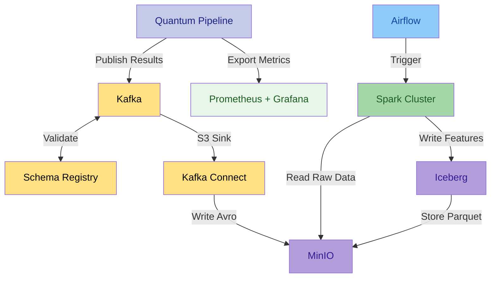
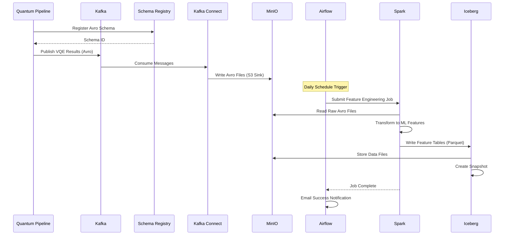
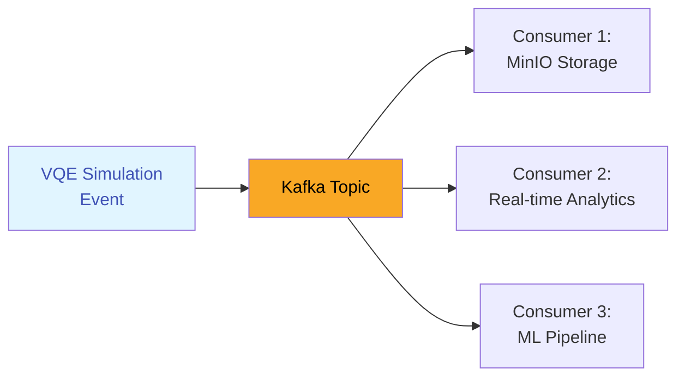
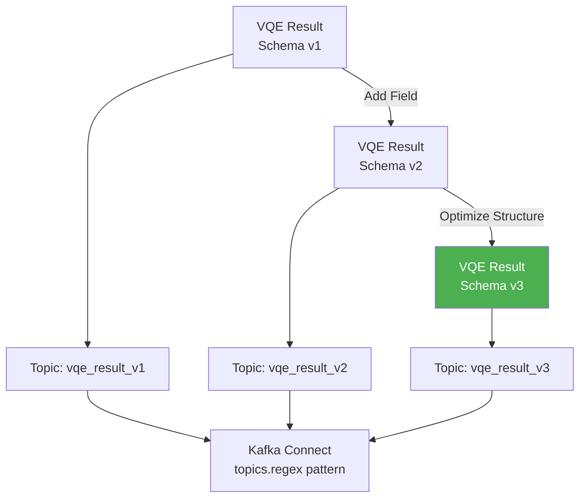
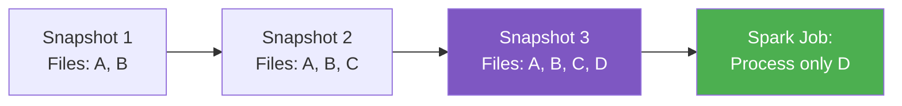

# Architecture Overview

The Quantum Pipeline is built on a **microservices architecture** that combines quantum simulation,
data streaming, distributed processing, and scalable storage.

This section explains the system design, data flow patterns, and key architectural decisions.

---

## Design Philosophy

The architecture follows these core principles:

!!! tip "Separation of Concerns"
    Each component handles a specific responsibility:

    - **Quantum Simulation** - VQE algorithm execution
    - **Streaming** - Real-time data transport (Kafka)
    - **Processing** - Feature engineering (Spark)
    - **Storage** - Persistent data lake (Iceberg/MinIO)
    - **Orchestration** - Workflow automation (Airflow)

!!! tip "Loose Coupling"
    Components communicate through well-defined interfaces (Avro schemas) allowing independent scaling and deployment.

!!! tip "Scalability"
    - Horizontal scaling for Spark workers
    - Vertical/Horizontal scaling for GPU containers
    - Partitioned Kafka topics for parallelism

!!! tip "Fault Tolerance"
    - Kafka message persistence
    - Airflow retry mechanisms
    - Iceberg ACID transactions

---

## High-Level Architecture

---

## Component Overview

###  Quantum Simulation Layer

**Quantum Pipeline Container**

- Executes VQE simulations using Qiskit Aer
- Supports CPU and GPU backends
- Monitors iteration-level metrics
- Produces structured result data

**Performance Monitor**

- Collects system metrics (CPU, memory, GPU)
- Tracks VQE-specific metrics (energy, iterations)
- Exports to Prometheus PushGateway
- Non-blocking background thread

[:octicons-arrow-right-24: System Design Details](system-design.md)

---

###  Messaging Layer

**Apache Kafka**

- Distributed message broker
- Topic-based publish/subscribe
- Message persistence and replay
- Partitioning for parallelism

**Schema Registry**

- Centralized Avro schema management
- Schema versioning and evolution
- Backward/forward compatibility checks
- Automatic topic suffix generation

**Kafka Connect**

- S3 Sink Connector for MinIO
- Automatic Avro file writing
- Flush size configuration
- Error tolerance and retry

[:octicons-arrow-right-24: Avro Serialization Pattern](avro-serialization.md)

---

###  Orchestration Layer

**Apache Airflow**

- DAG-based workflow orchestration
- Daily scheduling for batch processing
- Retry logic with exponential backoff
- Email alerting on success/failure
- PostgreSQL for metadata storage

**Key DAG**: `quantum_processing_dag`

- Ingests VQE results from Kafka
- Triggers Spark feature engineering jobs
- Loads processed data into Iceberg tables
- Manages incremental processing state

[:octicons-arrow-right-24: Data Flow Pattern](data-flow.md)

---

###  Processing Layer

**Apache Spark Cluster**

- Master node for job coordination
- Worker nodes for distributed processing
- In-memory computation engine
- Support for Avro, Parquet, Iceberg

**Processing Pattern**

1. Read raw Avro files from MinIO
2. Deserialize using Avro schemas
3. Transform into ML feature tables
4. Write to Iceberg in Parquet format
5. Update metadata snapshots

**Feature Tables** (9 tables):

- `molecules` - Molecular structures
- `vqe_results` - Optimization results
- `vqe_iterations` - Iteration history
- `vqe_parameters` - Optimal parameters
- `hamiltonians` - Operator coefficients
- `timing_metrics` - Performance data
- `accuracy_metrics` - Scientific validation
- `system_metrics` - Resource usage
- `processing_metadata` - Data lineage

---

###  Storage Layer

**MinIO (S3-Compatible Object Storage)**

- Raw Avro files from Kafka Connect
- Parquet files from Spark processing
- Iceberg table data files
- Bucket: `local-vqe-results`

**Apache Iceberg (Data Lake Metadata)**

- ACID transaction support
- Time-travel queries
- Schema evolution
- Snapshot isolation
- Partition management

**PostgreSQL**

- Airflow metadata database
- DAG run history
- Task state tracking
- Connection management

---

###  Monitoring Layer

**Prometheus PushGateway**

- Receives metrics from short-lived jobs
- Gateway for container metrics
- Time-series data storage
- Label-based querying

**Grafana**

- Visualization dashboards
- Real-time metric monitoring
- Custom query panels
- Alert management

**Monitored Metrics**:

- System: CPU%, memory%, disk I/O
- VQE: Energy convergence, iterations, timing
- Scientific: Accuracy vs reference database
- Data: Kafka lag, Spark job duration

---

## Data Flow Pattern

[:octicons-arrow-right-24: Detailed Data Flow](data-flow.md)

---

## Key Architectural Patterns

### 1. Event-Driven Architecture

Example 

**Benefits**:

- Decoupling producers from consumers
- Multiple consumers for same data
- Message persistence and replay
- Asynchronous processing

### 2. Schema Evolution

**Benefits**:

- Backward compatibility
- Forward compatibility
- Zero-downtime schema updates
- Parallel version support

### 3. Incremental Processing

**Benefits**:

- Process only new data
- Reduce computation time
- Lower resource usage
- Maintain complete history

[:octicons-arrow-right-24: System Design](system-design.md)

---

## Next Steps

You can learn more about specific architectural components:

- **[System Design](system-design.md)** - Detailed component design and interactions
- **[Avro Serialization](avro-serialization.md)** - Schema registry pattern and evolution
- **[Data Flow](data-flow.md)** - End-to-end data pipeline with examples

Or explore related topics:

- **[Deployment Guide](../deployment/index.md)** - How to deploy the architecture
- **[Monitoring](../monitoring/index.md)** - Observability and metrics
- **[Configuration](../usage/configuration.md)** - Tune the components
