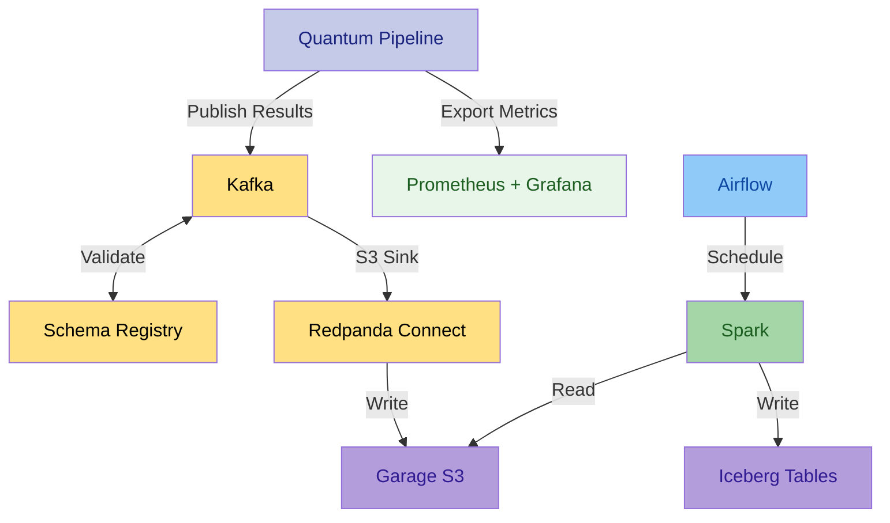

# Architecture

How the components fit together, from the simulation model to the rest of the
pipeline.

```mermaid
graph TD
    QP[Quantum Pipeline] -->|Publish Results| KAFKA[Kafka]
    QP -->|Export Metrics| PROM[Prometheus + Grafana]
    KAFKA <-->|Validate| SR[Schema Registry]
    KAFKA -->|S3 Sink| RC[Redpanda Connect]
    RC -->|Write| GARAGE[Garage S3]
    AIRFLOW[Airflow] -->|Schedule| SPARK[Spark]
    SPARK -->|Read| GARAGE
    SPARK -->|Write| ICE[Iceberg Tables]

    style QP fill:#c5cae9,color:#1a237e
    style KAFKA fill:#ffe082,color:#000
    style SR fill:#ffe082,color:#000
    style RC fill:#ffe082,color:#000
    style AIRFLOW fill:#90caf9,color:#0d47a1
    style SPARK fill:#a5d6a7,color:#1b5e20
    style GARAGE fill:#b39ddb,color:#311b92
    style ICE fill:#b39ddb,color:#311b92
    style PROM fill:#e8f5e9,color:#1b5e20
```

Project runs VQE simulations, streams results to Kafka, and processes them
into Iceberg feature tables via Spark. Airflow orchestrates the batch jobs.
Prometheus and Grafana provide observability.

## Section Guide

-   :material-cog-outline:{ .lg .middle } **System Design**

    ---

    Component breakdown: simulation module, Kafka, Garage storage, Airflow
    DAGs, Spark, and the incremental feature pipeline.

    [:octicons-arrow-right-24: System Design](system-design.md)

-   :material-swap-horizontal:{ .lg .middle } **Data Flow**

    ---

    How data moves stage by stage, from molecule input through VQE, Kafka,
    and Spark to Iceberg tables, with an end-to-end \(H_2\) example.

    [:octicons-arrow-right-24: Data Flow](data-flow.md)

-   :material-file-document-edit-outline:{ .lg .middle } **Serialization**

    ---

    The Avro wire format, schema registry, schema definitions, and the JSON
    vs Avro storage choice between connectors.

    [:octicons-arrow-right-24: Serialization](serialization.md)

