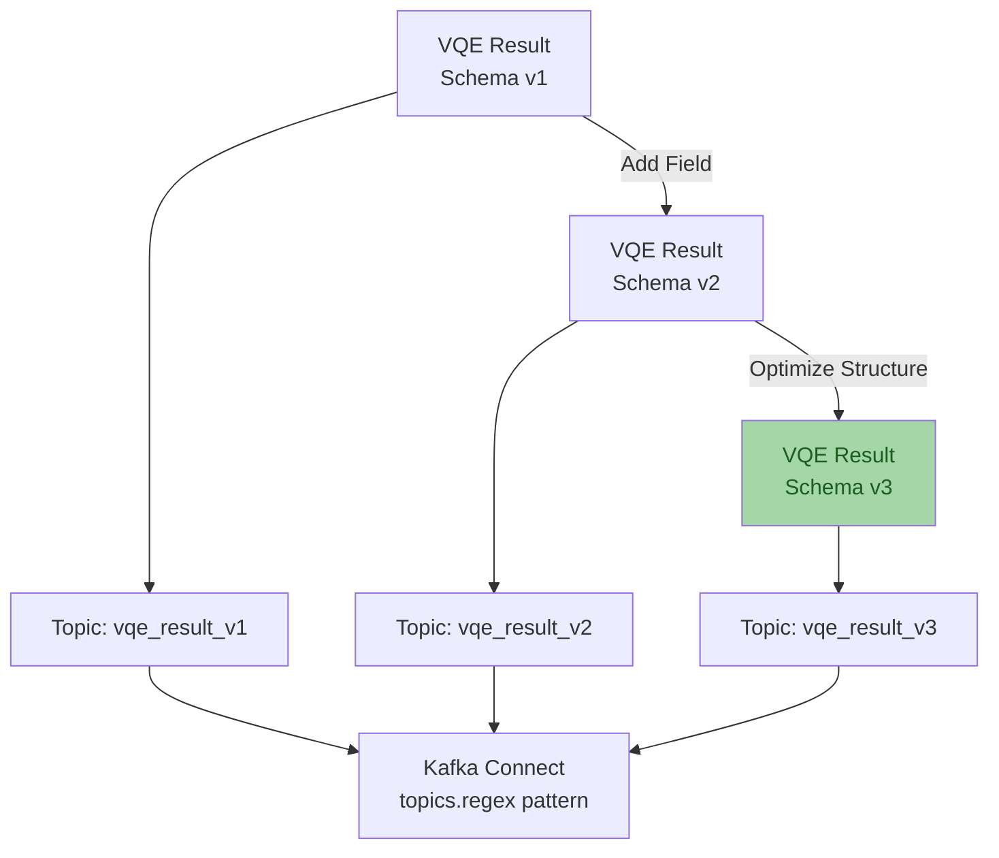
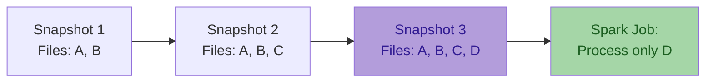

# Architecture Overview

The Quantum Pipeline is built on a **microservices architecture** that combines quantum simulation,
data streaming, distributed processing, and Iceberg-based storage.

This section explains the system design, data flow patterns, and key architectural decisions.

---

## Design Philosophy

The architecture follows these core principles:

!!! tip "Separation of Concerns"
    Each component handles a specific responsibility:

    - **Quantum Simulation** - VQE algorithm execution
    - **Streaming** - Real-time data transport (Kafka)
    - **Processing** - Feature engineering (Spark)
    - **Storage** - Persistent data lake (Iceberg/MinIO)
    - **Orchestration** - Workflow automation (Airflow)

!!! tip "Loose Coupling"
    Components communicate through well-defined interfaces (Avro schemas) allowing independent scaling and deployment.

!!! tip "Fault Tolerance"
    - Kafka message persistence
    - Airflow retry mechanisms
    - Iceberg ACID transactions

---

## High-Level Architecture

---

## Component Overview

###  Quantum Simulation Layer

**Quantum Pipeline Container**

- Executes VQE simulations using Qiskit Aer
- Supports CPU and GPU backends
- Monitors iteration-level metrics
- Produces structured result data

**Performance Monitor**

- Collects system metrics (CPU, memory, GPU)
- Tracks VQE-specific metrics (energy, iterations)
- Exports to Prometheus PushGateway
- Non-blocking background thread

[:octicons-arrow-right-24: System Design Details](system-design.md)

---

###  Messaging Layer

**Apache Kafka**

- Streams VQE results from simulation containers to storage
- Topic-per-configuration naming for schema isolation
- Message persistence enables replay and late consumers

**Schema Registry**

- Centralized Avro schema management for VQE result schemas
- Compatibility mode: NONE in development
- Automatic topic suffix generation from simulation parameters

**Kafka Connect**

- S3 Sink Connector for MinIO
- Automatic Avro file writing
- Flush size configuration
- Error tolerance and retry

[:octicons-arrow-right-24: Avro Serialization Pattern](avro-serialization.md)

---

###  Orchestration Layer

**Apache Airflow**

- Orchestrates daily Spark feature-engineering jobs
- Retry logic (3 retries, 20-minute delay)
- Email alerting on success/failure

**Key DAG**: `quantum_feature_processing`

- Triggers Spark to read VQE results from MinIO
- Triggers Spark feature engineering jobs
- Loads processed data into Iceberg tables
- Manages incremental processing state

[:octicons-arrow-right-24: Data Flow Pattern](data-flow.md)

---

###  Processing Layer

**Apache Spark Cluster**

- Master-worker configuration for distributed feature engineering
- Reads raw Avro from MinIO, writes Iceberg feature tables in Parquet

**Processing Pattern**

1. Read raw Avro files from MinIO
2. Deserialize using Avro schemas
3. Transform into ML feature tables
4. Write to Iceberg in Parquet format
5. Update metadata snapshots

**Feature Tables** (10 tables):

- `molecules` - Molecular structures
- `ansatz_info` - Quantum circuit configurations
- `performance_metrics` - Execution timing
- `vqe_results` - Optimization results
- `initial_parameters` - Starting parameter values
- `optimal_parameters` - Optimized parameter values
- `vqe_iterations` - Per-iteration optimization data
- `iteration_parameters` - Parameters at each iteration
- `hamiltonian_terms` - Pauli operator coefficients
- `processing_metadata` - Data lineage tracking

---

###  Storage Layer

**MinIO (S3-Compatible Object Storage)**

- Stores raw Avro files (from Kafka Connect) and Parquet feature tables (from Spark)
- Bucket: `local-vqe-results`

**Apache Iceberg (Data Lake Metadata)**

- ACID transactions and snapshot isolation for feature tables
- Time-travel queries for experiment reproducibility
- Partition pruning for efficient queries

**PostgreSQL**

- Airflow metadata database

---

###  Monitoring Layer

**Prometheus PushGateway**

- Receives metrics from simulation containers (short-lived jobs)

**Grafana**

- Dashboards for VQE metrics, system resource usage, and experiment tracking

**Monitored Metrics**:

- System: CPU%, memory% (via `quantum_system_cpu_percent`, `quantum_system_memory_percent`)
- VQE: Energy, iterations, timing (via `quantum_vqe_minimum_energy`, `quantum_vqe_iterations_count`, `quantum_vqe_total_time`)
- Experiment: Molecule ID, basis set, backend metadata

---

## Data Flow Pattern

[:octicons-arrow-right-24: Detailed Data Flow](data-flow.md)

---

## Key Architectural Patterns

### 1. Event-Driven Architecture

Example 

**Benefits**:

- Decoupling producers from consumers
- Message persistence and replay
- Asynchronous processing

### 2. Schema Evolution

**Benefits**:

- Backward compatibility
- Forward compatibility
- Zero-downtime schema updates
- Parallel version support

### 3. Incremental Processing

**Benefits**:

- Process only new data
- Reduce computation time
- Lower resource usage
- Maintain complete history

[:octicons-arrow-right-24: System Design](system-design.md)

---

## Next Steps

You can learn more about specific architectural components:

- **[System Design](system-design.md)** - Detailed component design and interactions
- **[Avro Serialization](avro-serialization.md)** - Schema registry pattern and evolution
- **[Data Flow](data-flow.md)** - End-to-end data pipeline with examples

Or explore related topics:

- **[Deployment Guide](../deployment/index.md)** - How to deploy the architecture
- **[Monitoring](../monitoring/index.md)** - Observability and metrics
- **[Configuration](../usage/configuration.md)** - Tune the components
