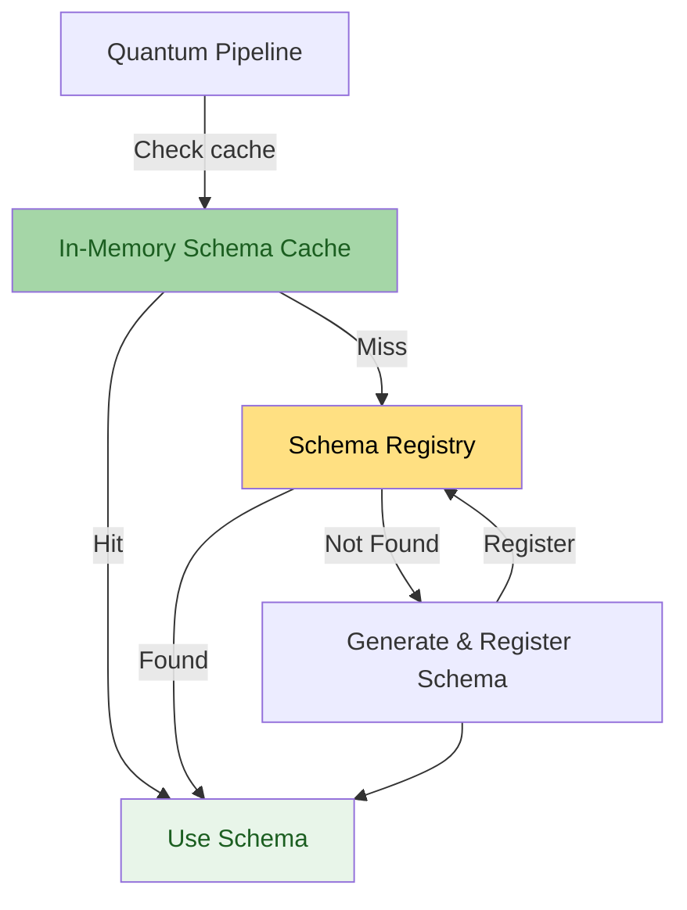
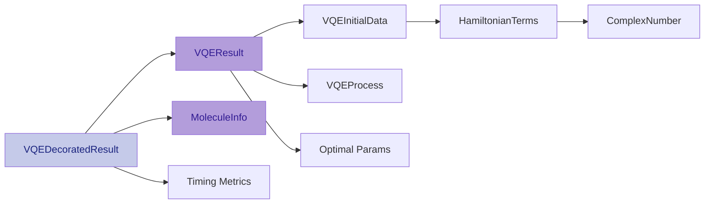

# Serialization

How VQE results are serialized, transmitted through Kafka, and stored.

## Overview

Quantum Pipeline uses Apache Avro for **wire serialization** between the
Python producer and Kafka. This is an important distinction from v1.x, where
Avro was treated as the end-to-end data format. In the current architecture:

- **On the wire** (Python producer -> Kafka): Avro, using the Confluent wire
  format with Schema Registry for serialization and deserialization.
- **At rest** (Garage S3): depends on which connector writes the data.
  Redpanda Connect (default) decodes Avro via `schema_registry_decode` and
  writes JSON. Kafka Connect with `AvroConverter` writes Avro directly.
- **Spark reads**: both formats.
  [`read_experiments_by_topic()`](https://codeberg.org/piotrkrzysztof/quantum-pipeline/src/branch/master/docker/airflow/scripts/quantum_incremental_processing.py#L75)
  tries Avro first, then falls back to JSON, so it works regardless of
  which connector produced the files.

The default setup uses Redpanda Connect, which decodes to JSON at rest. If you
need Avro end-to-end (for example, to take advantage of schema evolution on the
storage layer), you can [configure redpanda](https://docs.redpanda.com/redpanda-connect/components/processors/avro/)
or swap in the Kafka Connect alternative by running the compose
stack with `docker-compose.ml.kafka-connect.yaml` and `--scale redpanda-connect=0`.
That config uses the Confluent S3 sink with `AvroConverter`. The Spark processing
scripts handle both formats, so no downstream changes are needed.

For general Avro concepts, see the [Apache Avro specification](https://avro.apache.org/docs/current/specification/).

## Schema Registry

The Schema Registry implements a two-tier lookup with runtime generation as a
fallback:

Schemas are resolved through: in-memory cache first, then Confluent Schema
Registry. If neither has the schema, the interface class generates it at runtime
and registers it. See the
[Confluent Schema Registry documentation](https://docs.confluent.io/platform/current/schema-registry/)
for details on the registry API.

## Schema Structure

The top-level message is a
[`VQEDecoratedResult`](https://codeberg.org/piotrkrzysztof/quantum-pipeline/src/branch/master/quantum_pipeline/structures/vqe_observation.py#L64),
composed from nested types. Each type has its own Avro interface class in
[`stream/serialization/interfaces/vqe.py`](https://codeberg.org/piotrkrzysztof/quantum-pipeline/src/branch/master/quantum_pipeline/stream/serialization/interfaces/vqe.py).

### VQEDecoratedResult (top-level)

| Field | Type | Description |
|---|---|---|
| `vqe_result` | VQEResult | Nested simulation result |
| `molecule` | MoleculeInfo | Molecule geometry and metadata |
| `basis_set` | string | Basis set used (e.g., `sto3g`) |
| `hamiltonian_time` | double | Time to build Hamiltonian (seconds) |
| `mapping_time` | double | Time for Jordan-Wigner mapping (seconds) |
| `vqe_time` | double | Time for VQE optimization (seconds) |
| `total_time` | double | Total wall time (seconds) |
| `molecule_id` | int | Index of molecule in input file |
| `performance_start` | string (nullable) | System metrics snapshot at start |
| `performance_end` | string (nullable) | System metrics snapshot at end |

### VQEResult

| Field | Type | Description |
|---|---|---|
| `initial_data` | VQEInitialData | Backend, ansatz, initial parameters |
| `iteration_list` | array of VQEProcess | Per-iteration energy and parameters |
| `minimum` | double | Lowest energy found |
| `optimal_parameters` | array of double | Best parameter values |
| `maxcv` | double (nullable) | Maximum constraint violation |
| `minimization_time` | double | Optimization wall time (seconds) |
| `nuclear_repulsion_energy` | double (nullable) | Nuclear repulsion energy from PySCF |
| `success` | boolean (nullable) | Whether optimizer reported convergence |
| `nfev` | int (nullable) | Number of function evaluations |
| `nit` | int (nullable) | Number of optimizer iterations |

### VQEInitialData

| Field | Type | Description |
|---|---|---|
| `backend` | string | Simulator backend name |
| `num_qubits` | int | Number of qubits in circuit |
| `hamiltonian` | array of HamiltonianTerm | Pauli terms with complex coefficients |
| `num_parameters` | int | Number of ansatz parameters |
| `initial_parameters` | array of double | Starting parameter values |
| `optimizer` | string | Optimizer name (e.g., `L-BFGS-B`) |
| `ansatz` | string | QASM3 representation of ansatz circuit |
| `noise_backend` | string | Noise model backend (empty if none) |
| `default_shots` | int | Number of measurement shots |
| `ansatz_reps` | int | Ansatz repetition count |
| `init_strategy` | string (nullable) | `random` or `hf` |
| `seed` | int (nullable) | Random seed if set |
| `ansatz_name` | string (nullable) | Ansatz class name |

### VQEProcess (per-iteration)

| Field | Type | Description |
|---|---|---|
| `iteration` | int | Iteration number |
| `parameters` | array of double | Parameter values at this step |
| `result` | double | Energy at this step |
| `std` | double | Standard deviation of energy estimate |
| `energy_delta` | double (nullable) | Change from previous iteration |
| `parameter_delta_norm` | double (nullable) | L2 norm of parameter change |
| `cumulative_min_energy` | double (nullable) | Best energy seen so far |

### MoleculeInfo

| Field | Type | Description |
|---|---|---|
| `molecule_data.symbols` | array of string | Atomic symbols |
| `molecule_data.coords` | array of array of double | 3D coordinates |
| `molecule_data.multiplicity` | int | Spin multiplicity |
| `molecule_data.charge` | int | Molecular charge |
| `molecule_data.units` | string | Coordinate units |
| `molecule_data.masses` | array of double (nullable) | Atomic masses |

For the full Avro JSON schema definitions, see the interface classes in
[`stream/serialization/interfaces/vqe.py`](https://codeberg.org/piotrkrzysztof/quantum-pipeline/src/branch/master/quantum_pipeline/stream/serialization/interfaces/vqe.py#L436).

## Schema Evolution

The Schema Registry is set to **NONE** compatibility mode. This allows
unrestricted schema changes. On the wire, each message carries its schema ID in
the Confluent header, so consumers always know which version to use for
decoding.

When a field is added to a dataclass, the corresponding interface's schema
property is updated with a nullable default. This keeps older and newer messages
decodable by the same consumer.

!!! info "Kafka Connect"

    If you switch to the Kafka Connect path with Avro at rest, consider
    tightening compatibility to `BACKWARD` or `FULL` so that Spark can read
    files written with different schema versions without issues. With the
    default Redpanda Connect path (JSON at rest), `NONE` is sufficient. See the
    [Confluent Schema Evolution documentation](https://docs.confluent.io/platform/current/schema-registry/fundamentals/schema-evolution.html)
    for details on compatibility modes.

## Topic and Schema Naming

All VQE results go to a single Kafka topic: `experiment.vqe`. The schema is
registered under the subject `experiment.vqe-value` (the default
TopicNameStrategy).

Versions 1.x generated a separate topic per configuration, encoding molecule
ID, basis set, backend, and iteration count into the topic name. That made
consumer setup and topic management increasingly difficult as configurations
grew. The current single-topic approach keeps all results in one place.
Downstream filtering happens in Spark during feature extraction.

## Wire Format

Messages use the
[Confluent Wire Format](https://docs.confluent.io/platform/current/schema-registry/fundamentals/serdes-develop/index.html#wire-format):
a magic byte (`0x00`), a 4-byte schema ID, then the Avro binary payload.

**Producer side** -
[`to_avro_bytes()`](https://codeberg.org/piotrkrzysztof/quantum-pipeline/src/branch/master/quantum_pipeline/stream/serialization/interfaces/vqe.py#L86)
on `AvroInterfaceBase`:

1. Parses the schema dict into an Avro schema object
2. Writes the Confluent header (magic byte + 4-byte schema ID from the
   registry's `id_cache`)
3. Serializes the object using `DatumWriter` and `BinaryEncoder`

**Consumer side** - depends on the connector:

- **Redpanda Connect** (default): `schema_registry_decode` reads the schema ID,
  fetches the schema from the registry, decodes the payload, and writes JSON.
- **Kafka Connect**: `AvroConverter` handles decoding internally and the S3 sink
  writes Avro files directly.

## Type Conversion

Avro does not natively support NumPy types or complex numbers. The
[`AvroInterfaceBase`](https://codeberg.org/piotrkrzysztof/quantum-pipeline/src/branch/master/quantum_pipeline/stream/serialization/interfaces/vqe.py#L26)
handles conversion in both directions:

- **NumPy to Avro**:
  [`_convert_to_primitives()`](https://codeberg.org/piotrkrzysztof/quantum-pipeline/src/branch/master/quantum_pipeline/stream/serialization/interfaces/vqe.py#L56)
  converts `ndarray` to lists, NumPy ints/floats to Python native types.
- **Avro to NumPy**:
  [`_convert_to_numpy()`](https://codeberg.org/piotrkrzysztof/quantum-pipeline/src/branch/master/quantum_pipeline/stream/serialization/interfaces/vqe.py#L70)
  converts lists back to `ndarray`.
- **Complex numbers**: Hamiltonian coefficients are complex-valued.
  [`_serialize_hamiltonian()`](https://codeberg.org/piotrkrzysztof/quantum-pipeline/src/branch/master/quantum_pipeline/stream/serialization/interfaces/vqe.py#L235)
  splits each coefficient into `real` and `imaginary` fields.
  [`_deserialize_hamiltonian()`](https://codeberg.org/piotrkrzysztof/quantum-pipeline/src/branch/master/quantum_pipeline/stream/serialization/interfaces/vqe.py#L253)
  reconstructs `complex` values from these fields.

## References

- [Apache Avro Specification](https://avro.apache.org/docs/current/specification/)
- [Confluent Schema Registry](https://docs.confluent.io/platform/current/schema-registry/)
- [Schema Evolution and Compatibility](https://docs.confluent.io/platform/current/schema-registry/fundamentals/schema-evolution.html)
- [Confluent Wire Format](https://docs.confluent.io/platform/current/schema-registry/fundamentals/serdes-develop/index.html#wire-format)
