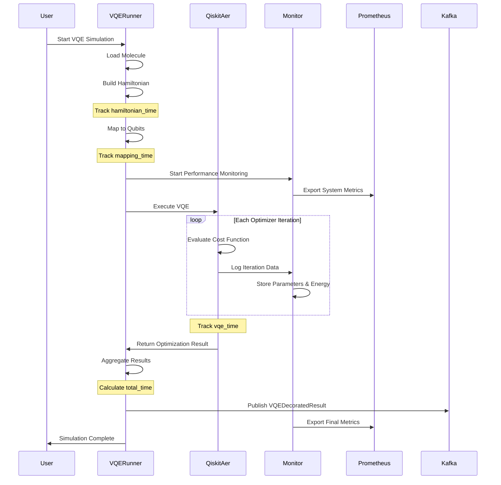
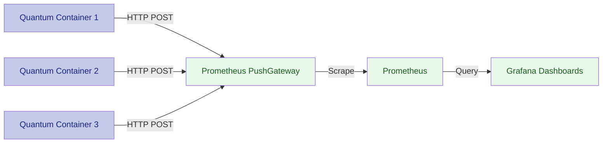
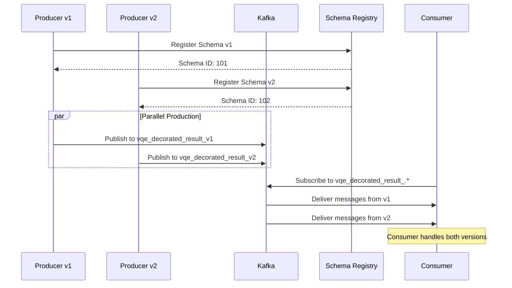
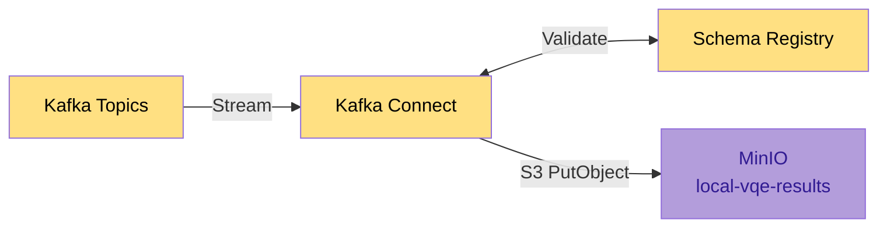
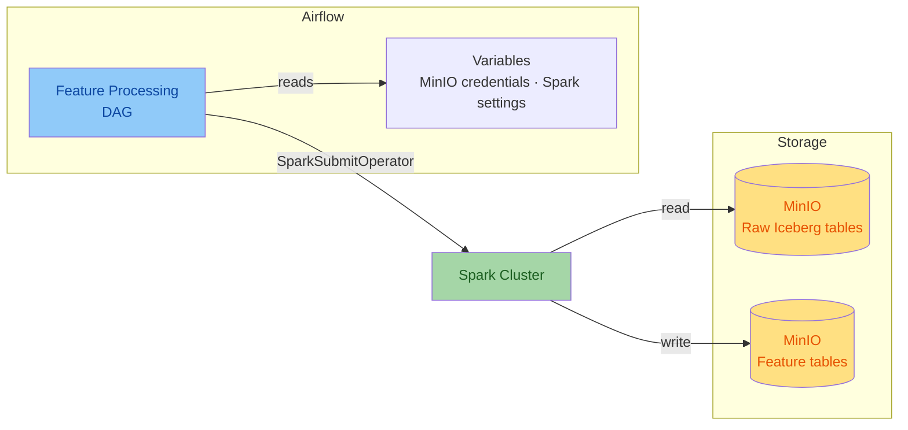
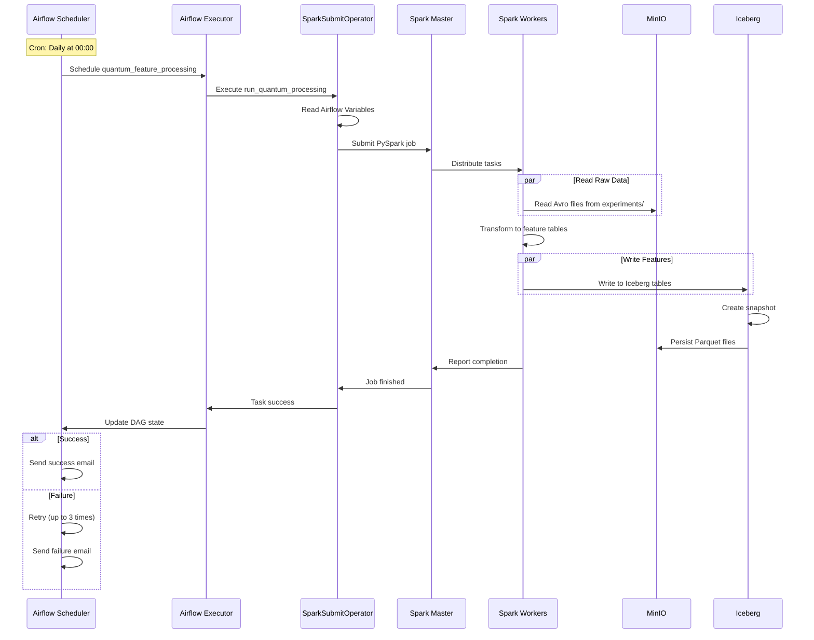
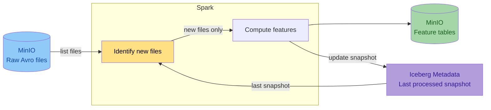
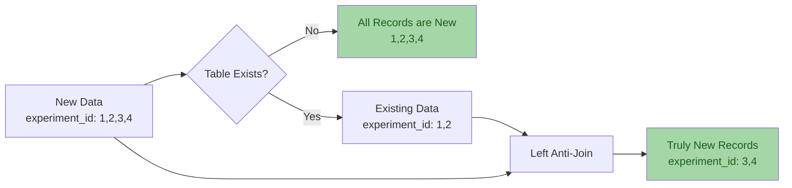
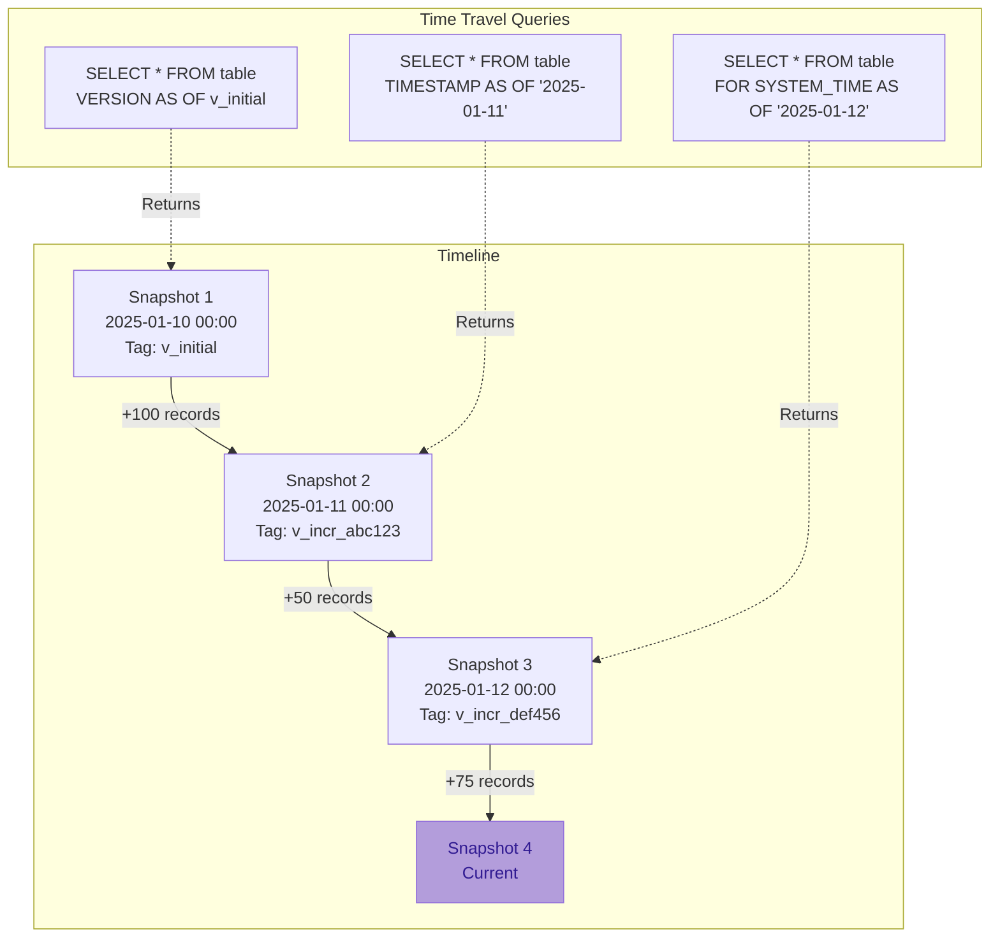

# System Design Documentation

## Overview

This chapter presents the architecture of the system designed for simulating and processing
Variational Quantum Eigensolver (VQE) algorithm results.

It consists of the following key components:

- Simulation module
- Apache Kafka message broker
- MinIO storage system
- Apache Airflow orchestrator
- Apache Spark processing engine (master-worker configuration with one worker)

Each component communicates with the others through a Docker container network,
ensuring isolation, consistency, and the ability to scale independently.
The architecture is based on the microservices pattern.


## Architecture Principles

The system follows several key architectural principles:

1. **Separation of Concerns**: Each component has a well-defined responsibility
2. **Loose Coupling**: Components communicate through well-defined interfaces
3. **Scalability**: Horizontal scaling capabilities for compute-intensive tasks
4. **Data Versioning**: Immutable data with schema evolution support
5. **Incremental Processing**: Only process new data to optimize resources
6. **Observability**: Comprehensive monitoring and metrics collection

---

## 1. Quantum Simulation Module

### Overview

The main simulation module prepares data for simulation and executes VQE simulations using the Qiskit
Aer simulator. The system was designed with the capability to integrate with real quantum computers via
IBM Quantum, but due to access costs, only the simulator is extensively tested and used in this project.

The VQE algorithm is monitored during execution - data is collected from each optimizer iteration,
execution times for individual stages, and information about the molecule and the basis set used.

Each simulation module container also exports system metrics (CPU and RAM usage) to Prometheus PushGateway,
enabling resource monitoring in a containerized environment.

### VQE Execution Pipeline



### Data Collection During Execution

All collected data are aggregated into a single result object, which size depends on the problem
complexity and the number of algorithm iterations.

The monitoring system collects:

- **Iteration Data**: Parameters, energy values, and standard deviation for each optimizer step
- **Timing Information**:
    - `hamiltonian_time`: Time to construct the molecular Hamiltonian
    - `mapping_time`: Time to map fermionic operators to qubit operators
    - `vqe_time`: VQE optimization execution time
    - `total_time`: Total simulation time
- **Molecule Information**: Atomic symbols, coordinates, charge, multiplicity, basis set
- **System Metrics**: CPU usage, memory consumption, container resource utilization

### VQEDecoratedResult Interface

The implementation uses Apache Avro as the data serialization format.

`VQEDecoratedResultInterface` class is responsible for serialization, deserialization, and managing
the data schema in the schema registry.

This separation of responsibilities ensures data format consistency between different system components.
Long term planned is migration to a more readable and less cluttered Pydantic structure.

```python
class VQEDecoratedResultInterface(AvroInterfaceBase[VQEDecoratedResult]):
    def __init__(self, registry):
        super().__init__(registry)
        self.result_interface = VQEResultInterface(self.registry)
        self.molecule_interface = MoleculeInfoInterface(self.registry)
        self.schema_name = 'vqe_decorated_result'

    @property
    def schema(self) -> dict[str, Any]:
        try:
            return self.registry.get_schema(self.schema_name)
        except FileNotFoundError:
            schema = {
                'type': 'record',
                'name': 'VQEDecoratedResult',
                'fields': [
                    {'name': 'vqe_result', 'type': self.result_interface.schema},
                    {'name': 'molecule', 'type': self.molecule_interface.schema},
                    {'name': 'basis_set', 'type': 'string'},
                    {'name': 'hamiltonian_time', 'type': 'double'},
                    {'name': 'mapping_time', 'type': 'double'},
                    {'name': 'vqe_time', 'type': 'double'},
                    {'name': 'total_time', 'type': 'double'},
                    {'name': 'molecule_id', 'type': 'int'},
                ],
            }
            dict_schema = deepcopy(schema)
            self.registry.save_schema(self.schema_name, schema)
            return dict_schema

    def serialize(self, obj: VQEDecoratedResult) -> dict[str, Any]:
        return {
            'vqe_result': self.result_interface.serialize(obj.vqe_result),
            'molecule': self.molecule_interface.serialize(obj.molecule),
            'basis_set': obj.basis_set,
            'hamiltonian_time': float(obj.hamiltonian_time),
            'mapping_time': float(obj.mapping_time),
            'vqe_time': float(obj.vqe_time),
            'total_time': float(obj.total_time),
            'molecule_id': obj.molecule_id,
        }

    def deserialize(self, data: dict[str, Any]) -> VQEDecoratedResult:
        return VQEDecoratedResult(
            vqe_result=self.result_interface.deserialize(data['vqe_result']),  # Simulation results - including each iteration
            molecule=self.molecule_interface.deserialize(data['molecule']),    # Information about simulated molecule
            basis_set=data['basis_set'],                                       # Basis set - determines simulation accuracy
            hamiltonian_time=float64(data['hamiltonian_time']),                # Time to build Hamiltonian operator
            mapping_time=float64(data['mapping_time']),                        # Mapping time
            vqe_time=float64(data['vqe_time']),                                # VQE algorithm simulation time
            total_time=float64(data['total_time']),                            # Total simulation time
            molecule_id=int(data['molecule_id']),                              # Molecule identifier
        )
```

### Schema Structure Breakdown

!!! info "Nested Schema Architecture"
    The `VQEDecoratedResult` schema uses a **compositional design pattern**, where
    complex types are built from simpler nested schemas.

#### Top-Level Schema: VQEDecoratedResult

| Field | Type | Description |
|-------|------|-------------|
| `vqe_result` | VQEResult (nested) | Complete VQE optimization results |
| `molecule` | MoleculeInfo (nested) | Molecular structure information |
| `basis_set` | string | Basis set used (e.g., "sto-3g", "cc-pvdz") |
| `hamiltonian_time` | double | Hamiltonian construction time (seconds) |
| `mapping_time` | double | Fermionic-to-qubit mapping time (seconds) |
| `vqe_time` | double | VQE optimization execution time (seconds) |
| `total_time` | double | Total end-to-end execution time (seconds) |
| `molecule_id` | int | Unique molecule identifier |

#### VQEResult Schema

| Field | Type | Description |
|-------|------|-------------|
| `initial_data` | VQEInitialData (nested) | Initial configuration and parameters |
| `iteration_list` | array&lt;VQEProcess&gt; | Complete iteration history |
| `minimum` | double | Minimum energy found (Hartree) |
| `optimal_parameters` | array&lt;double&gt; | Optimal circuit parameters |
| `maxcv` | double (nullable) | Maximum constraint violation |
| `minimization_time` | double | Optimizer execution time (seconds) |

#### VQEInitialData Schema

| Field | Type | Description |
|-------|------|-------------|
| `backend` | string | Qiskit backend name (e.g., "aer_simulator") |
| `num_qubits` | int | Number of qubits in circuit |
| `hamiltonian` | array&lt;HamiltonianTerm&gt; | Pauli operator terms with coefficients |
| `num_parameters` | int | Number of variational parameters |
| `initial_parameters` | array&lt;double&gt; | Starting parameter values |
| `optimizer` | string | Optimizer name (e.g., "L-BFGS-B") |
| `ansatz` | string | QASM3 representation of circuit |
| `ansatz_reps` | int | Number of ansatz repetitions |
| `noise_backend` | string | Noise model configuration |
| `default_shots` | int | Number of measurement shots |

#### VQEProcess Schema (Iteration Data)

| Field | Type | Description |
|-------|------|-------------|
| `iteration` | int | Iteration number |
| `parameters` | array&lt;double&gt; | Parameter values at this iteration |
| `result` | double | Energy value (Hartree) |
| `std` | double | Standard deviation of measurement |

#### MoleculeInfo Schema

| Field | Type | Description |
|-------|------|-------------|
| `symbols` | array&lt;string&gt; | Atomic symbols (e.g., ["H", "H"]) |
| `coords` | array&lt;array&lt;double&gt;&gt; | 3D coordinates (Angstrom or Bohr) |
| `multiplicity` | int | Spin multiplicity |
| `charge` | int | Total molecular charge |
| `units` | string | Coordinate units ("angstrom" or "bohr") |
| `masses` | array&lt;double&gt; (nullable) | Atomic masses (amu) |

#### HamiltonianTerm Schema

| Field | Type | Description |
|-------|------|-------------|
| `label` | string | Pauli string (e.g., "XYZI", "IIZZ") |
| `coefficients` | ComplexNumber | Complex coefficient |

#### ComplexNumber Schema

| Field | Type | Description |
|-------|------|-------------|
| `real` | double | Real component |
| `imaginary` | double | Imaginary component |

### Serialization Details

!!! tip "Type Conversion Strategy"
    The Avro interface handles automatic conversion between Python/NumPy types and Avro-compatible primitives:

    - `numpy.float64` -> `double`
    - `numpy.int64` -> `long` / `int`
    - `numpy.ndarray` -> `array<T>`
    - Complex numbers -> `{real: double, imaginary: double}`

### Binary Serialization with Schema Registry

After serialization, data is transmitted to Apache Kafka. The serialization process includes:

1. **Schema Registration**: Schema is registered with Confluent Schema Registry
2. **Magic Byte Prefix**: Binary data starts with `0x00` (Confluent wire format)
3. **Schema ID**: 4-byte big-endian schema identifier
4. **Avro Binary Data**: Compact binary-encoded payload

```python
def to_avro_bytes(self, obj: T, schema_name: str = 'vqe_decorated_result') -> bytes:
    """Convert object to Avro binary format."""
    schema = self.schema
    parsed_schema = avro.schema.parse(json.dumps(schema))

    writer = DatumWriter(parsed_schema)
    bytes_writer = io.BytesIO()

    # Write Confluent Schema Registry header
    bytes_writer.write(bytes([0]))  # Magic byte
    bytes_writer.write(self.registry.id_cache[schema_name].to_bytes(4, byteorder='big'))

    encoder = BinaryEncoder(bytes_writer)
    writer.write(self.serialize(obj), encoder)
    return bytes_writer.getvalue()
```

### Container Metrics Export

Each simulation container exports metrics to Prometheus PushGateway:



**Exported Metrics:**

- `quantum_system_cpu_percent`: CPU utilization percentage
- `quantum_system_memory_percent`: Memory utilization percentage
- `quantum_vqe_total_time`: Total VQE execution time
- `quantum_vqe_minimum_energy`: Minimum energy value found
- `quantum_vqe_iterations_count`: Number of optimizer iterations

---

## 2. Apache Kafka Integration

### Schema Registry Automatic Versioning

The Schema Registry provides several key capabilities:

1. **Automatic Version Management**: Each schema change creates a new version
2. **Compatibility Mode**: Currently set to `NONE` (unrestricted changes in development)
3. **Schema Evolution**: Supports adding/removing fields with default values
4. **Centralized Schema Store**: Single source of truth for data structures

!!! warning "Schema Compatibility Modes"
    The system uses `NONE` compatibility mode in the connector configuration, allowing unrestricted schema evolution. In production systems, consider using:

    - `BACKWARD`: New schema can read old data
    - `FORWARD`: Old schema can read new data
    - `FULL`: Both backward and forward compatible

### Kafka Configuration Parameters

=== "Producer Configuration"

    ```python
    @dataclass
    class ProducerConfig:
        servers: str          # Kafka bootstrap servers
        topic: str            # Target topic name
        security: SecurityConfig
        retries: int = 3      # Application-level retries
        retry_delay: int = 2  # Delay between retries (seconds)
        kafka_retries: int = 5  # Kafka internal retries
        acks: str = 'all'     # Acknowledgment level
        timeout: int = 10     # Producer timeout (seconds)
    ```

=== "Kafka Cluster"

    Kafka runs in **KRaft mode**.

    ```yaml
    kafka:
      image: bitnami/kafka:latest
      environment:
        - KAFKA_CFG_NODE_ID=0
        - KAFKA_CFG_PROCESS_ROLES=controller,broker
        - KAFKA_CFG_CONTROLLER_QUORUM_VOTERS=0@kafka:9093
        - KAFKA_CFG_LISTENERS=PLAINTEXT://kafka:9092,CONTROLLER://:9093,EXTERNAL://0.0.0.0:9094
        - KAFKA_CFG_ADVERTISED_LISTENERS=PLAINTEXT://kafka:9092,EXTERNAL://localhost:9094
        - KAFKA_CFG_LISTENER_SECURITY_PROTOCOL_MAP=CONTROLLER:PLAINTEXT,PLAINTEXT:PLAINTEXT,EXTERNAL:PLAINTEXT
        - KAFKA_CFG_CONTROLLER_LISTENER_NAMES=CONTROLLER
        - KAFKA_CFG_INTER_BROKER_LISTENER_NAME=PLAINTEXT
    ```

=== "Schema Registry"

    ```yaml
    schema-registry:
      image: confluentinc/cp-schema-registry:7.5.0
      environment:
        SCHEMA_REGISTRY_HOST_NAME: schema-registry
        SCHEMA_REGISTRY_KAFKASTORE_BOOTSTRAP_SERVERS: 'kafka:9092'
        SCHEMA_REGISTRY_LISTENERS: 'http://0.0.0.0:8081'
        SCHEMA_REGISTRY_SCHEMA_COMPATIBILITY_LEVEL: 'none'
    ```

### Parallel Version Support

Allows multiple versions of the simulation module to run in parallel (e.g., when testing new functionality)
without the risk of data structure conflicts. Kafka buffers results from multiple parallel simulator instances,
ensuring transmission reliability in case of temporary consumer unavailability.



**Use Cases:**

1. **A/B Testing**: Run different algorithm configurations simultaneously
2. **Blue-Green Deployments**: Deploy new version without stopping old one
3. **Canary Releases**: Gradually roll out schema changes
4. **Development/Production Isolation**: Separate topics for different environments

---

## 3. MinIO Integration

### S3-Compatible Object Storage

For persistent data storage, the system uses MinIO - an object storage compatible with the Amazon S3 API. Data is automatically transferred from Kafka to MinIO using the Kafka Connect S3 Sink connector.



### Kafka Connect S3 Sink Connector Configuration

The following configuration defines how data is stored, the serialization format, and connection parameters to MinIO:

```json
{
  "name": "minio-sink",
  "config": {
    "connector.class": "io.confluent.connect.s3.S3SinkConnector",
    "tasks.max": "1",

    "topics.regex": "vqe_decorated_result_.*",
    "refresh.topics.enabled": "true",

    "topics.dir": "experiments",
    "directory.delim": "/",

    "s3.bucket.name": "local-vqe-results",
    "store.url": "http://minio:9000",
    "s3.region": "us-east-1",
    "s3.path.style.access": "true",
    "s3.access.key.id": "admin",
    "s3.secret.access.key": "admin123",
    "s3.part.size": "5242880",
    "s3.retry.backoff.ms": "1000",

    "flush.size": "1",
    "schema.compatibility": "NONE",
    "storage.class": "io.confluent.connect.s3.storage.S3Storage",
    "format.class": "io.confluent.connect.s3.format.avro.AvroFormat",

    "key.converter": "io.confluent.connect.avro.AvroConverter",
    "value.converter": "io.confluent.connect.avro.AvroConverter",
    "key.converter.schema.registry.url": "http://schema-registry:8081",
    "value.converter.schema.registry.url": "http://schema-registry:8081",

    "errors.tolerance": "all",
    "errors.log.enable": "true",
    "errors.log.include.messages": "true"
  }
}
```

!!! note "Connector Configuration Details"
    For detailed S3 Sink connector parameter documentation, see the [Confluent S3 Sink Connector docs](https://docs.confluent.io/kafka-connectors/s3-sink/current/overview.html). Key project-specific choices: `flush.size: 1` for immediate write-through, `schema.compatibility: NONE` for unrestricted schema evolution, and `s3.path.style.access: true` required for MinIO.

### Directory Structure in MinIO

The connector creates the following directory structure:

```
s3://local-vqe-results/
└── experiments/
    ├── vqe_decorated_result_v1/
    │   ├── partition=0/
    │   │   ├── vqe_decorated_result_v1+0+0000000000.avro
    │   │   ├── vqe_decorated_result_v1+0+0000000001.avro
    │   │   └── vqe_decorated_result_v1+0+0000000002.avro
    │   ├── partition=1/
    │   │   └── vqe_decorated_result_v1+1+0000000000.avro
    │   └── partition=2/
    │       └── vqe_decorated_result_v1+2+0000000000.avro
    └── vqe_decorated_result_v2/
        ├── partition=0/
        │   └── vqe_decorated_result_v2+0+0000000000.avro
        └── partition=1/
            └── vqe_decorated_result_v2+1+0000000000.avro
```

**File Naming Convention:**

```
{topic_name}+{partition}+{start_offset}.avro
```

Example: `vqe_decorated_result_v1+0+0000000000.avro`

- Topic: `vqe_decorated_result_v1`
- Partition: `0`
- Start Offset: `0000000000`

<figure>
  
  <figcaption>Figure 3. MinIO object storage browser displaying stored VQE results for the LiH molecule.</figcaption>
</figure>

### Data Consistency Guarantees

The connector configuration ensures data consistency through:

| Feature | Configuration | Guarantee |
|---------|---------------|-----------|
| **Exactly-Once Semantics** | `enable.idempotence: true` (producer) | No duplicate writes |
| **Durability** | `acks: all` (producer) | Data persisted to all replicas |
| **Error Handling** | `errors.tolerance: all` | Failed messages logged but processing continues |
| **Schema Validation** | Schema Registry integration | Only valid messages written to MinIO |

---

## 4. Apache Airflow Orchestration

### Workflow Orchestration

Apache Airflow orchestrates the data processing workflow by managing the processing schedule. In this project, Airflow runs a daily incremental processing task (`schedule_interval=timedelta(days=1)`) that delegates computations to Apache Spark.



### DAG Definition

The DAG (Directed Acyclic Graph) defines the task for processing quantum experiment results into ML features:

```python
with DAG(
    'quantum_feature_processing',
    default_args={**default_args, 'retries': 3, 'retry_delay': timedelta(minutes=20)},
    description='Process quantum experiment data into ML feature tables',
    schedule_interval=timedelta(days=1),
    start_date=datetime(2025, 1, 1),
    catchup=False,
    tags=['quantum', 'ML', 'features', 'processing', 'Apache Spark'],
    on_success_callback=send_success_email,
) as dag:
    quantum_simulation_results_processing = SparkSubmitOperator(
        task_id='run_quantum_processing',
        application='/opt/airflow/dags/scripts/quantum_incremental_processing.py',
        conn_id='spark_default',
        name='quantum_feature_processing',
        conf={
            'spark.master': Variable.get('SPARK_MASTER'),
            'spark.app.name': Variable.get('APP_NAME'),
            'spark.hadoop.fs.s3a.endpoint': Variable.get('S3_ENDPOINT'),
            'spark.hadoop.fs.s3a.access.key': Variable.get('MINIO_ACCESS_KEY'),
            'spark.hadoop.fs.s3a.secret.key': Variable.get('MINIO_SECRET_KEY'),
            'spark.hadoop.fs.s3a.path.style.access': 'true',
            'spark.hadoop.fs.s3a.connection.ssl.enabled': 'false',
            'spark.jars.packages': (
                'org.slf4j:slf4j-api:2.0.17,'
                'commons-codec:commons-codec:1.18.0,'
                'com.google.j2objc:j2objc-annotations:3.0.0,'
                'org.apache.spark:spark-avro_2.12:3.5.5,'
                'org.apache.hadoop:hadoop-aws:3.3.1,'
                'org.apache.hadoop:hadoop-common:3.3.1,'
                'org.apache.iceberg:iceberg-spark-runtime-3.5_2.12:1.4.2'
            ),
        },
        env_vars={
            'MINIO_ACCESS_KEY': Variable.get('MINIO_ACCESS_KEY'),
            'MINIO_SECRET_KEY': Variable.get('MINIO_SECRET_KEY'),
            'S3_ENDPOINT': Variable.get('S3_ENDPOINT'),
            'S3_BUCKET': Variable.get('S3_BUCKET'),
            'S3_WAREHOUSE': Variable.get('S3_WAREHOUSE'),
            'SPARK_MASTER': Variable.get('SPARK_MASTER'),
        },
        verbose=True,
    )
```

The DAG runs daily with `catchup=False` (no backfill), retries up to 3 times with 20-minute delays, and sends email notifications on success/failure. For Airflow scheduling and retry configuration details, see the [Apache Airflow docs](https://airflow.apache.org/docs/apache-airflow/stable/index.html).

The `SparkSubmitOperator` delegates to the Spark cluster. All connection parameters (MinIO credentials, Spark master URL, S3 endpoints) are managed through Airflow Variables, initialized from `DEFAULT_CONFIG` defaults and environment variables.

**Default Configuration Values:**

```python
DEFAULT_CONFIG = {
    'S3_ENDPOINT': 'http://minio:9000',
    'SPARK_MASTER': 'spark://spark-master:7077',
    'S3_BUCKET': 's3a://local-vqe-results/experiments/',
    'S3_WAREHOUSE': 's3a://local-features/warehouse/',
    'APP_NAME': 'Quantum Pipeline Feature Processing',
}
```

### DAG Execution Flow



The Airflow web UI is accessible at `http://airflow:8084` for monitoring DAG execution, task status, and logs.

<figure>
  
  <figcaption>Figure 2. Apache Airflow DAG view for the quantum feature processing workflow.</figcaption>
</figure>

---

## 5. Incremental Processing

### Overview

The system implements **incremental processing**, meaning that only new data since the last run is processed. This eliminates the need to repeatedly process the same results and significantly reduces execution time and computational resource usage.

Apache Iceberg provides a mechanism for tracking the state of processed data through a metadata layer. Iceberg stores information about data snapshots, enabling Spark to efficiently detect which files in MinIO have already been processed and which are new.



### 6-Step Processing Workflow

The incremental processing workflow consists of the following steps:

#### Step 1: Create Spark Session with MinIO Configuration

```python
def create_spark_session(config=None):
    """Create and configure a Spark session with Iceberg and S3 support."""
    if config is None:
        config = DEFAULT_CONFIG

    validate_environment()

    access_key = os.environ.get('MINIO_ACCESS_KEY')
    secret_key = os.environ.get('MINIO_SECRET_KEY')

    return (
        SparkSession.builder
        .appName(config.get('APP_NAME'))
        .master(config.get('SPARK_MASTER'))
        .config('spark.jars.packages', (
            'org.apache.spark:spark-avro_2.12:3.5.5,'
            'org.apache.hadoop:hadoop-aws:3.3.1,'
            'org.apache.iceberg:iceberg-spark-runtime-3.5_2.12:1.4.2'
        ))
        .config('spark.sql.extensions',
                'org.apache.iceberg.spark.extensions.IcebergSparkSessionExtensions')
        .config('spark.sql.catalog.quantum_catalog',
                'org.apache.iceberg.spark.SparkCatalog')
        .config('spark.sql.catalog.quantum_catalog.type', 'hadoop')
        .config('spark.sql.catalog.quantum_catalog.warehouse',
                config.get('S3_WAREHOUSE'))
        .config('spark.hadoop.fs.s3a.impl',
                'org.apache.hadoop.fs.s3a.S3AFileSystem')
        .config('spark.hadoop.fs.s3a.access.key', access_key)
        .config('spark.hadoop.fs.s3a.secret.key', secret_key)
        .config('spark.hadoop.fs.s3a.endpoint', config.get('S3_ENDPOINT'))
        .config('spark.hadoop.fs.s3a.path.style.access', 'true')
        .config('spark.hadoop.fs.s3a.connection.ssl.enabled', 'false')
        .config('spark.sql.adaptive.enabled', 'true')
        .config('spark.sql.shuffle.partitions', '200')
        .getOrCreate()
    )
```

The session configures the `quantum_catalog` Iceberg catalog backed by a Hadoop warehouse on MinIO (`s3a://local-features/warehouse/`), with adaptive query execution enabled and 200 shuffle partitions.

#### Step 2: Initialize or Read Iceberg Metadata

```python
def list_available_topics(spark, bucket_path):
    """List available topics from the storage."""
    fs = spark._jvm.org.apache.hadoop.fs.FileSystem.get(
        spark._jvm.java.net.URI.create(bucket_path),
        spark._jsc.hadoopConfiguration()
    )

    path = spark._jvm.org.apache.hadoop.fs.Path(bucket_path)

    if fs.exists(path) and fs.isDirectory(path):
        return [f.getPath().getName() for f in fs.listStatus(path) if f.isDirectory()]
    return []
```

**Iceberg Metadata Structure:**

```
s3a://local-features/warehouse/
└── quantum_features/
    ├── vqe_results/
    │   ├── metadata/
    │   │   ├── v1.metadata.json
    │   │   ├── v2.metadata.json
    │   │   ├── snap-1234567890.avro
    │   │   └── snap-1234567891.avro
    │   └── data/
    │       ├── part-00000.parquet
    │       └── part-00001.parquet
    └── vqe_iterations/
        ├── metadata/
        └── data/
```

#### Step 3: Filter Data - Select Only New Files

```python
def identify_new_records(spark, new_data_df, table_name, key_columns):
    """
    Identifies records in new_data_df that don't exist in the target table.
    Uses DataFrame operations for better performance.
    """
    # If table does not exist, every record is new
    if not spark.catalog.tableExists(f'quantum_catalog.quantum_features.{table_name}'):
        return new_data_df

    # Retrieve existing keys
    existing_keys = spark.sql(
        f'SELECT DISTINCT {", ".join(key_columns)} '
        f'FROM quantum_catalog.quantum_features.{table_name}'
    )

    # If table exists but has no records - return all records
    if existing_keys.isEmpty():
        return new_data_df

    # Anti-join to find new records
    new_with_marker = new_data_df.select(*key_columns).distinct().withColumn('is_new', lit(1))
    existing_with_marker = existing_keys.withColumn('exists', lit(1))

    joined = new_with_marker.join(existing_with_marker, on=key_columns, how='left')
    new_keys = joined.filter(col('exists').isNull()).select(*key_columns)

    # Join back to get full records
    truly_new_data = new_data_df.join(new_keys, on=key_columns, how='inner')

    return truly_new_data
```

**Deduplication Logic:**



#### Step 4: Process Data - Extract Features

```python
def transform_quantum_data(df):
    """Transforms the original quantum data into various feature tables."""
    base_df = add_metadata_columns(df, 'quantum_base_processing')

    # Extract nested fields
    base_df = base_df.select(
        col('experiment_id'),
        col('molecule_id'),
        col('basis_set'),
        col('vqe_result.initial_data').alias('initial_data'),
        col('vqe_result.iteration_list').alias('iteration_list'),
        col('vqe_result.minimum').alias('minimum_energy'),
        # ... more fields
    )

    # Create specialized feature tables
    return {
        'molecules': extract_molecule_features(base_df),
        'vqe_results': extract_vqe_features(base_df),
        'vqe_iterations': extract_iteration_features(base_df),
        'hamiltonian_terms': extract_hamiltonian_features(base_df),
        # ... 9 total feature tables
    }
```

**Feature Table Transformations:**

=== "Molecules Table"

    ```python
    df_molecule = base_df.select(
        col('experiment_id'),
        col('molecule_id'),
        col('molecule_data.symbols').alias('atom_symbols'),
        col('molecule_data.coords').alias('coordinates'),
        col('molecule_data.multiplicity').alias('multiplicity'),
        col('molecule_data.charge').alias('charge'),
        col('processing_timestamp'),
        col('processing_date'),
    )
    ```

=== "VQE Results Table"

    ```python
    df_vqe = base_df.select(
        col('experiment_id'),
        col('molecule_id'),
        col('basis_set'),
        col('initial_data.backend').alias('backend'),
        col('initial_data.num_qubits').alias('num_qubits'),
        col('initial_data.optimizer').alias('optimizer'),
        col('minimum_energy'),
        size(col('iteration_list')).alias('total_iterations'),
        col('processing_date'),
    )
    ```

=== "Iterations Table"

    ```python
    df_iterations = base_df.select(
        col('experiment_id'),
        explode(col('iteration_list')).alias('iteration'),
    ).select(
        col('experiment_id'),
        col('iteration.iteration').alias('iteration_step'),
        col('iteration.result').alias('iteration_energy'),
        col('iteration.std').alias('energy_std_dev'),
    )
    ```

#### Step 5: Write Processed Data in Parquet Format

```python
def process_incremental_data(spark, new_data_df, table_name, key_columns,
                             partition_columns=None, comment=None):
    """Process the data incrementally - only data that wasn't processed yet."""

    # Check if table exists
    table_exists = spark.catalog._jcatalog.tableExists(
        f'quantum_catalog.quantum_features.{table_name}'
    )

    if not table_exists:
        # Create new table
        writer = new_data_df.write.format('iceberg').option('write-format', 'parquet')

        if partition_columns:
            writer = writer.partitionBy(*partition_columns)

        writer.mode('overwrite').saveAsTable(
            f'quantum_catalog.quantum_features.{table_name}'
        )
    else:
        # Append only new records
        truly_new_data = identify_new_records(spark, new_data_df, table_name, key_columns)

        if truly_new_data.count() == 0:
            return None, 0

        truly_new_data.write.format('iceberg') \
            .option('write-format', 'parquet') \
            .mode('append') \
            .saveAsTable(f'quantum_catalog.quantum_features.{table_name}')

    return version_tag, record_count
```

Data is written in [Parquet](https://parquet.apache.org/) columnar format via Iceberg.

#### Step 6: Update Iceberg Metadata - Create New Snapshot

```python
# Create a tag for this version of the table
snapshot_id = spark.sql(
    f'SELECT snapshot_id FROM quantum_catalog.quantum_features.{table_name}.snapshots '
    f'ORDER BY committed_at DESC LIMIT 1'
).collect()[0][0]

processing_batch_id = new_data_df.limit(1).collect()[0]['processing_batch_id'].replace('-', '')
version_tag = f'v_{processing_batch_id}'

spark.sql(f"""
    ALTER TABLE quantum_catalog.quantum_features.{table_name}
    CREATE TAG {version_tag} AS OF VERSION {snapshot_id}
""")
```

**Iceberg Snapshot Management:**



**Time-Travel Queries:**

```sql
-- Query data as of specific snapshot
SELECT * FROM quantum_catalog.quantum_features.vqe_results
VERSION AS OF 'v_incr_abc123';

-- Query data at specific timestamp
SELECT * FROM quantum_catalog.quantum_features.vqe_results
TIMESTAMP AS OF '2025-01-11 12:00:00';

-- Compare snapshots
SELECT current.*, previous.*
FROM quantum_catalog.quantum_features.vqe_results FOR SYSTEM_VERSION AS OF 12345 AS current
JOIN quantum_catalog.quantum_features.vqe_results FOR SYSTEM_VERSION AS OF 12344 AS previous
ON current.experiment_id = previous.experiment_id
WHERE current.minimum_energy != previous.minimum_energy;
```

### Feature Tables Schema

The system creates 9 specialized feature tables:

=== "1. molecules"

    **Purpose:** Molecular structure information

    | Column | Type | Description |
    |--------|------|-------------|
    | experiment_id | string | Unique experiment identifier |
    | molecule_id | int | Molecule identifier |
    | atom_symbols | array&lt;string&gt; | Chemical symbols |
    | coordinates | array&lt;array&lt;double&gt;&gt; | 3D coordinates |
    | multiplicity | int | Spin multiplicity |
    | charge | int | Molecular charge |
    | coordinate_units | string | Units (angstrom/bohr) |
    | atomic_masses | array&lt;double&gt; | Atomic masses |

    **Partitioning:** `processing_date`

=== "2. ansatz_info"

    **Purpose:** Quantum circuit ansatz configurations

    | Column | Type | Description |
    |--------|------|-------------|
    | experiment_id | string | Unique experiment identifier |
    | molecule_id | int | Molecule identifier |
    | basis_set | string | Basis set (sto-3g, etc.) |
    | ansatz | string | QASM3 circuit representation |
    | ansatz_reps | int | Number of repetitions |

    **Partitioning:** `processing_date`, `basis_set`

=== "3. performance_metrics"

    **Purpose:** Execution timing and performance

    | Column | Type | Description |
    |--------|------|-------------|
    | experiment_id | string | Unique experiment identifier |
    | molecule_id | int | Molecule identifier |
    | basis_set | string | Basis set |
    | hamiltonian_time | double | Hamiltonian build time (s) |
    | mapping_time | double | Mapping time (s) |
    | vqe_time | double | VQE execution time (s) |
    | total_time | double | Total time (s) |
    | minimization_time | double | Optimizer time (s) |

    **Partitioning:** `processing_date`, `basis_set`

=== "4. vqe_results"

    **Purpose:** VQE optimization results

    | Column | Type | Description |
    |--------|------|-------------|
    | experiment_id | string | Unique experiment identifier |
    | molecule_id | int | Molecule identifier |
    | basis_set | string | Basis set |
    | backend | string | Qiskit backend |
    | num_qubits | int | Number of qubits |
    | optimizer | string | Optimizer algorithm |
    | minimum_energy | double | Ground state energy (Ha) |
    | total_iterations | int | Number of iterations |

    **Partitioning:** `processing_date`, `basis_set`, `backend`

=== "5. initial_parameters"

    **Purpose:** Initial variational parameters

    | Column | Type | Description |
    |--------|------|-------------|
    | parameter_id | string | Unique parameter identifier |
    | experiment_id | string | Experiment identifier |
    | molecule_id | int | Molecule identifier |
    | parameter_index | int | Parameter position |
    | initial_parameter_value | double | Initial value |

    **Partitioning:** `processing_date`, `basis_set`

=== "6. optimal_parameters"

    **Purpose:** Optimized variational parameters

    | Column | Type | Description |
    |--------|------|-------------|
    | parameter_id | string | Unique parameter identifier |
    | experiment_id | string | Experiment identifier |
    | molecule_id | int | Molecule identifier |
    | parameter_index | int | Parameter position |
    | optimal_parameter_value | double | Optimized value |

    **Partitioning:** `processing_date`, `basis_set`

=== "7. vqe_iterations"

    **Purpose:** Per-iteration optimization data

    | Column | Type | Description |
    |--------|------|-------------|
    | iteration_id | string | Unique iteration identifier |
    | experiment_id | string | Experiment identifier |
    | molecule_id | int | Molecule identifier |
    | iteration_step | int | Iteration number |
    | iteration_energy | double | Energy at this step (Ha) |
    | energy_std_dev | double | Standard deviation |

    **Partitioning:** `processing_date`, `basis_set`, `backend`

=== "8. iteration_parameters"

    **Purpose:** Parameters at each iteration

    | Column | Type | Description |
    |--------|------|-------------|
    | parameter_id | string | Unique parameter identifier |
    | iteration_id | string | Iteration identifier |
    | experiment_id | string | Experiment identifier |
    | iteration_step | int | Iteration number |
    | parameter_value | double | Parameter value |

    **Partitioning:** `processing_date`, `basis_set`

=== "9. hamiltonian_terms"

    **Purpose:** Hamiltonian Pauli operator terms

    | Column | Type | Description |
    |--------|------|-------------|
    | term_id | string | Unique term identifier |
    | experiment_id | string | Experiment identifier |
    | molecule_id | int | Molecule identifier |
    | term_label | string | Pauli string (e.g., "XYZI") |
    | coeff_real | double | Real coefficient |
    | coeff_imag | double | Imaginary coefficient |

    **Partitioning:** `processing_date`, `basis_set`, `backend`

<figure>
  
  <figcaption>Figure 4. Apache Spark master interface during quantum feature processing execution.</figcaption>
</figure>

<figure>
  
  <figcaption>Figure 5. Preview of a processed feature table stored in Parquet format.</figcaption>
</figure>

### Efficient Filtering of Processed Files

The incremental processing system uses several optimization strategies:

#### 1. Partition Pruning

```python
# Only scan partitions for today
df = spark.read.format('iceberg') \
    .load('quantum_catalog.quantum_features.vqe_results') \
    .filter(col('processing_date') == current_date())
```

#### 2. Predicate Pushdown

```sql
-- Filter pushed to storage layer
SELECT * FROM quantum_catalog.quantum_features.vqe_results
WHERE basis_set = 'sto-3g' AND minimum_energy < -1.0;
```

#### 3. Metadata-Only Queries

```sql
-- No data file reads required
SELECT COUNT(*) FROM quantum_catalog.quantum_features.vqe_results;

SELECT MIN(minimum_energy), MAX(minimum_energy)
FROM quantum_catalog.quantum_features.vqe_results;
```

#### 4. File-Level Deduplication

Iceberg tracks individual data files, avoiding re-reading already processed files:

```python
# Iceberg automatically skips files already in the table
new_files = set(current_files) - set(processed_files_in_snapshot)
```

### Metadata Tracking Table

The system maintains a metadata table to track all processing runs:

```sql
CREATE TABLE IF NOT EXISTS quantum_catalog.quantum_features.processing_metadata (
    processing_batch_id STRING,
    processing_name STRING,
    processing_timestamp TIMESTAMP,
    processing_date DATE,
    table_names ARRAY<STRING>,
    table_versions ARRAY<STRING>,
    record_counts ARRAY<BIGINT>,
    source_data_info STRING
) USING iceberg
```

---

## Deployment Architecture

### Docker Compose Services

The complete platform is deployed using Docker Compose with the following services:

```yaml
services:
  # Data Streaming Layer - KRaft mode
  kafka:
    image: bitnami/kafka:latest

  schema-registry:
    image: confluentinc/cp-schema-registry:7.5.0
    depends_on:
      - kafka

  kafka-connect:
    image: confluentinc/cp-kafka-connect:7.5.0
    depends_on:
      - kafka
      - schema-registry
      - minio

  # Storage Layer
  minio:
    image: minio/minio:latest

  # Processing Layer
  spark-master:
    image: straightchlorine/quantum-pipeline:spark

  spark-worker:
    image: straightchlorine/quantum-pipeline:spark
    depends_on:
      - spark-master

  # Orchestration Layer
  postgres:
    image: postgres:14

  airflow-webserver:
    image: straightchlorine/quantum-pipeline:airflow
    depends_on:
      - postgres

  airflow-scheduler:
    image: straightchlorine/quantum-pipeline:airflow
    depends_on:
      - postgres

  # Quantum Simulation
  quantum-pipeline:
    image: straightchlorine/quantum-pipeline:latest
    depends_on:
      - kafka
      - schema-registry
```

---

## Monitoring and Observability

The system exports metrics to Prometheus via PushGateway (VQE execution metrics, resource utilization).
Grafana dashboards are accessible at `http://grafana:3000` for VQE execution monitoring, data pipeline health.
For details on the monitoring stack configuration, see the [Monitoring](../monitoring/index.md) section.
