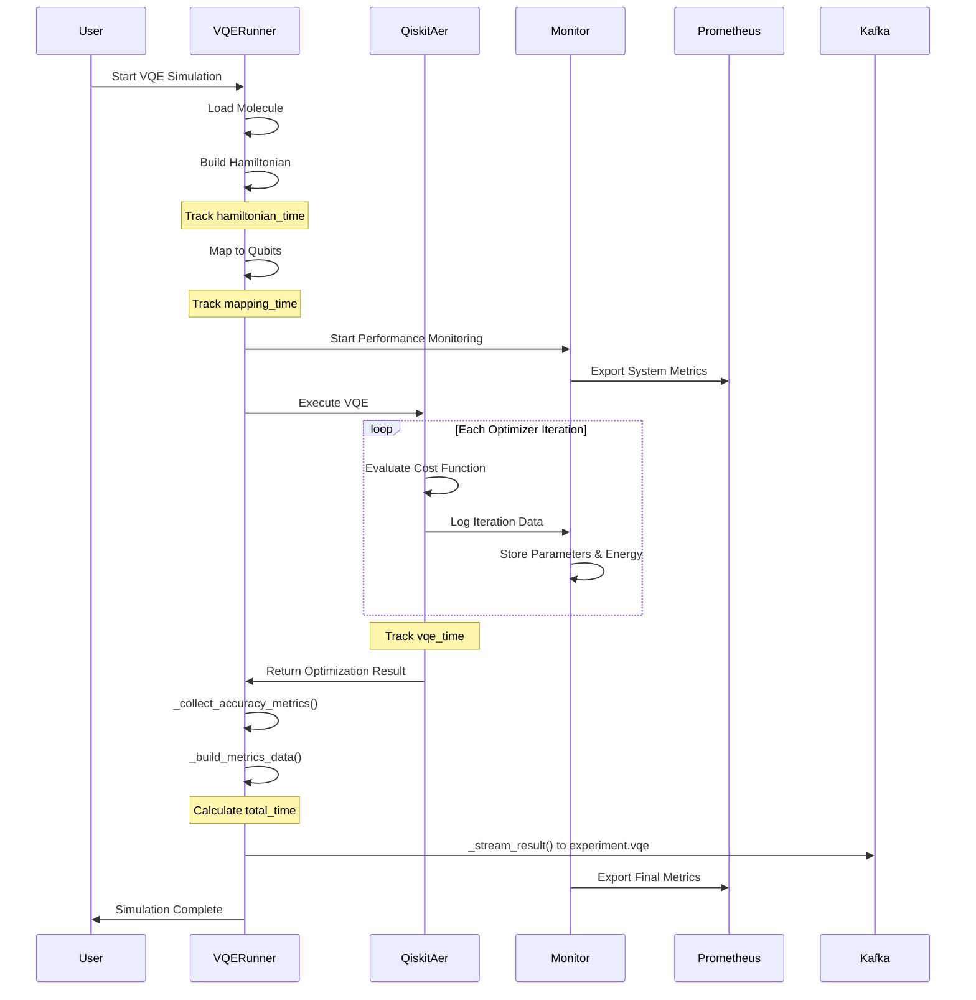
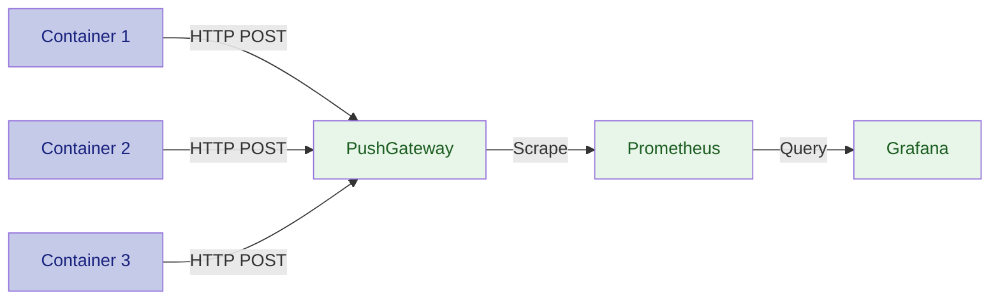
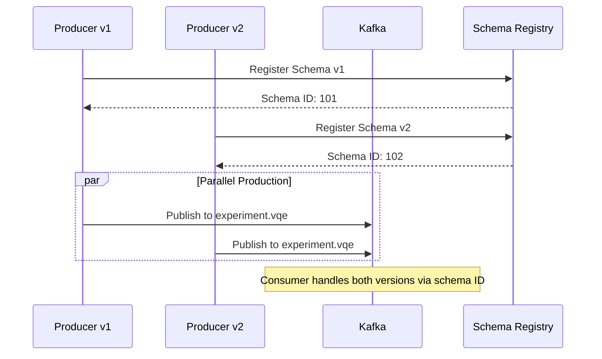
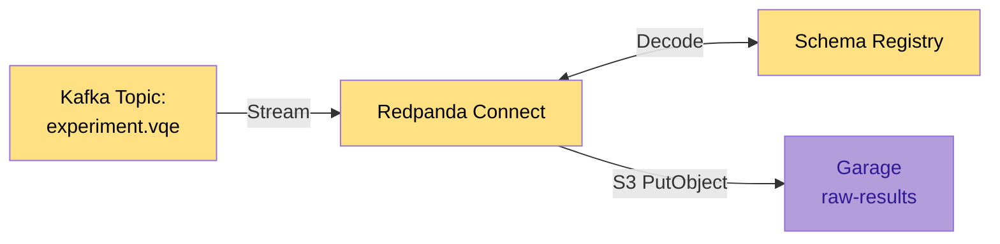
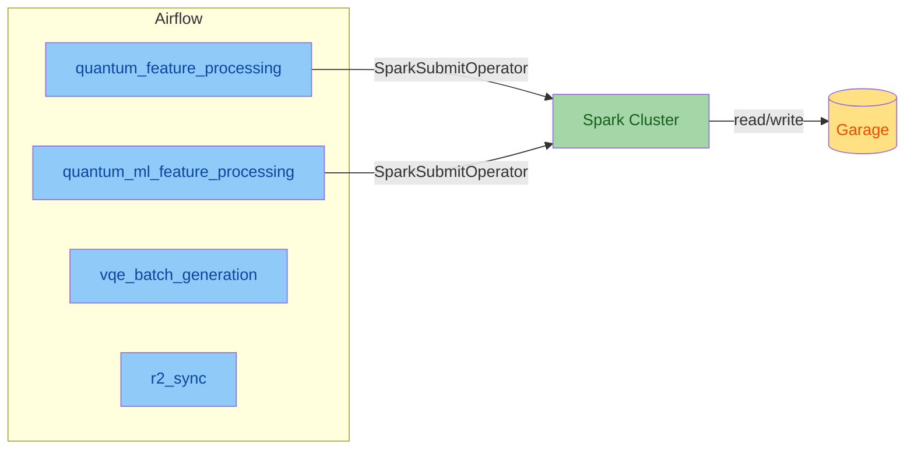
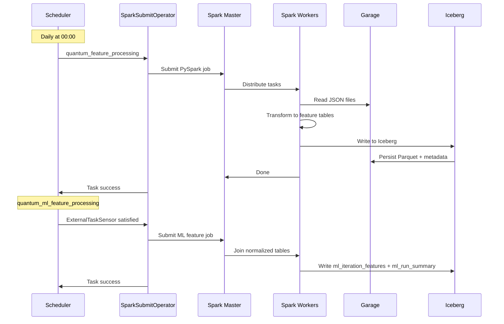
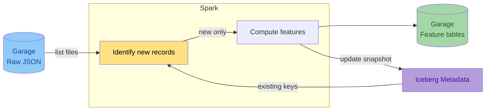

# System Design

Component-by-component breakdown of the stack.

## Quantum Pipeline Module

The simulation module runs VQE using Qiskit Aer (or IBM Quantum). It is
structured around ABC base classes
([`Runner`](https://codeberg.org/piotrkrzysztof/quantum-pipeline/src/branch/master/quantum_pipeline/runners/runner.py#L6),
[`Solver`](https://codeberg.org/piotrkrzysztof/quantum-pipeline/src/branch/master/quantum_pipeline/solvers/solver.py#L13),
[`Mapper`](https://codeberg.org/piotrkrzysztof/quantum-pipeline/src/branch/master/quantum_pipeline/mappers/mapper.py#L4))
with concrete implementations:

- [`VQERunner`](https://codeberg.org/piotrkrzysztof/quantum-pipeline/src/branch/master/quantum_pipeline/runners/vqe_runner.py#L24) - orchestrates the full pipeline per molecule
- [`VQESolver`](https://codeberg.org/piotrkrzysztof/quantum-pipeline/src/branch/master/quantum_pipeline/solvers/vqe_solver.py#L47) - ansatz construction, circuit preparation, optimization loop
- [`JordanWignerMapper`](https://codeberg.org/piotrkrzysztof/quantum-pipeline/src/branch/master/quantum_pipeline/mappers/jordan_winger_mapper.py#L14) - fermionic-to-qubit operator mapping

### Execution Flow


```mermaid
sequenceDiagram
    participant User
    participant VQERunner
    participant QiskitAer
    participant Monitor
    participant Prometheus
    participant Kafka

    User->>VQERunner: Start VQE Simulation
    VQERunner->>VQERunner: Load Molecule
    VQERunner->>VQERunner: Build Hamiltonian
    Note over VQERunner: Track hamiltonian_time

    VQERunner->>VQERunner: Map to Qubits
    Note over VQERunner: Track mapping_time

    VQERunner->>Monitor: Start Performance Monitoring
    Monitor->>Prometheus: Export System Metrics

    VQERunner->>QiskitAer: Execute VQE
    loop Each Optimizer Iteration
        QiskitAer->>QiskitAer: Evaluate Cost Function
        QiskitAer->>Monitor: Log Iteration Data
        Monitor->>Monitor: Store Parameters & Energy
    end
    Note over QiskitAer: Track vqe_time

    QiskitAer->>VQERunner: Return Optimization Result
    VQERunner->>VQERunner: _collect_accuracy_metrics()
    VQERunner->>VQERunner: _build_metrics_data()
    Note over VQERunner: Calculate total_time

    VQERunner->>Kafka: _stream_result() to experiment.vqe
    Monitor->>Prometheus: Export Final Metrics
    VQERunner->>User: Simulation Complete
```

### VQERunner Methods

| Method | What it does |
|--------|-------------|
| [`_process_molecule()`](https://codeberg.org/piotrkrzysztof/quantum-pipeline/src/branch/master/quantum_pipeline/runners/vqe_runner.py#L289) | Full VQE execution for a single molecule  |
| [`_collect_accuracy_metrics()`](https://codeberg.org/piotrkrzysztof/quantum-pipeline/src/branch/master/quantum_pipeline/runners/vqe_runner.py#L228) | Compares VQE energy against HF reference |
| [`_build_metrics_data()`](https://codeberg.org/piotrkrzysztof/quantum-pipeline/src/branch/master/quantum_pipeline/runners/vqe_runner.py#L266) | Constructs the metrics dict for Prometheus export |
| [`_stream_result()`](https://codeberg.org/piotrkrzysztof/quantum-pipeline/src/branch/master/quantum_pipeline/runners/vqe_runner.py#L371) | Sends a decorated VQE result to Kafka |

### Data Collected Per Simulation

- **Per iteration**: parameters, energy, standard deviation, energy delta, parameter delta norm, cumulative minimum energy
- **Timing**: hamiltonian construction, Jordan-Wigner mapping, VQE optimization, total wall time
- **Molecule info**: atomic symbols, coordinates, charge, multiplicity, basis set
- **System metrics**: CPU usage, memory consumption (exported to Prometheus)
- **Accuracy**: HF reference energy comparison, error in millihartree, accuracy score

The result structure is documented in [Serialization - Schema Structure](serialization.md#schema-structure).

### Metrics Export

Each simulation container exports metrics to Prometheus PushGateway via
[`PerformanceMonitor`](https://codeberg.org/piotrkrzysztof/quantum-pipeline/src/branch/master/quantum_pipeline/monitoring/performance_monitor.py#L32):


```mermaid
graph LR
    QC1[Container 1] -->|HTTP POST| PG[PushGateway]
    QC2[Container 2] -->|HTTP POST| PG
    QC3[Container 3] -->|HTTP POST| PG
    PG -->|Scrape| PROM[Prometheus]
    PROM -->|Query| GRAF[Grafana]

    style QC1 fill:#c5cae9,color:#1a237e
    style QC2 fill:#c5cae9,color:#1a237e
    style QC3 fill:#c5cae9,color:#1a237e
    style PG fill:#e8f5e9,color:#1b5e20
    style PROM fill:#e8f5e9,color:#1b5e20
    style GRAF fill:#e8f5e9,color:#1b5e20
```

**VQE metrics**: `qp_vqe_total_time`, `qp_vqe_hamiltonian_time`, `qp_vqe_mapping_time`, `qp_vqe_vqe_time`, `qp_vqe_minimum_energy`, `qp_vqe_iterations_count`, `qp_vqe_optimal_parameters_count`

**Accuracy metrics**: `qp_vqe_reference_energy`, `qp_vqe_energy_error_hartree`, `qp_vqe_energy_error_millihartree`, `qp_vqe_accuracy_score`

**Derived**: `qp_vqe_iterations_per_second`, `qp_vqe_time_per_iteration`, `qp_vqe_overhead_ratio`, `qp_vqe_efficiency`, `qp_vqe_setup_ratio`

**System**: `qp_sys_cpu_percent`, `qp_sys_cpu_load_1m`, `qp_sys_memory_percent`, `qp_sys_memory_used_bytes`, `qp_sys_uptime_seconds`

For dashboard configuration, see [Monitoring](../monitoring/index.md).


## Apache Kafka Integration

All VQE results are published to a single Kafka topic: `experiment.vqe`.
The schema subject is `experiment.vqe-value`. For serialization details, see
[Serialization](serialization.md).

The Schema Registry supports running multiple versions of the simulation in
parallel - each registers its own schema version, and consumers decode using
the schema ID embedded in each message:


```mermaid
sequenceDiagram
    participant P1 as Producer v1
    participant P2 as Producer v2
    participant K as Kafka
    participant SR as Schema Registry

    P1->>SR: Register Schema v1
    SR-->>P1: Schema ID: 101

    P2->>SR: Register Schema v2
    SR-->>P2: Schema ID: 102

    par Parallel Production
        P1->>K: Publish to experiment.vqe
        P2->>K: Publish to experiment.vqe
    end

    Note over K: Consumer handles both versions via schema ID
```

Producer configuration is in
[`ProducerConfig`](https://codeberg.org/piotrkrzysztof/quantum-pipeline/src/branch/master/quantum_pipeline/configs/module/producer.py#L9)
(servers, topic, retries, acks, timeout). Security options (SSL, SASL) are in
[`SecurityConfig`](https://codeberg.org/piotrkrzysztof/quantum-pipeline/src/branch/master/quantum_pipeline/configs/module/security.py#L60).


## Garage Storage

Garage is a lightweight, Rust-based S3-compatible object store that replaced
MinIO from v1.x. Data flows from Kafka to Garage via Redpanda Connect.


```mermaid
graph LR
    K[Kafka Topic:<br/>experiment.vqe] -->|Stream| RC[Redpanda Connect]
    RC <-->|Decode| SR[Schema Registry]
    RC -->|S3 PutObject| GARAGE[Garage<br/>raw-results]

    style K fill:#ffe082,color:#000
    style RC fill:#ffe082,color:#000
    style SR fill:#ffe082,color:#000
    style GARAGE fill:#b39ddb,color:#311b92
```

### Redpanda Connect Configuration

The Redpanda Connect config is at
[`compose/redpanda-connect.yaml`](https://codeberg.org/piotrkrzysztof/quantum-pipeline/src/branch/master/compose/redpanda-connect.yaml).
It consumes from `experiment.vqe`, decodes Avro via `schema_registry_decode`,
and writes JSON files to the `raw-results` bucket. For the Kafka Connect
alternative (Avro at rest), see [Serialization - Overview](serialization.md#overview).

### Directory Structure

Raw results written by Redpanda Connect:

```
s3://raw-results/
  experiments/
    experiment.vqe/
      year=2026/
        month=03/
          ...
      1-1774375957377835260.json
      2-1774887616244742408.json
      ...
```

File names follow `{counter}-{timestamp_unix_nano}.json`. Older runs land
flat in the topic directory; newer runs may appear under time-partitioned
subdirectories depending on the connector configuration.

Iceberg feature tables (written by Spark):

```
s3://features/
  warehouse/
    quantum_features/
      vqe_results/
        metadata/
        data/
      molecules/
        metadata/
        data/
      ...
```

Each table has Iceberg's `metadata/` (snapshots, manifests) and `data/`
(Parquet files) subdirectories.

!!! tip
    Garage is S3 compatible. Use `aws configure --profile garage` with your
    `S3_ACCESS_KEY` / `S3_SECRET_KEY` from `.env` to browse files with `aws s3`.


## Apache Airflow Orchestration

Airflow runs 4 DAGs using CeleryExecutor with Redis as the broker. Shared
configuration lives in
[`docker/airflow/common/`](https://codeberg.org/piotrkrzysztof/quantum-pipeline/src/branch/master/docker/airflow/common)
(S3 paths, catalog names, default args, Spark session factory).


```mermaid
graph LR
    subgraph "Airflow"
        DAG1["quantum_feature_processing"]
        DAG2["quantum_ml_feature_processing"]
        DAG3["vqe_batch_generation"]
        DAG4["r2_sync"]
    end

    SPARK[Spark Cluster]
    GARAGE[(Garage)]

    DAG1 -->|SparkSubmitOperator| SPARK
    DAG2 -->|SparkSubmitOperator| SPARK
    SPARK -->|read/write| GARAGE

    style DAG1 fill:#90caf9,color:#0d47a1
    style DAG2 fill:#90caf9,color:#0d47a1
    style DAG3 fill:#90caf9,color:#0d47a1
    style DAG4 fill:#90caf9,color:#0d47a1
    style SPARK fill:#a5d6a7,color:#1b5e20
    style GARAGE fill:#ffe082,color:#e65100
```

### DAGs

| DAG | Schedule | What it does | Source |
|-----|----------|-------------|--------|
| `quantum_feature_processing` | Daily | Reads raw data from Garage, transforms into 9 normalized Iceberg tables | [`quantum_processing_dag.py`](https://codeberg.org/piotrkrzysztof/quantum-pipeline/src/branch/master/docker/airflow/quantum_processing_dag.py) |
| `quantum_ml_feature_processing` | Daily | Joins normalized tables into 2 ML-ready feature tables. Waits for upstream via `ExternalTaskSensor` | [`quantum_ml_feature_dag.py`](https://codeberg.org/piotrkrzysztof/quantum-pipeline/src/branch/master/docker/airflow/quantum_ml_feature_dag.py) |
| `vqe_batch_generation` | Manual | Builds Docker images, runs batch VQE generation script. Trigger conf: `{"tier": N}` | [`vqe_batch_generation_dag.py`](https://codeberg.org/piotrkrzysztof/quantum-pipeline/src/branch/master/docker/airflow/vqe_batch_generation_dag.py) |
| `r2_sync` | Manual | Syncs ML feature Parquet from Garage to Cloudflare R2 via rclone | [`r2_sync_dag.py`](https://codeberg.org/piotrkrzysztof/quantum-pipeline/src/branch/master/docker/airflow/r2_sync_dag.py) |

### Execution Flow


```mermaid
sequenceDiagram
    participant S as Scheduler
    participant SSO as SparkSubmitOperator
    participant SM as Spark Master
    participant SW as Spark Workers
    participant G as Garage
    participant I as Iceberg

    Note over S: Daily at 00:00
    S->>SSO: quantum_feature_processing

    SSO->>SM: Submit PySpark job
    SM->>SW: Distribute tasks

    SW->>G: Read JSON files
    SW->>SW: Transform to feature tables
    SW->>I: Write to Iceberg
    I->>G: Persist Parquet + metadata

    SW->>SM: Done
    SSO->>S: Task success

    Note over S: quantum_ml_feature_processing
    S->>SSO: ExternalTaskSensor satisfied
    SSO->>SM: Submit ML feature job
    SM->>SW: Join normalized tables
    SW->>I: Write ml_iteration_features + ml_run_summary
    SSO->>S: Task success
```


## Incremental Processing

Only new data is processed on each run. The Spark scripts use an anti-join on
key columns to identify records not yet in the target Iceberg table, then
append only those.


```mermaid
graph LR
    RAW[(Garage<br/>Raw JSON)]
    META[Iceberg Metadata]

    subgraph "Spark"
        FILTER[Identify new records]
        PROC[Compute features]
        FILTER -->|new only| PROC
    end

    FEAT[(Garage<br/>Feature tables)]

    RAW -->|list files| FILTER
    META -->|existing keys| FILTER
    PROC --> FEAT
    PROC -->|update snapshot| META

    style FILTER fill:#ffe082,color:#000
    style RAW fill:#90caf9,color:#0d47a1
    style FEAT fill:#a5d6a7,color:#1b5e20
    style META fill:#b39ddb,color:#311b92
```

The deduplication logic is in
[`identify_new_records()`](https://codeberg.org/piotrkrzysztof/quantum-pipeline/src/branch/master/docker/airflow/scripts/quantum_incremental_processing.py#L134)
and the write logic in
[`process_incremental_data()`](https://codeberg.org/piotrkrzysztof/quantum-pipeline/src/branch/master/docker/airflow/scripts/quantum_incremental_processing.py#L190).
Each write is tagged with a version (`v_{batch_id}` or `v_incr_{batch_id}`),
enabling Iceberg time-travel queries.

### Feature Tables {: #feature-tables-schema }

The first Spark job
([`quantum_incremental_processing.py`](https://codeberg.org/piotrkrzysztof/quantum-pipeline/src/branch/master/docker/airflow/scripts/quantum_incremental_processing.py))
produces 9 normalized tables:

| Table | Key Columns | Partition | Purpose |
|---|---|---|---|
| `molecules` | experiment_id, molecule_id | processing_date | Geometry, symbols, masses, charge |
| `ansatz_info` | experiment_id, molecule_id | processing_date, basis_set | QASM circuit, repetitions |
| `performance_metrics` | experiment_id, molecule_id, basis_set | processing_date, basis_set | Timing breakdown |
| `vqe_results` | experiment_id, molecule_id, basis_set | processing_date, basis_set, backend | Energy, iterations, optimizer |
| `initial_parameters` | parameter_id | processing_date, basis_set | Starting parameter values (exploded) |
| `optimal_parameters` | parameter_id | processing_date, basis_set | Best parameter values (exploded) |
| `vqe_iterations` | iteration_id | processing_date, basis_set, backend | Per-step energy + std |
| `iteration_parameters` | parameter_id | processing_date, basis_set | Per-step parameter values (exploded) |
| `hamiltonian_terms` | term_id | processing_date, basis_set, backend | Pauli terms with coefficients |

The second Spark job
([`quantum_ml_feature_processing.py`](https://codeberg.org/piotrkrzysztof/quantum-pipeline/src/branch/master/docker/airflow/scripts/quantum_ml_feature_processing.py))
joins these into 2 ML-ready tables:

| Table | Purpose |
|---|---|
| `ml_iteration_features` | Per-iteration feature vectors for convergence prediction |
| `ml_run_summary` | Per-run aggregate features for energy estimation |

All tables live under `quantum_catalog.quantum_features` (Hadoop catalog backed
by Garage).


## Monitoring Stack

| Source | Exporter | Prometheus Target |
|--------|----------|-------------------|
| VQE containers | PushGateway | `pushgateway:9091` |
| Airflow | statsd-exporter | `airflow-statsd-exporter:9102` |
| PostgreSQL | postgres-exporter | `postgres-exporter:9187` |
| Redis | redis-exporter | `redis-exporter:9121` |
| GPU | nvidia-gpu-exporter | `nvidia-gpu-exporter:9835` |

Grafana dashboards at `http://grafana:3000`. For configuration details, see
[Monitoring](../monitoring/index.md).


## ML Modules

The [`quantum_pipeline/ml/`](https://codeberg.org/piotrkrzysztof/quantum-pipeline/src/branch/master/quantum_pipeline/ml)
package contains ML modules that are not yet integrated into the core VQE flow:

- **convergence_predictor** - predicts whether a VQE run will converge based on early iteration features
- **energy_estimator** - estimates final ground-state energy from partial optimization trajectories
- **preprocessing** - feature extraction utilities for ML model training
- **tracking** - MLflow experiment tracking integration

These are intended for the next phase of the project (ML predictive model PoC).
