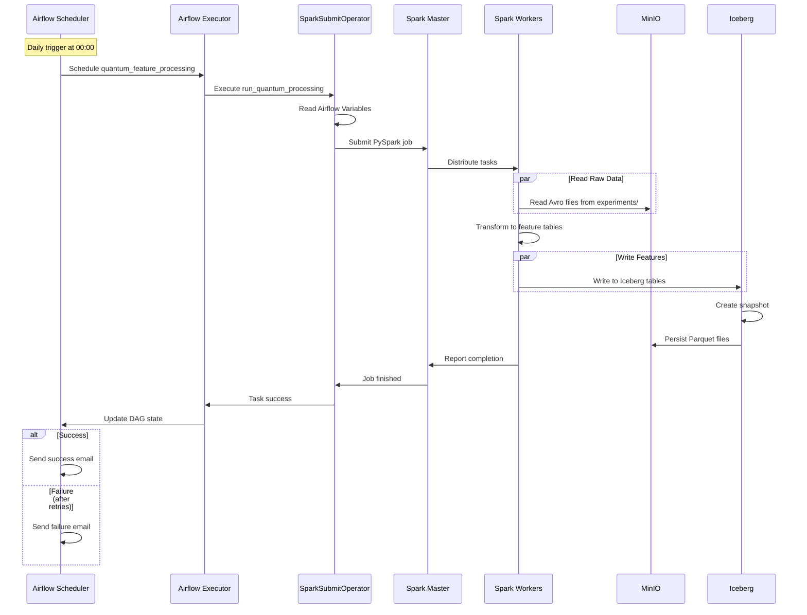

# Airflow Orchestration

## Overview

**Apache Airflow** orchestrates the Spark feature engineering job. A single DAG runs daily and delegates computation to Spark via the `SparkSubmitOperator`.

[:octicons-arrow-right-24: System Design](../architecture/system-design.md) | [:octicons-arrow-right-24: Spark Processing](spark-processing.md)

---

## DAG Structure

The `quantum_feature_processing` DAG consists of a single task that submits a PySpark application to the Spark cluster.

### DAG Configuration

```python
with DAG(
    'quantum_feature_processing',
    default_args={
        **default_args,
        'retries': 3,
        'retry_delay': timedelta(minutes=20),
    },
    description='Process quantum experiment data into ML feature tables',
    schedule_interval=timedelta(days=1),
    start_date=datetime(2025, 1, 1),
    catchup=False,
    tags=['quantum', 'ML', 'features', 'processing', 'Apache Spark'],
    on_success_callback=send_success_email,
) as dag:
    # Single task: submit Spark job
    quantum_simulation_results_processing = SparkSubmitOperator(
        task_id='run_quantum_processing',
        application='/opt/airflow/dags/scripts/quantum_incremental_processing.py',
        conn_id='spark_default',
        name='quantum_feature_processing',
        conf={...},       # Spark configuration
        env_vars={...},   # Runtime environment variables
        verbose=True,
    )
```

### Configuration Parameters

| Parameter | Value | Description |
|-----------|-------|-------------|
| `schedule_interval` | `timedelta(days=1)` | Runs daily at midnight |
| `start_date` | `datetime(2025, 1, 1)` | First eligible execution date |
| `catchup` | `False` | Does not backfill historical runs |
| `retries` | `3` | Retries failed tasks up to 3 times |
| `retry_delay` | `timedelta(minutes=20)` | 20-minute pause between retries |
| `tags` | `['quantum', 'ML', ...]` | Tags for filtering in the Airflow UI |

!!! info "Catchup Behavior"
    With `catchup=False`, missed DAG runs are not backfilled. The next run picks up all unprocessed data.

<figure>
  
  <figcaption>Figure 1. The quantum_feature_processing DAG as displayed in the Airflow web interface.</figcaption>
</figure>

---

## SparkSubmitOperator

The `SparkSubmitOperator` constructs and submits a `spark-submit` command to the Spark master.

### Operator Configuration

```python
quantum_simulation_results_processing = SparkSubmitOperator(
    task_id='run_quantum_processing',
    application='/opt/airflow/dags/scripts/quantum_incremental_processing.py',
    conn_id='spark_default',
    name='quantum_feature_processing',
    conf={
        'spark.master': Variable.get('SPARK_MASTER'),
        'spark.app.name': Variable.get('APP_NAME'),
        'spark.hadoop.fs.s3a.endpoint': Variable.get('S3_ENDPOINT'),
        'spark.hadoop.fs.s3a.access.key': Variable.get('MINIO_ACCESS_KEY'),
        'spark.hadoop.fs.s3a.secret.key': Variable.get('MINIO_SECRET_KEY'),
        'spark.hadoop.fs.s3a.path.style.access': 'true',
        'spark.hadoop.fs.s3a.connection.ssl.enabled': 'false',
        'spark.jars.packages': (
            'org.slf4j:slf4j-api:2.0.17,'
            'commons-codec:commons-codec:1.18.0,'
            'com.google.j2objc:j2objc-annotations:3.0.0,'
            'org.apache.spark:spark-avro_2.12:3.5.5,'
            'org.apache.hadoop:hadoop-aws:3.3.1,'
            'org.apache.hadoop:hadoop-common:3.3.1,'
            'org.apache.iceberg:iceberg-spark-runtime-3.5_2.12:1.4.2'
        ),
    },
    env_vars={
        'MINIO_ACCESS_KEY': Variable.get('MINIO_ACCESS_KEY'),
        'MINIO_SECRET_KEY': Variable.get('MINIO_SECRET_KEY'),
        'S3_ENDPOINT': Variable.get('S3_ENDPOINT'),
        'S3_BUCKET': Variable.get('S3_BUCKET'),
        'S3_WAREHOUSE': Variable.get('S3_WAREHOUSE'),
        'SPARK_MASTER': Variable.get('SPARK_MASTER'),
    },
    verbose=True,
)
```

### Operator Parameters

| Parameter | Value | Description |
|-----------|-------|-------------|
| `application` | `/opt/airflow/dags/scripts/quantum_incremental_processing.py` | Path to the PySpark script inside the Airflow container |
| `conn_id` | `spark_default` | Airflow connection ID for the Spark cluster |
| `name` | `quantum_feature_processing` | Application name visible in the Spark Web UI |
| `verbose` | `True` | Enables detailed Spark logging in Airflow task logs |

### Package Dependencies

The `spark.jars.packages` configuration specifies Maven packages downloaded at runtime:

| Package | Version | Purpose |
|---------|---------|---------|
| `spark-avro_2.12` | 3.5.5 | Read/write Avro files |
| `hadoop-aws` | 3.3.1 | S3A filesystem connector for MinIO |
| `hadoop-common` | 3.3.1 | Hadoop core libraries |
| `iceberg-spark-runtime-3.5_2.12` | 1.4.2 | Apache Iceberg integration |
| `slf4j-api` | 2.0.17 | Logging framework |
| `commons-codec` | 1.18.0 | Encoding utilities |
| `j2objc-annotations` | 3.0.0 | Annotation compatibility |

---

## Variables Management

All runtime settings are stored as Airflow Variables and retrieved at DAG parse time.

### Default Configuration

```python
DEFAULT_CONFIG = {
    'S3_ENDPOINT': 'http://minio:9000',
    'SPARK_MASTER': 'spark://spark-master:7077',
    'S3_BUCKET': 's3a://local-vqe-results/experiments/',
    'S3_WAREHOUSE': 's3a://local-features/warehouse/',
    'APP_NAME': 'Quantum Pipeline Feature Processing',
}
```

### Variable Initialization

Variables are initialized with defaults on first run and updated from environment variables for secrets:

```python
# Set defaults if not already configured
for k, v in DEFAULT_CONFIG.items():
    if Variable.get(k, default_var=None) is None:
        Variable.set(k, v)

# Set secrets from environment
Variable.set('MINIO_ACCESS_KEY', os.getenv('MINIO_ACCESS_KEY'))
Variable.set('MINIO_SECRET_KEY', os.getenv('MINIO_SECRET_KEY'))
```

### Variables Reference

| Variable | Default Value | Description |
|----------|---------------|-------------|
| `S3_ENDPOINT` | `http://minio:9000` | MinIO endpoint URL |
| `SPARK_MASTER` | `spark://spark-master:7077` | Spark master address |
| `S3_BUCKET` | `s3a://local-vqe-results/experiments/` | Source bucket for raw Avro data |
| `S3_WAREHOUSE` | `s3a://local-features/warehouse/` | Iceberg warehouse location |
| `APP_NAME` | `Quantum Pipeline Feature Processing` | Spark application name |
| `MINIO_ACCESS_KEY` | (from environment) | MinIO access credential |
| `MINIO_SECRET_KEY` | (from environment) | MinIO secret credential |

### Accessing Variables

=== "Python (in DAG code)"

    ```python
    from airflow.models import Variable
    endpoint = Variable.get('S3_ENDPOINT')
    ```

=== "Web UI"

    Navigate to **Admin > Variables** in the Airflow web interface to view and edit all variables.

=== "CLI"

    ```bash
    airflow variables get S3_ENDPOINT
    airflow variables set S3_ENDPOINT http://minio:9000
    airflow variables import variables.json
    ```

---

## Email Notifications

The DAG sends email notifications on both success and failure.

### Success Callback

```python
def send_success_email(context):
    """Send a detailed success email with processing summary."""
    task_instance = context['task_instance']
    results = task_instance.xcom_pull(task_ids='run_quantum_processing')

    subject = f'Quantum Processing Success: {context["execution_date"]}'
    html_content = f"""
    <h3>Quantum Processing Completed Successfully</h3>
    <p><b>Execution Date:</b> {context['execution_date']}</p>
    <p><b>Processing Results:</b></p>
    <pre>{results}</pre>
    <p>View the <a href="{context['task_instance'].log_url}">logs</a>
       for more details.</p>
    """
    send_email(to=default_args['email'],
               subject=subject, html_content=html_content)
```

### Default Arguments

```python
default_args = {
    'owner': 'quantum_pipeline',
    'email': ['quantum_alerts@example.com'],
    'email_on_failure': True,
    'email_on_retry': False,
}
```

| Parameter | Value | Description |
|-----------|-------|-------------|
| `email_on_failure` | `True` | Send email when the task fails after all retries |
| `email_on_retry` | `False` | Do not send email on individual retry attempts |

The retry strategy uses 3 retries with a 20-minute delay between attempts, allowing recovery from transient infrastructure failures (Spark cluster unavailability, MinIO overload, network issues). For details on Airflow retry configuration, see the [Airflow documentation](https://airflow.apache.org/docs/apache-airflow/stable/core-concepts/tasks.html#task-instances).

---

## Execution Flow

Complete execution cycle from scheduler trigger through Spark processing to completion notification.



### Execution Steps

1. **Scheduler trigger** - At midnight (or the configured schedule), the Airflow scheduler identifies that `quantum_feature_processing` is due for execution.
2. **Task queuing** - The executor queues the `run_quantum_processing` task.
3. **Variable resolution** - The `SparkSubmitOperator` reads all Airflow Variables (endpoints, credentials, cluster address).
4. **Spark submission** - The operator constructs and executes a `spark-submit` command targeting the Spark master.
5. **Task distribution** - The Spark master distributes processing tasks to worker nodes.
6. **Data processing** - Workers read raw Avro files from MinIO, transform data into feature tables, and write Parquet files through Iceberg.
7. **Snapshot creation** - Iceberg creates a new snapshot recording the processing state.
8. **Completion** - Spark reports success to Airflow, which updates the DAG state and triggers the success email callback.

<figure>
  
  <figcaption>Figure 2. Completed feature processing job with Airflow task execution details.</figcaption>
</figure>

---

## Related Documentation

- [System Design](../architecture/system-design.md) - Full architecture overview
- [Spark Processing](spark-processing.md) - Details on the Spark job triggered by Airflow
- [Iceberg Storage](iceberg-storage.md) - How processed data is stored and managed
- [Docker Compose](../deployment/docker-compose.md) - Container deployment for the Airflow service
- [Environment Variables](../deployment/environment-variables.md) - Environment variable reference

## References

- [Apache Airflow Documentation](https://airflow.apache.org/docs/apache-airflow/stable/)
- [Airflow SparkSubmitOperator](https://airflow.apache.org/docs/apache-airflow-providers-apache-spark/stable/_api/airflow/providers/apache_spark/operators/spark_submit/index.html)
- [Airflow Variables](https://airflow.apache.org/docs/apache-airflow/stable/howto/variable.html)
