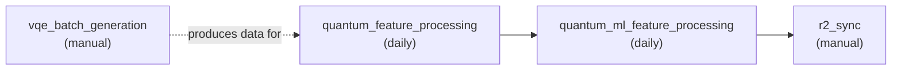
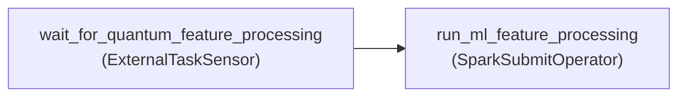
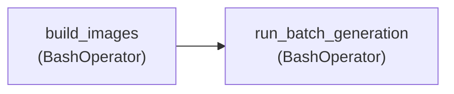
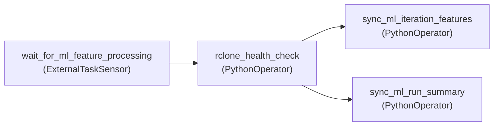

# Airflow Orchestration

Apache Airflow 3.1.8 orchestrates the data pipeline through four DAGs. The
deployment uses CeleryExecutor with Redis as the message broker and PostgreSQL
as the metadata database.

For how Airflow fits into the overall architecture, see
[System Design](../architecture/system-design.md#apache-airflow-orchestration).

## Infrastructure

### Services

All Airflow containers share a base image built from
[`docker/airflow/Dockerfile`](https://codeberg.org/piotrkrzysztof/quantum-pipeline/src/branch/master/docker/airflow/Dockerfile)
on top of `apache/airflow:3.1.8`. Services are defined in
[`compose/docker-compose.ml.yaml`](https://codeberg.org/piotrkrzysztof/quantum-pipeline/src/branch/master/compose/docker-compose.ml.yaml#L269)
using a shared `x-airflow-common` anchor.

| Service | Container | Command | Purpose |
|---------|-----------|---------|---------|
| `airflow-apiserver` | `ml-airflow-apiserver` | `api-server` | Web UI and REST API (port 8080, mapped to 8084 on host) |
| `airflow-scheduler` | `ml-airflow-scheduler` | `scheduler` | Monitors DAG schedules and triggers task execution |
| `airflow-dag-processor` | `ml-airflow-dag-processor` | `dag-processor` | Parses DAG files from the dags folder |
| `airflow-worker` | `ml-airflow-worker` | `celery worker` | Executes tasks dispatched by the scheduler |
| `airflow-triggerer` | `ml-airflow-triggerer` | `triggerer` | Handles deferred operators and async triggers |
| `airflow-init` | `ml-airflow-init` | (one-shot) | Runs DB migration, creates admin user, adds Spark connection |

### Backend Services

| Service | Purpose |
|---------|---------|
| PostgreSQL 16 | Airflow metadata database and Celery result backend |
| Redis 7.2 | Celery message broker |

### Custom Airflow Image

The
[Dockerfile](https://codeberg.org/piotrkrzysztof/quantum-pipeline/src/branch/master/docker/airflow/Dockerfile)
installs on top of the base Airflow image:

- **OpenJDK 17** - required for SparkSubmitOperator to launch PySpark jobs
- **Docker CE CLI + buildx + compose** - from Docker's official APT repo, for
  the batch generation DAG (the `docker.io` Debian package has a legacy builder
  that fails on permission-restricted build contexts)
- **rclone** - used by the R2 sync DAG

The image also creates a `hostdocker` group matching the host's Docker socket
GID (build arg `DOCKER_GID`, default 970) and adds the `airflow` user to it,
allowing the batch generation DAG to use the mounted Docker socket.

### Volumes

All Airflow containers mount:

- `docker/airflow/` at `/opt/airflow/dags` - DAG files and shared modules
- `airflow-logs` volume at `/opt/airflow/logs`
- `airflow-ivy-cache` volume at `/tmp/.ivy2` - Ivy cache for Spark dependencies
- `compose/spark-defaults.conf` at `/opt/spark/conf/spark-defaults.conf` (read-only)
- Repository root at `/opt/quantum-pipeline` - for batch generation script access
- Host Docker socket at `/var/run/docker.sock` - for Docker-in-Docker batch builds

### Monitoring

Airflow exports metrics via StatsD to a `prom/statsd-exporter` container, which
exposes them as Prometheus metrics:

```
Airflow --[StatsD UDP]--> statsd-exporter (:9125) --[HTTP]--> Prometheus (:9102)
```

| Variable | Value |
|----------|-------|
| `AIRFLOW__METRICS__STATSD_ON` | `true` |
| `AIRFLOW__METRICS__STATSD_HOST` | `airflow-statsd-exporter` |
| `AIRFLOW__METRICS__STATSD_PORT` | `9125` |
| `AIRFLOW__METRICS__STATSD_PREFIX` | `airflow` |

## Shared Configuration Modules

All DAGs import shared settings from the
[`common/`](https://codeberg.org/piotrkrzysztof/quantum-pipeline/src/branch/master/docker/airflow/common)
package.

### pipeline_config.py

[Source](https://codeberg.org/piotrkrzysztof/quantum-pipeline/src/branch/master/docker/airflow/common/pipeline_config.py) -
centralized S3 paths, Iceberg catalog names, ML parameters, and alert email.

| Setting | Default | Description |
|---------|---------|-------------|
| `S3_BUCKET_URL` | `s3a://raw-results/experiments/` | Source bucket for raw data |
| `S3_WAREHOUSE_URL` | `s3a://features/warehouse/` | Iceberg warehouse location |
| `CATALOG_FQN` | `quantum_catalog.quantum_features` | Fully qualified Iceberg catalog |
| `ML_ROLLING_WINDOW` | `5` | Rolling window size for ML iteration features |
| `ML_TRAJECTORY_HEAD` | `10` | Initial iterations for trajectory features |
| `ML_TRAJECTORY_TAIL` | `10` | Final iterations for trajectory features |
| `AIRFLOW_ALERT_EMAIL` | `quantum_alerts@example.com` | Email for DAG notifications |

### dag_defaults.py

[Source](https://codeberg.org/piotrkrzysztof/quantum-pipeline/src/branch/master/docker/airflow/common/dag_defaults.py) -
factory for `default_args` dicts with a consistent baseline across all DAGs.

Key baseline settings:

- Exponential backoff enabled (`retry_exponential_backoff: True`)
- Max retry delay capped at 1 hour
- Individual DAGs override `retries` and `retry_delay` as needed

### spark_factory.py

[Source](https://codeberg.org/piotrkrzysztof/quantum-pipeline/src/branch/master/docker/airflow/common/spark_factory.py) -
shared `SparkSession` factory. Creates a session with only the app name; all
catalog and S3 configuration is loaded from `spark-defaults.conf`.

## DAG Overview

| DAG | Schedule | Trigger | SLA | Source |
|-----|----------|---------|-----|--------|
| `quantum_feature_processing` | Daily | Automatic | 1h 30m | [`quantum_processing_dag.py`](https://codeberg.org/piotrkrzysztof/quantum-pipeline/src/branch/master/docker/airflow/quantum_processing_dag.py) |
| `quantum_ml_feature_processing` | Daily | After upstream | 45m | [`quantum_ml_feature_dag.py`](https://codeberg.org/piotrkrzysztof/quantum-pipeline/src/branch/master/docker/airflow/quantum_ml_feature_dag.py) |
| `vqe_batch_generation` | None | Manual | - | [`vqe_batch_generation_dag.py`](https://codeberg.org/piotrkrzysztof/quantum-pipeline/src/branch/master/docker/airflow/vqe_batch_generation_dag.py) |
| `r2_sync` | None (configurable) | Manual or after ML processing | - | [`r2_sync_dag.py`](https://codeberg.org/piotrkrzysztof/quantum-pipeline/src/branch/master/docker/airflow/r2_sync_dag.py) |


```mermaid
graph LR
    A["quantum_feature_processing<br/>(daily)"] --> B["quantum_ml_feature_processing<br/>(daily)"]
    B --> C["r2_sync<br/>(manual)"]
    D["vqe_batch_generation<br/>(manual)"] -.->|"produces data for"| A
```

## DAG 1: quantum_feature_processing

Processes raw VQE data from Garage into 9 Iceberg feature tables via
`SparkSubmitOperator`.

| Parameter | Value |
|-----------|-------|
| `schedule` | `timedelta(days=1)` |
| `retries` | `3` (with exponential backoff) |
| `retry_delay` | `timedelta(minutes=20)` |
| `execution_timeout` | 2 hours |
| `sla` | 1 hour 30 minutes |


## DAG 2: quantum_ml_feature_processing

Joins the 9 normalized Iceberg tables into two ML-ready feature tables:
`ml_iteration_features` (per-iteration) and `ml_run_summary` (per-run
aggregates). Waits for DAG 1 via `ExternalTaskSensor`.


```mermaid
graph LR
    A["wait_for_quantum_feature_processing<br/>(ExternalTaskSensor)"] --> B["run_ml_feature_processing<br/>(SparkSubmitOperator)"]
```

| Parameter | Value |
|-----------|-------|
| `schedule` | `timedelta(days=1)` |
| `retries` | `2` (with exponential backoff) |
| `ExternalTaskSensor mode` | `reschedule` (frees worker slot while waiting) |
| `poke_interval` | 60 seconds |
| `sla` | 45 minutes |

## DAG 3: vqe_batch_generation

Builds simulation Docker images and runs the VQE batch generation script. The
script handles all generation logic internally (3-lane parallel execution, JSON
state, resume from last completed invocation). Airflow provides scheduling,
alerting, and state tracking.


```mermaid
graph LR
    A["build_images<br/>(BashOperator)"] --> B["run_batch_generation<br/>(BashOperator)"]
```

| Parameter | Value |
|-----------|-------|
| `schedule` | `None` (manual trigger via Airflow UI) |
| `email_on_failure` | `True` |
| `Trigger conf` | `{"tier": N}` (optional, default: 1) |
| `CUDA_ARCH` | `6.1` (default, env var override) |
| `execution_timeout` | 30 hours (batch generation can run long) |

Requirements: Docker socket mounted into the worker, repo root at
`/opt/quantum-pipeline`, airflow user in the host Docker socket GID group.

## DAG 4: r2_sync

Syncs ML feature Parquet files from Garage to Cloudflare R2 using `rclone`.


```mermaid
graph LR
    A["wait_for_ml_feature_processing<br/>(ExternalTaskSensor)"] --> B["rclone_health_check<br/>(PythonOperator)"]
    B --> C["sync_ml_iteration_features<br/>(PythonOperator)"]
    B --> D["sync_ml_run_summary<br/>(PythonOperator)"]
```

| Source (Garage) | Destination (R2) |
|-----------------|------------------|
| `garage:features/warehouse/quantum_features/ml_iteration_features/` | `r2:qp-data/features/ml_iteration_features/` |
| `garage:features/warehouse/quantum_features/ml_run_summary/` | `r2:qp-data/features/ml_run_summary/` |

| Parameter | Value |
|-----------|-------|
| `schedule` | `None` (set `R2_SYNC_SCHEDULE` Airflow Variable to override) |
| `transfers` | `8` parallel rclone transfers (configurable via `R2_SYNC_TRANSFERS`) |
| `checkers` | `4` parallel rclone checkers (configurable via `R2_SYNC_CHECKERS`) |

Rclone remote configuration is injected through environment variables in
`docker-compose.ml.yaml`. The Garage remote uses the same S3 credentials as the
rest of the pipeline. The R2 remote requires `R2_ACCOUNT_ID`,
`R2_ACCESS_KEY_ID`, and `R2_SECRET_ACCESS_KEY`.

## Related Documentation

- [System Design](../architecture/system-design.md) - Full architecture overview
- [Spark Processing](spark-processing.md) - Spark jobs triggered by Airflow
- [Iceberg Storage](iceberg-storage.md) - How processed data is stored
- [Docker Compose](../deployment/docker-compose.md) - Container deployment
- [Environment Variables](../deployment/environment-variables.md) - Env var reference

## References

- [Apache Airflow Documentation](https://airflow.apache.org/docs/apache-airflow/stable/)
- [SparkSubmitOperator](https://airflow.apache.org/docs/apache-airflow-providers-apache-spark/stable/_api/airflow/providers/apache_spark/operators/spark_submit/index.html)
- [ExternalTaskSensor](https://airflow.apache.org/docs/apache-airflow/stable/_api/airflow/sensors/external_task/index.html)
