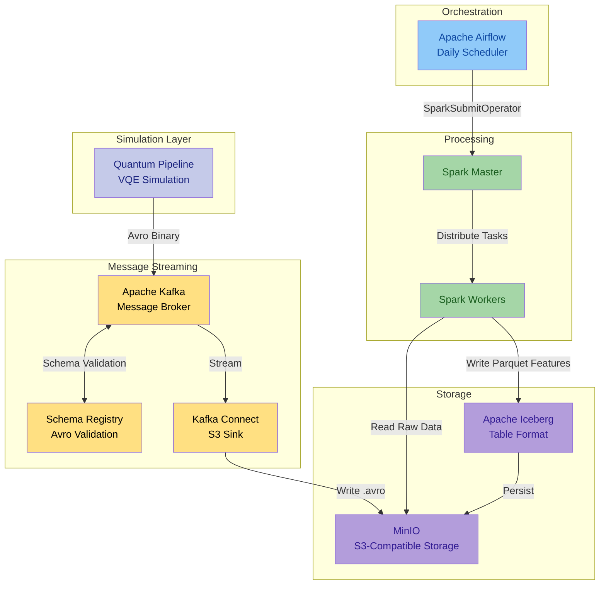

# Data Platform

The Data Platform processes, transforms, and stores VQE simulation results into analytics-ready ML feature tables.

[:octicons-arrow-right-24: System Design](../architecture/system-design.md)

---

## Core Components

### Apache Kafka - Message Streaming

Kafka ingests VQE results in real time with schema-validated payloads via **Confluent Schema Registry**. **Kafka Connect** writes serialized Avro data to object storage automatically.

[:octicons-arrow-right-24: Kafka Streaming](kafka-streaming.md)

### Apache Spark - Feature Engineering

Spark reads raw Avro files from object storage and transforms them into nine structured feature tables. It performs incremental processing - only new data since the last run is transformed.

[:octicons-arrow-right-24: Spark Processing](spark-processing.md)

### Apache Airflow - Workflow Orchestration

Airflow schedules and executes the Spark feature engineering job. A single DAG runs daily via the `SparkSubmitOperator`, with retry logic and email notifications.

[:octicons-arrow-right-24: Airflow Orchestration](airflow-orchestration.md)

### Apache Iceberg and MinIO - Storage Layer

**MinIO** provides S3-compatible object storage for raw Avro and processed Parquet files. **Apache Iceberg** adds ACID transactions, time-travel queries, schema evolution, and snapshot management.

[:octicons-arrow-right-24: Iceberg Storage](iceberg-storage.md)

---

## Architecture Overview

VQE results flow through Kafka into MinIO, where Airflow triggers Spark to produce Iceberg-managed feature tables.

<figure>
  
  <figcaption>Figure 1. Quantum Pipeline service architecture with GPU-accelerated simulation containers feeding into the data platform.</figcaption>
</figure>

---

## Data Flow Summary

The end-to-end data flow follows six stages:

1. **Generation** - VQE simulations produce `VQEDecoratedResult` objects containing optimization results, molecular data, and timing metrics.
2. **Serialization** - Results are serialized to Avro binary format using Schema Registry for validation and versioning.
3. **Streaming** - Kafka brokers receive and buffer messages; Kafka Connect writes them as `.avro` files to MinIO.
4. **Orchestration** - Airflow triggers the daily Spark job via `SparkSubmitOperator`.
5. **Processing** - Spark reads raw Avro files, filters for new data using Iceberg metadata, and extracts features into nine tables.
6. **Storage** - Processed features are written as Parquet files managed by Iceberg, enabling time-travel queries and schema evolution.

---

## Section Navigation

-   **[Kafka Streaming](kafka-streaming.md)**

    Topic naming, schema versioning, producer configuration, dynamic subscription, and message format details.

-   **[Spark Processing](spark-processing.md)**

    Cluster architecture, the 6-step feature engineering pipeline, all 9 feature table schemas, and incremental processing.

-   **[Airflow Orchestration](airflow-orchestration.md)**

    DAG structure, SparkSubmitOperator configuration, retry logic, email notifications, and monitoring the web UI.

-   **[Iceberg Storage](iceberg-storage.md)**

    Table organization, ACID transactions, time-travel queries, schema evolution, MinIO integration, and data retention.

---

## Related Documentation

- [System Design](../architecture/system-design.md) - Full system architecture
- [Data Flow](../architecture/data-flow.md) - End-to-end data flow
- [Avro Serialization](../architecture/avro-serialization.md) - Schema definitions
- [Docker Compose](../deployment/docker-compose.md) - Container deployment
