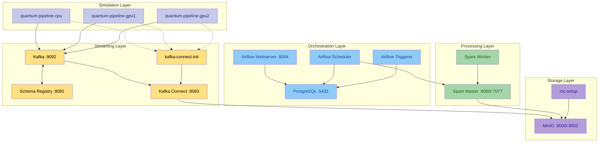

# Docker Compose Deployment

The full Quantum Pipeline platform runs as a set of interconnected Docker containers
managed by Docker Compose. This deployment includes the quantum simulation engine,
Apache Kafka for data streaming, Apache Spark for data processing, Apache Airflow
for workflow orchestration, MinIO for object storage, and monitoring agents.

## Overview

The platform follows a microservices architecture where each component runs in its
own container, communicating over a shared Docker bridge network. Services can be
scaled, replaced, or upgraded independently without affecting the rest of the system.

The Docker Compose configuration defines:

- **Simulation containers** - CPU and GPU variants of the Quantum Pipeline
- **Streaming layer** - Kafka broker, Schema Registry, Kafka Connect
- **Processing layer** - Spark master and workers
- **Orchestration** - Airflow webserver, scheduler, and triggerer with PostgreSQL
- **Storage** - MinIO object storage with automatic bucket initialization
- **Monitoring** - Dozzle and Portainer agents for container management

## Service Graph



## Quick Start

### Prerequisites

- Docker Engine 24.0 or later
- Docker Compose v2.20 or later
- NVIDIA Container Toolkit (for GPU containers)
- At least 6 CPU cores, 30 GB RAM, and 20 GB disk space

### Step 1: Clone the Repository

```bash
git clone https://github.com/straightchlorine/quantum-pipeline.git
cd quantum-pipeline
```

### Step 2: Configure Environment

Copy the example environment file and customize it:

```bash
cp .env.thesis.example .env
```

Edit `.env` to set credentials, resource limits, and service ports. See the
[Environment Variables](environment-variables.md) reference for all options.

### Step 3: Deploy

For the full thesis experiment setup:

```bash
docker compose -f docker-compose.thesis.yaml up -d
```

For a minimal deployment (CPU only, fewer services):

```bash
docker compose up -d
```

### Step 4: Verify

Check that all services are running:

```bash
docker compose -f docker-compose.thesis.yaml ps
```

## Thesis Experiment Setup

The thesis experiments used a three-way deployment to compare CPU and GPU performance
across different hardware configurations. The `docker-compose.thesis.yaml` file defines
this setup with three Quantum Pipeline containers running simultaneously.

### Container Configuration

**1. CPU Pipeline (`quantum-pipeline-cpu`)**

- Built from `docker/Dockerfile.cpu`
- Resource limits: 2 CPUs, 10 GB RAM
- Simulation method: `statevector`
- Optimizer: `L-BFGS-B` with 300 max iterations
- Convergence threshold: `1e-6`
- Publishes results to Kafka topic `vqe_results_cpu`

**2. GPU Pipeline - GTX 1060 (`quantum-pipeline-gpu1`)**

- Built from `docker/Dockerfile.gpu`
- Resource limits: 2 CPUs, 10 GB RAM + GTX 1060 6GB (device 0)
- Same simulation parameters as CPU
- Publishes results to Kafka topic `vqe_results_gpu1`
- Environment: `CUDA_VISIBLE_DEVICES=0`

**3. GPU Pipeline - GTX 1050 Ti (`quantum-pipeline-gpu2`)**

- Built from `docker/Dockerfile.gpu`
- Resource limits: 2 CPUs, 10 GB RAM + GTX 1050 Ti 4GB (device 1)
- Same simulation parameters as CPU
- Publishes results to Kafka topic `vqe_results_gpu2`
- Environment: `CUDA_VISIBLE_DEVICES=0` (mapped as device 0 inside container)

All three containers use the same molecule dataset (`molecules.thesis.json`), basis
set (`sto3g`), and optimization parameters, ensuring a fair comparison.

### GPU Resource Allocation

Each GPU container reserves a specific GPU using Docker's device reservation:

```yaml
deploy:
  resources:
    reservations:
      devices:
        - driver: nvidia
          device_ids: ['0']  # Specific GPU device
          capabilities: [gpu]
```

This ensures each container has exclusive access to its assigned GPU, preventing
resource contention during benchmarks.

## Service Configuration

### Streaming Services

| Service | Image | Port(s) | Description |
|---|---|---|---|
| `kafka` | `bitnami/kafka` | 9092 (internal), 9094 (external) | Message broker with KRaft mode |
| `schema-registry` | `confluentinc/cp-schema-registry` | 8081 | Avro schema management |
| `kafka-connect` | `confluentinc/cp-kafka-connect` | 8083 | S3 Sink connector to MinIO |
| `kafka-connect-init` | `curlimages/curl` | -- | Registers the MinIO Sink connector |

Kafka runs in KRaft mode. Schema Registry manages Avro schemas. Kafka Connect runs the S3 Sink connector to stream data to MinIO.

### Processing Services

| Service | Image | Port(s) | Description |
|---|---|---|---|
| `spark-master` | Custom (Dockerfile.spark) | 8080 (UI), 7077 (RPC) | Spark cluster master |
| `spark-worker` | Custom (Dockerfile.spark) | -- | Spark executor node (4 GB, 2 cores) |

### Orchestration Services

| Service | Image | Port(s) | Description |
|---|---|---|---|
| `airflow-webserver` | Custom (Dockerfile.airflow) | 8084 | Airflow web interface |
| `airflow-scheduler` | Custom (Dockerfile.airflow) | -- | DAG scheduling |
| `airflow-triggerer` | Custom (Dockerfile.airflow) | -- | Deferred task execution |
| `airflow-init` | Custom (Dockerfile.airflow) | -- | Database migration, user creation |
| `postgres` | `postgres:13` | 5432 | Airflow metadata database |

Airflow uses the LocalExecutor with PostgreSQL. The init container runs migrations, creates the admin user, and registers the Spark connection.

### Storage and Monitoring Services

| Service | Image | Port(s) | Description |
|---|---|---|---|
| `minio` | `minio/minio` | 9000 (API), 9002 (Console) | S3-compatible object storage |
| `mc-setup` | `minio/mc` | -- | Creates buckets and sets policies |
| `dozzle` | `amir20/dozzle` | 7007 | Real-time container log viewer |
| `portainer` | `portainer/agent` | 9002 | Container management agent |

The `mc-setup` container automatically creates required buckets (`quantum-data`, `iceberg`) on first run.

## Networking

All services share a single Docker bridge network (`quantum-pipeline-network`). Services communicate using container names as hostnames (e.g., `kafka:9092`, `minio:9000`). The Kafka external listener on port 9094 allows access from outside the Docker network.

## Volumes

The deployment uses named Docker volumes for persistent data:

| Volume | Service | Purpose |
|---|---|---|
| `quantum-minio-data` | MinIO | Object storage data |
| `quantum-spark-warehouse` | Spark | Spark SQL warehouse |
| `quantum-airflow-postgres` | PostgreSQL | Airflow metadata |
| `quantum-airflow-logs` | Airflow | Task execution logs |
| `quantum-kafka-data` | Kafka | Kafka log segments |

Bind mounts provide access to project files: `./gen/` (simulation output), `./data/` (molecule definitions), `./docker/airflow/` (DAG definitions), and `./docker/connectors/` (Kafka Connect configs).

## Health Checks

Services include health checks for proper startup ordering via `depends_on` conditions. The Quantum Pipeline containers wait for `kafka-connect-init` to complete before starting. See the `docker-compose.thesis.yaml` file for the full health check configuration.

## Scaling

Scale Spark workers with:

```bash
docker compose -f docker-compose.thesis.yaml up -d --scale spark-worker=3
```

For additional simulation instances, add new service definitions with a unique `container_name`, distinct `--topic`, appropriate GPU device assignment, and separate output volume mounts. Each Spark worker reserves 2 cores and 4 GB RAM; each GPU container requires exclusive GPU access.

## Stopping the Deployment

```bash
# Stop services, preserve data
docker compose -f docker-compose.thesis.yaml down

# Stop and remove all data volumes
docker compose -f docker-compose.thesis.yaml down -v
```
