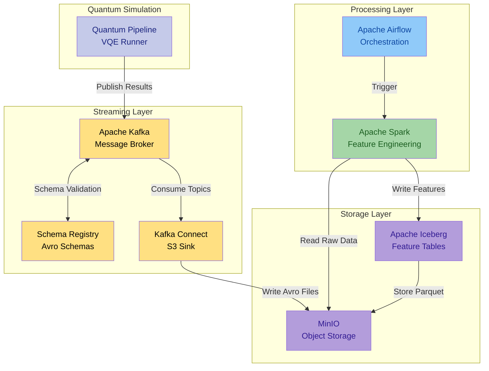
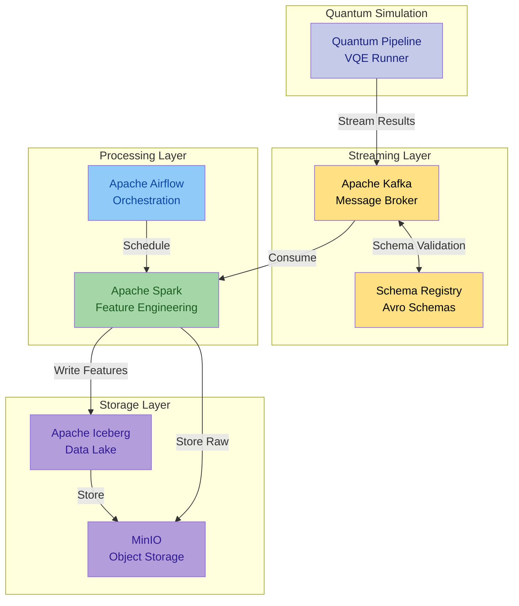

# Quantum Pipeline

  
  
  
  
   
  
  
  
  

## Overview

The Quantum Pipeline project is an **extensible framework** designed for exploring
quantum algorithms. Currently, only **Variational Quantum Eigensolver (VQE)** is
implemented. It combines quantum and classical computing to estimate the
ground-state energy of molecular systems with a comprehensive data engineering pipeline.

The framework provides modules to handle algorithm orchestration, parametrization,
monitoring, and data visualization. Data can be streamed via **Apache Kafka** for
real-time processing, transformed into ML features using **Apache Spark**,
and stored in **Apache Iceberg** tables for scalable analytics.

---

## Key Features

### Core Quantum Computing

- **Molecule Loading** - Load and validate molecular data from files
- **Hamiltonian Preparation** - Generate second-quantized Hamiltonians for molecular systems
- **Quantum Circuit Construction** - Create parameterized ansatz circuits with customizable repetitions
- **VQE Execution** - Solve Hamiltonians using the VQE algorithm with support for various optimizers
- **Advanced Backend Options** - Customize simulation parameters such as qubit count, shot count, and optimization levels

### Data Engineering Pipeline

- **Real-time Streaming** - Stream simulation results to Apache Kafka with Avro serialization
- **ML Feature Engineering** - Transform quantum experiment data into ML features using Apache Spark
- **Data Lake Storage** - Store processed data in Apache Iceberg tables with versioning and time-travel
- **Object Storage** - Persist data using MinIO S3-compatible storage with automated backup
- **Workflow Orchestration** - Automate data processing workflows using Apache Airflow

### Analytics and Visualization

- **Visualization Tools** - Plot molecular structures, energy convergence, and operator coefficients
- **Report Generation** - Automatically generate detailed reports for each processed molecule
- **Scientific Reference Validation** - Compare VQE results against experimentally verified ground state energies
- **Feature Tables** - Access structured data through 9 specialized ML feature tables
- **Processing Metadata** - Track data lineage and processing history

### Production Deployment

- **Containerized Execution** - Deploy as multi-service Docker containers with GPU support
- **CI/CD Pipeline** - Automated testing, building, and publishing of Docker images
- **Scalable Architecture** - Distributed processing with Spark clusters and horizontal scaling
- **Security** - Comprehensive secrets management and secure communication between services

---

## Quick Links

-   **Getting Started**

    ---

    Install Quantum Pipeline and run your first VQE simulation in minutes

    [Installation Guide →](getting-started/installation.md)

-   **Configuration**

    ---

    Learn about optimizers, simulation methods, and parameter tuning

    [Usage Guide →](usage/index.md)

-   **Architecture**

    ---

    Understand the system design, data flow, and Avro serialization

    [Architecture Docs →](architecture/index.md)

-   **Deployment**

    ---

    Deploy with Docker, enable GPU acceleration, configure environments

    [Deployment Guide →](deployment/index.md)

---

## System Architecture

<figure>
  
  <figcaption>Figure 1. Overview of the GPU-accelerated quantum pipeline service architecture.</figcaption>
</figure>

### Thesis Experiment Architecture

The following diagram presents the architecture as deployed for the engineering thesis experiments.
Kafka Connect writes raw Avro files to MinIO, and Spark (triggered by Airflow) reads from MinIO to
produce ML features, while utilising Iceberg for incremental processing.

### General Architecture

The project is configurable -- Kafka can stream directly to Spark consumers, bypassing the MinIO
intermediate storage. This is useful for real-time processing scenarios.

---

## Technology Stack

=== "Quantum Computing"

    - **Qiskit** - IBM's quantum computing framework
    - **Qiskit Aer** - Quantum circuit simulator
    - **PySCF** - Quantum chemistry library for Python
    - **CUDA/cuQuantum** - GPU acceleration for quantum simulations

=== "Data Engineering"

    - **Apache Kafka** - Distributed event streaming platform
    - **Apache Spark** - Unified analytics engine for big data
    - **Apache Airflow** - Workflow orchestration platform
    - **Apache Iceberg** - Open table format for data lakes
    - **MinIO** - S3-compatible object storage

=== "Infrastructure"

    - **Docker** - Container platform
    - **Prometheus** - Monitoring and alerting toolkit
    - **Grafana** - Metrics visualization and dashboards
    - **PostgreSQL** - Relational database for metadata

---

## Use Cases

!!! example "Research & Development"

    - Explore VQE convergence behavior across different molecules
    - Benchmark CPU vs GPU acceleration for quantum simulations
    - Compare optimizer performance

!!! example "Data Science & ML"

    - Analyze quantum experiment metadata at scale
    - Create time-series predictions for molecular properties

!!! example "Production Deployments"

    - Run automated quantum simulations
    - Monitor system performance and scientific accuracy
    - Scaling processing with distributed Spark clusters

---

## Next Steps

1. **[Install Quantum Pipeline](getting-started/installation.md)** - Get up and running
2. **[First Simulation](getting-started/quick-start.md)** - H₂ molecule example
3. **[Configuration Options](usage/configuration.md)** - Customize your setup
4. **[Full Platform Deployment](deployment/docker-compose.md)** - Launch all services

---

## Links related to the project

- **Codeberg**: [piotrkrzysztof/quantum-pipeline](https://codeberg.org/piotrkrzysztof/quantum-pipeline)
- **GitHub (mirror)**: [straightchlorine/quantum-pipeline](https://github.com/straightchlorine/quantum-pipeline)
- **Docker Hub**: [straightchlorine/quantum-pipeline](https://hub.docker.com/r/straightchlorine/quantum-pipeline)
- **PyPI**: [quantum-pipeline](https://pypi.org/project/quantum-pipeline/)
- **Issues**: [Report bugs or request features](https://github.com/straightchlorine/quantum-pipeline/issues)

---

!!! info "Engineering Thesis Project"
    This project was developed as part of an engineering thesis at the **DSW University of Lower Silesia**
    focusing on GPU-accelerated quantum simulations and production-grade data engineering for quantum
    computing workflows.
