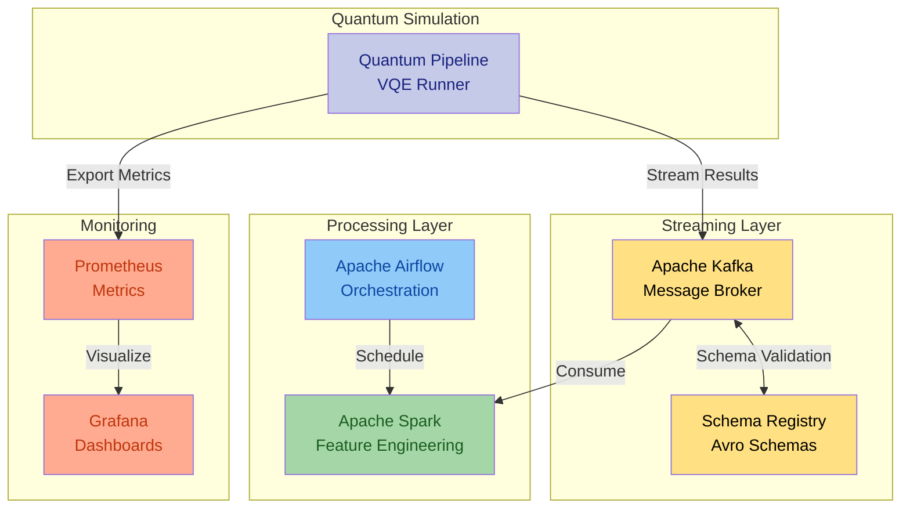

# Quantum Pipeline

  

  
  
  
  
   
  
  
  
  

## Overview

Quantum Pipeline is a framework for running quantum algorithms. Currently, only
the **Variational Quantum Eigensolver (VQE)** is implemented. It combines quantum
and classical computing to estimate the ground-state energy of molecular systems.

The framework handles algorithm orchestration, parametrization, monitoring, and
data visualization. Simulation results can be streamed via **Apache Kafka** for
real-time processing and transformed into ML features using **Apache Spark**.

This started as an engineering thesis project at DSW University of Lower Silesia,
and it is still a work in progress.

---

## Key Features

### Core Quantum Computing

- **Molecule Loading** - Load and validate molecular data from JSON files
- **Hamiltonian Preparation** - Generate second-quantized Hamiltonians for molecular systems
- **Quantum Circuit Construction** - Parameterized ansatz circuits (EfficientSU2, RealAmplitudes, ExcitationPreserving)
- **VQE Execution** - Multiple optimizers (L-BFGS-B, COBYLA, SLSQP, Nelder-Mead, Powell, BFGS, CG, TNC, and others)
- **Initialization Strategies** - Random uniform or Hartree-Fock based parameter initialization
- **Backend Options** - Configurable simulation method, shot count, optimization level, GPU acceleration

### Data Engineering Pipeline

- **Real-time Streaming** - Stream simulation results to Apache Kafka with Avro serialization
- **ML Feature Engineering** - Transform quantum experiment data into ML features using Apache Spark
- **Workflow Orchestration** - Automate data processing workflows using Apache Airflow

### ML Pipeline

- **Convergence Prediction** - Predict VQE convergence behavior from experiment metadata
- **Energy Estimation** - Estimate ground-state energies from molecular and circuit parameters
- **Experiment Tracking** - Log and compare ML training runs via MLflow
- **Dedicated Stack** - Separate Docker Compose stack (`just ml-up` / `just ml-down`)

### Monitoring and Observability

- **Prometheus Metrics** - Export performance and resource metrics to Prometheus via PushGateway
- **Grafana Dashboards** - Visualize simulation performance, convergence, and system resources
- **Environment Configuration** - Toggle monitoring via `MONITORING_ENABLED`, `PUSHGATEWAY_URL`, `MONITORING_INTERVAL`, `MONITORING_EXPORT_FORMAT`

### Analytics and Visualization

- **Visualization Tools** - Plot molecular structures, energy convergence, and operator coefficients
- **Report Generation** - Automatically generate PDF reports for each processed molecule
- **Feature Tables** - Access structured data through ML feature tables

### Deployment

- **Docker Images** - CPU (`quantum-pipeline:cpu`) and GPU (`quantum-pipeline:gpu`) images
- **Docker Compose** - Multi-service stack for the full data platform
- **GPU Acceleration** - CUDA-based simulation via Qiskit Aer

---

## Quick Links

-   **Getting Started**

    ---

    Install Quantum Pipeline and run your first VQE simulation in minutes

    [Installation Guide →](getting-started/installation.md)

-   **Configuration**

    ---

    Learn about optimizers, ansatz types, initialization strategies, and parameter tuning

    [Usage Guide →](usage/index.md)

-   **Architecture**

    ---

    Understand the system design and data flow

    [Architecture Docs →](architecture/index.md)

-   **Deployment**

    ---

    Deploy with Docker, enable GPU acceleration, configure environments

    [Deployment Guide →](deployment/index.md)

---

## System Architecture

<figure>
  
  <figcaption>Figure 1. Overview of the GPU-accelerated quantum pipeline service architecture.</figcaption>
</figure>

### Data Platform Architecture

The following diagram presents the general data platform architecture. Kafka streams
VQE results to Spark for feature engineering, with Airflow orchestrating the workflows.

```mermaid
graph TB
    subgraph "Quantum Simulation"
        QP[Quantum Pipeline<br/>VQE Runner]
    end

    subgraph "Streaming Layer"
        KAFKA[Apache Kafka<br/>Message Broker]
        SR[Schema Registry<br/>Avro Schemas]
    end

    subgraph "Processing Layer"
        AIRFLOW[Apache Airflow<br/>Orchestration]
        SPARK[Apache Spark<br/>Feature Engineering]
    end

    subgraph "Monitoring"
        PROM[Prometheus<br/>Metrics]
        GRAF[Grafana<br/>Dashboards]
    end

    QP -->|Stream Results| KAFKA
    KAFKA <-->|Schema Validation| SR
    KAFKA -->|Consume| SPARK
    AIRFLOW -->|Schedule| SPARK
    QP -->|Export Metrics| PROM
    PROM -->|Visualize| GRAF

    style QP fill:#c5cae9,color:#1a237e
    style KAFKA fill:#ffe082,color:#000
    style SR fill:#ffe082,color:#000
    style SPARK fill:#a5d6a7,color:#1b5e20
    style AIRFLOW fill:#90caf9,color:#0d47a1
    style PROM fill:#ffab91,color:#bf360c
    style GRAF fill:#ffab91,color:#bf360c
```

---

## Technology Stack

=== "Quantum Computing"

    - **Qiskit** - IBM's quantum computing framework
    - **Qiskit Aer** - Quantum circuit simulator
    - **PySCF** - Quantum chemistry library for Python
    - **CUDA/cuQuantum** - GPU acceleration for quantum simulations

=== "Data Engineering"

    - **Apache Kafka** - Distributed event streaming platform
    - **Apache Spark** - Unified analytics engine for big data
    - **Apache Airflow** - Workflow orchestration platform

=== "ML Pipeline"

    - **scikit-learn / XGBoost** - Model training
    - **MLflow** - Experiment tracking and training run comparison

=== "Infrastructure"

    - **Docker** - Container platform
    - **Prometheus** - Monitoring and metrics collection
    - **Grafana** - Metrics visualization and dashboards
    - **PostgreSQL** - Relational database for metadata

---

## Use Cases

!!! example "Research and Development"

    - Explore VQE convergence behavior across different molecules
    - Benchmark CPU vs GPU acceleration for quantum simulations
    - Compare optimizer and initialization strategy performance

!!! example "Data Science and ML"

    - Analyze quantum experiment metadata at scale
    - Train predictive models on VQE convergence data

!!! example "Deployment"

    - Run automated quantum simulations
    - Monitor system performance and resource usage

---

## Next Steps

1. **[Install Quantum Pipeline](getting-started/installation.md)** - Get up and running
2. **[First Simulation](getting-started/quick-start.md)** - H\(_2\) molecule example
3. **[Configuration Options](usage/configuration.md)** - Customize your setup
4. **[Full Platform Deployment](deployment/docker-compose.md)** - Launch all services

---

## Links related to the project

- **GitHub**: [straightchlorine/quantum-pipeline](https://github.com/straightchlorine/quantum-pipeline)
- **Codeberg (mirror)**: [piotrkrzysztof/quantum-pipeline](https://codeberg.org/piotrkrzysztof/quantum-pipeline)
- **Docker Hub**: [straightchlorine/quantum-pipeline](https://hub.docker.com/r/straightchlorine/quantum-pipeline)
- **PyPI**: [quantum-pipeline](https://pypi.org/project/quantum-pipeline/)
- **Issues**: [Report bugs or request features](https://github.com/straightchlorine/quantum-pipeline/issues)

---

!!! info "Engineering Thesis Project"
    This project was developed as part of an engineering thesis at the **DSW University of Lower Silesia**
    focusing on GPU-accelerated quantum simulations and modern data engineering for quantum
    computing workflows.
