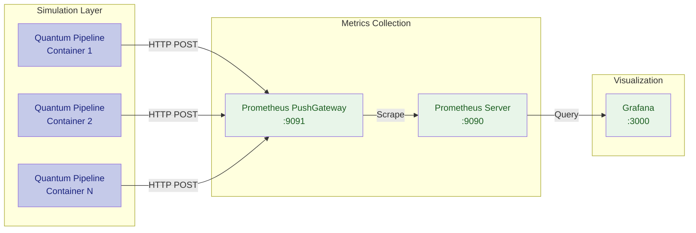

# Monitoring

The monitoring stack uses **Prometheus** and **Grafana** for real-time visibility into VQE performance, resource utilization, and pipeline health.

## Monitoring Architecture

Simulation containers push metrics to the **Prometheus PushGateway**, which Prometheus scrapes on its configured interval. **Grafana** renders dashboards from the Prometheus data source.



## Components

| Component | Port | Purpose |
|-----------|------|---------|
| **Prometheus PushGateway** | `:9091` | Receives metrics pushed from simulation containers |
| **Prometheus** | `:9090` | Scrapes, stores, and queries time-series metric data |
| **Grafana** | `:3000` | Visualizes metrics through configurable dashboards |

### Prometheus PushGateway

Ingestion point for metrics from short-lived simulation containers. The push model ensures metrics are exported before container termination.

- **URL:** `http://pushgateway:9091`
- **Metrics endpoint:** `http://pushgateway:9091/metrics`

### Prometheus Server

Scrapes the PushGateway at regular intervals and stores time-series data. Supports PromQL for querying.

- **URL:** `http://prometheus:9090`
- **Retention:** Configurable (default 15 days)

### Grafana

Pre-built dashboards for VQE execution, system resources, and scientific accuracy. The thesis analysis dashboard is included in the repository.

- **URL:** `http://grafana:3000`
- **Default credentials:** `admin` / `admin`

## Enabling Monitoring

Activate monitoring with the `--enable-performance-monitoring` flag:

```bash
quantum-pipeline run \
    --molecule H2 \
    --basis-set sto-3g \
    --optimizer L-BFGS-B \
    --enable-performance-monitoring
```

When enabled, the container will:

1. Collect CPU and memory metrics in a background thread
2. Push system metrics to the PushGateway at configurable intervals
3. Export VQE metrics (iterations, energy, timing) on completion
4. Report GPU utilization if CUDA is detected

!!! info "Monitoring Overhead"
    The monitoring thread introduces minimal overhead (< 1% CPU) and runs independently of VQE computation.

## Service URLs

With Docker Compose, services are accessible at:

| Service | URL | Description |
|---------|-----|-------------|
| PushGateway | `http://localhost:9091` | View pushed metrics, manage metric groups |
| Prometheus | `http://localhost:9090` | Query metrics, view targets, check alerts |
| Grafana | `http://localhost:3000` | Dashboards, alerting, data exploration |

## Quick Verification

Verify the stack is operational after deployment:

```bash
# Check PushGateway is receiving metrics
curl -s http://localhost:9091/metrics | head -20

# Check Prometheus is scraping successfully
curl -s http://localhost:9090/api/v1/targets | python -m json.tool

# Check Grafana is accessible
curl -s -o /dev/null -w "%{http_code}" http://localhost:3000/api/health
```

---

## Monitoring Pages

<div class="grid cards" markdown>

-   **[Performance Metrics](performance-metrics.md)**

    Metric names, labels, and PromQL query examples.

-   **[Grafana Dashboards](grafana-dashboards.md)**

    Setup, import, and usage of pre-built VQE dashboards.

</div>

---

[:octicons-arrow-right-24: System Design](../architecture/system-design.md)
