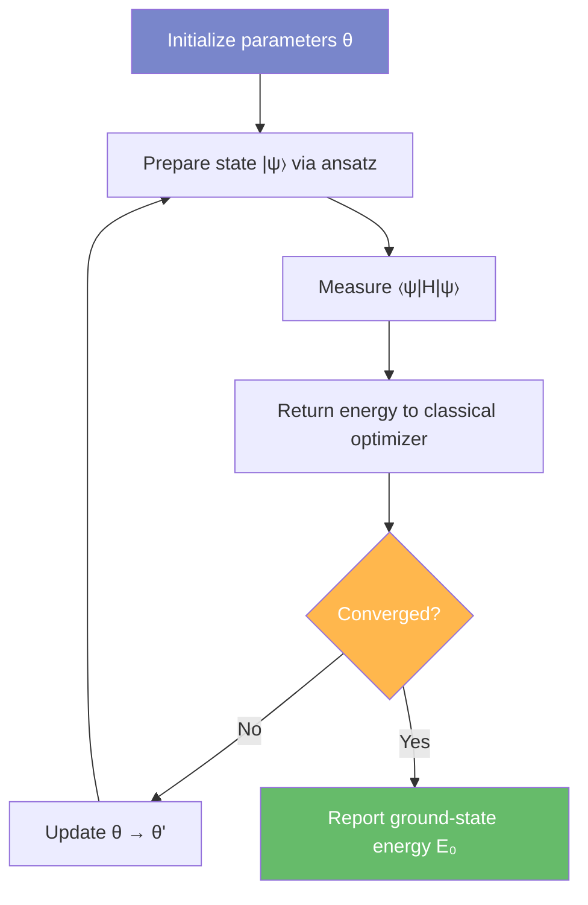

# Variational Quantum Eigensolver

The Variational Quantum Eigensolver (VQE) is a hybrid quantum-classical algorithm
designed to approximate the ground-state energy of a quantum system. Originally
proposed by Peruzzo et al. (2014), VQE combines parameterized quantum circuits
with classical optimization to find the lowest eigenvalue of a molecular
Hamiltonian. Its shallow circuit depth and tolerance for noise make it one of the
most practical algorithms for near-term quantum devices operating in the NISQ
(Noisy Intermediate-Scale Quantum) regime.

For a thorough treatment of VQE theory, see Tilly et al. (2022) and the
[Qiskit VQE tutorial](https://learning.quantum.ibm.com/tutorial/variational-quantum-eigensolver).

---

## Algorithm Overview

The VQE algorithm operates as an iterative loop between a quantum processor (or
simulator) and a classical optimizer:

1. **Initialization** - Select a molecular system, basis set, and ansatz.
   Initialize the variational parameters \(\theta\).

2. **State Preparation** - Execute the parameterized quantum circuit (ansatz)
   to prepare the trial state \(\lvert \psi(\theta) \rangle\).

3. **Energy Measurement** - Measure the expectation value
   \(\langle \psi(\theta) | \hat{H} | \psi(\theta) \rangle\) by decomposing
   the Hamiltonian into a sum of Pauli operators.

4. **Classical Optimization** - Feed the measured energy back to a classical
   optimizer (e.g., [L-BFGS-B](https://docs.scipy.org/doc/scipy/reference/optimize.minimize-lbfgsb.html),
   [COBYLA](https://docs.scipy.org/doc/scipy/reference/optimize.minimize-cobyla.html)),
   which proposes updated parameters \(\theta'\).

5. **Convergence Check** - If the energy change between successive iterations
   falls below a specified threshold (e.g., \(10^{-6}\) Ha), terminate.
   Otherwise, return to step 2.

### Flowchart

The following diagram illustrates the VQE optimization loop as implemented in
the Quantum Pipeline:

---

## Ansatz Construction

The **ansatz** is the parameterized quantum circuit that prepares the trial
state. The choice of ansatz is critical to VQE performance: it must be
expressive enough to represent the ground state while remaining shallow enough
to execute on noisy hardware.

### UCCSD Ansatz

The Unitary Coupled Cluster Singles and Doubles (UCCSD) ansatz is a
chemistry-inspired construction that applies single and double excitation
operators to a Hartree-Fock reference state:

\[
\lvert \psi_{\text{UCCSD}} \rangle = e^{T(\theta) - T^\dagger(\theta)} \lvert \phi_0 \rangle
\]

While UCCSD provides strong theoretical guarantees, its circuit depth can be
prohibitive for NISQ devices, motivating hardware-efficient alternatives.

### EfficientSU2 Ansatz

The Quantum Pipeline employs the [**EfficientSU2**](https://docs.quantum.ibm.com/api/qiskit/qiskit.circuit.library.EfficientSU2) ansatz from Qiskit
([source](https://github.com/straightchlorine/quantum-pipeline/blob/master/quantum_pipeline/solvers/vqe_solver.py#L189))
as the default circuit construction. EfficientSU2 is a hardware-efficient ansatz that
uses layers of single-qubit SU(2) rotations followed by entangling CNOT gates.
Its advantages include:

- **Shallow circuit depth** - scales linearly with the number of qubits and
  layers, making it feasible for NISQ simulation.
- **Full SU(2) coverage** - each qubit undergoes RY and RZ rotations,
  providing sufficient expressibility for many molecular systems.
- **Flexible entanglement** - supports various entanglement patterns (linear,
  full, circular).

The trade-off is that hardware-efficient ansatze lack the physical intuition of
UCCSD and may encounter optimization difficulties such as barren plateaus for
large systems.

---

## Experimental Observations

The thesis experiments ran VQE with random parameter initialization and a
single optimizer (L-BFGS-B) across six molecules. The results illustrate both
the potential and the current limitations of the approach.

The optimizer ran for approximately 650 iterations (H\(_2\)) and 630 iterations
(HeH\(^+\)) on average for 4-qubit systems, and 1,500-2,700 iterations for
larger molecules (8-12 qubits). In most cases, the optimizer was terminated
without reaching the known ground-state energy — the runs show the optimizer
exploring the landscape and getting trapped in local minima, not converging
to the correct solution.

### Why the Results Fall Short

The pipeline initializes EfficientSU2 parameters from a uniform random
distribution over \([0, 2\pi)\) via
[`np.random.random()`](https://github.com/straightchlorine/quantum-pipeline/blob/master/quantum_pipeline/solvers/vqe_solver.py#L193).
Because the VQE cost function is non-convex and [L-BFGS-B](https://docs.scipy.org/doc/scipy/reference/optimize.minimize-lbfgsb.html) is a local optimizer,
each run converges to the nearest minimum from its starting point - not
necessarily the global minimum.

- **Small molecules (H\(_2\), 4 qubits, 32 parameters):** Figure 1 shows one
  of three runs approaching -1.117 Ha (HF/STO-3G; Szabo & Ostlund 1996, p.108)
  while the other two settle in shallower local minima.
- **Larger molecules (H\(_2\)O, 12 qubits, 96+ parameters):** Random starting
  points produced relative errors of 9-25% in the benchmarking results.

EfficientSU2 does not preserve particle number or spin symmetry, which can lead
to anomalous results such as the HeH\(^+\) VQE energy falling below the exact
Full CI value (see
[Benchmarking: Comparison with Reference Values](../scientific/benchmarking.md#comparison-with-reference-values)).

Hardware-efficient ansatze are also susceptible to **barren plateaus** - regions
where gradients vanish exponentially with system size (McClean et al. 2018).

The following are planned next steps to address the problems documented above:

- **Hartree-Fock-informed initialization** - using the classical HF solution as
  a starting point instead of random parameters.
- **Adaptive ansatze (ADAPT-VQE)** - dynamically growing the circuit to lower
  energy at each step (Grimsley et al. 2019).
- **Multiple random restarts** - running VQE from several initial points and
  selecting the best result.

<figure>
  
  <figcaption>Figure 1. VQE optimization trajectories for H2 across three hardware configurations over ~700 iterations. The three energy bands (~-0.9, ~-0.7, ~-0.6 Ha) result from different random initializations, not hardware differences. None of the runs reached the known ground-state energy of -1.117 Ha (HF/STO-3G; Szabo &amp; Ostlund 1996). The best trace (~-0.9 Ha) remains ~20% above it; the other two are trapped in shallow local minima. This illustrates the fundamental challenge of random initialization with a hardware-efficient ansatz.</figcaption>
</figure>

<figure>
  
  <figcaption>Figure 2. VQE optimization trajectory for LiH (8 qubits). The optimizer ran for more iterations than H2 but the trajectory shows extended plateaus rather than steady progress toward the ground state, reflecting the difficulty of navigating a larger parameter space with random initialization.</figcaption>
</figure>

Known problems identified in the thesis experiments:

- **Basis set complexity** — cc-pVDZ experiments failed entirely (energies of
  24-26 Ha vs expected -1 Ha for H\(_2\)).
- **Ansatz limitations** — EfficientSU2 does not preserve particle number or
  spin symmetry, leading to unphysical results (e.g. HeH\(^+\) sub-FCI anomaly).

---

## Implementation in Quantum Pipeline

Within the Quantum Pipeline framework, VQE simulations are executed through the
[`vqe_runner`](https://github.com/straightchlorine/quantum-pipeline/blob/master/quantum_pipeline/runners/vqe_runner.py) module, which orchestrates the interaction between Qiskit's quantum
circuit primitives and the classical optimization backend. Key implementation
details include:

- [**Hamiltonian construction**](https://github.com/straightchlorine/quantum-pipeline/blob/master/quantum_pipeline/runners/vqe_runner.py#L145) via PySCF driver integration, supporting multiple
  basis sets and molecular geometries.
- [**Qubit mapping**](https://github.com/straightchlorine/quantum-pipeline/blob/master/quantum_pipeline/mappers/jordan_winger_mapper.py) via Jordan-Wigner transformation, converting the second-quantized Hamiltonian to a qubit operator.
- **Ansatz selection** defaulting to [EfficientSU2](https://docs.quantum.ibm.com/api/qiskit/qiskit.circuit.library.EfficientSU2)
  ([source](https://github.com/straightchlorine/quantum-pipeline/blob/master/quantum_pipeline/solvers/vqe_solver.py#L189))
  with configurable depth and entanglement topology.
- **Optimizer** defaulting to [L-BFGS-B](https://docs.scipy.org/doc/scipy/reference/optimize.minimize-lbfgsb.html)
  ([source](https://github.com/straightchlorine/quantum-pipeline/blob/master/quantum_pipeline/configs/defaults.py#L9)),
  with support for [COBYLA](https://docs.scipy.org/doc/scipy/reference/optimize.minimize-cobyla.html),
  [SLSQP](https://docs.scipy.org/doc/scipy/reference/optimize.minimize-slsqp.html),
  [Nelder-Mead](https://docs.scipy.org/doc/scipy/reference/optimize.minimize-neldermead.html),
  and SPSA. All optimizers are provided by [`scipy.optimize.minimize`](https://docs.scipy.org/doc/scipy/reference/generated/scipy.optimize.minimize.html).
  See the [Optimizers](../usage/optimizers.md) page for configuration details.
- **Statevector simulation** with optional GPU acceleration through NVIDIA
  cuQuantum, enabling significant speedups for medium-to-large molecular
  systems (see [GPU Acceleration](../deployment/gpu-acceleration.md)).
- **Streaming telemetry** - iteration-level data (energy, parameters, timing)
  is published to Apache Kafka for real-time monitoring and post-hoc analysis.

For practical guidance on running VQE simulations, consult the
[Quick Start](../getting-started/quick-start.md) and
[Examples](../usage/examples.md) pages.

---

## References

1. Peruzzo, A. et al. *A variational eigenvalue solver on a photonic quantum processor.* Nature Communications 5, 4213 (2014).
2. McClean, J.R. et al. *The theory of variational hybrid quantum-classical algorithms.* New Journal of Physics 18, 023023 (2016).
3. Tilly, J. et al. *The Variational Quantum Eigensolver: A review of methods and best practices.* Physics Reports 986, 1-128 (2022).
4. McClean, J.R. et al. *Barren plateaus in quantum neural network training landscapes.* Nature Communications 9, 4812 (2018).
5. Grimsley, H.R. et al. *An adaptive variational algorithm for exact molecular simulations on a quantum computer.* Nature Communications 10, 3007 (2019).
6. Szabo, A. & Ostlund, N.S. *Modern Quantum Chemistry: Introduction to Advanced Electronic Structure Theory.* Dover Publications (1996).
