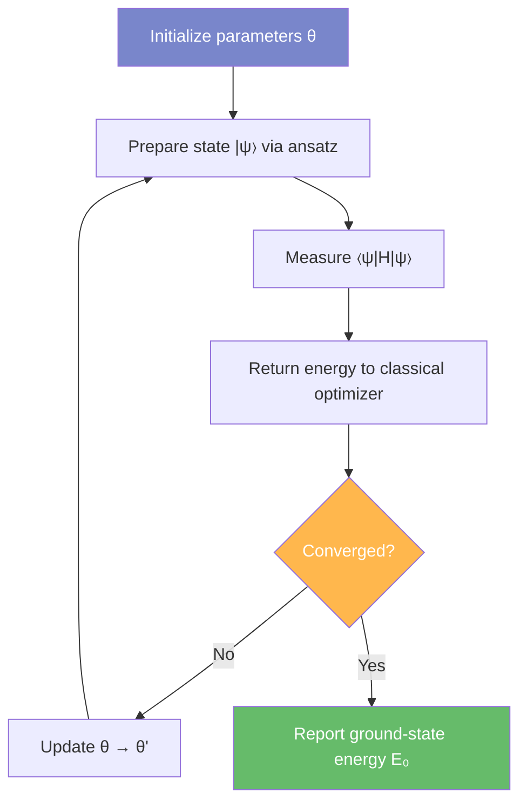

# Variational Quantum Eigensolver

The Variational Quantum Eigensolver (VQE) is a hybrid quantum-classical algorithm
for approximating the ground-state energy of a quantum system. Originally
proposed by Peruzzo et al. (2014), VQE combines parameterized quantum circuits
with classical optimization to find the lowest eigenvalue of a molecular
Hamiltonian. Its shallow circuit depth makes it practical for near-term quantum
devices in the NISQ regime.

For a thorough treatment, see Tilly et al. (2022) and the
[Qiskit VQE tutorial](https://learning.quantum.ibm.com/tutorial/variational-quantum-eigensolver).

## Algorithm Overview

The VQE algorithm operates as an iterative loop between a quantum processor (or
simulator) and a classical optimizer:

1. **Initialization** - Select a molecular system, basis set, and ansatz.
   Initialize the variational parameters \(\theta\) (randomly or via
   Hartree-Fock pre-optimization).

2. **State Preparation** - Execute the parameterized quantum circuit (ansatz)
   to prepare the trial state \(\lvert \psi(\theta) \rangle\).

3. **Energy Measurement** - Measure the expectation value
   \(\langle \psi(\theta) | \hat{H} | \psi(\theta) \rangle\) by decomposing
   the Hamiltonian into a sum of Pauli operators.

4. **Classical Optimization** - Feed the measured energy back to a classical
   optimizer, which proposes updated parameters \(\theta'\). The pipeline
   supports multiple optimizers via
   [`scipy.optimize.minimize`](https://docs.scipy.org/doc/scipy/reference/generated/scipy.optimize.minimize.html) -
   see [Optimizers](../usage/optimizers.md) for details.

5. **Convergence Check** - If the energy change between successive iterations
   falls below a specified threshold (e.g., \(10^{-6}\) Ha), terminate.
   Otherwise, return to step 2.

### Flowchart

```mermaid
flowchart TD
    A["Initialize parameters #952;"] --> B["Prepare state #124;#968;#9002; via ansatz"]
    B --> C["Measure #9001;#968;#124;H#124;#968;#9002;"]
    C --> D[Return energy to classical optimizer]
    D --> E{Converged?}
    E -->|No| F["Update #952; #8594; #952;#39;"]
    F --> B
    E -->|Yes| G["Report ground-state energy E#8320;"]

    style A fill:#7986cb,color:#ffffff
    style G fill:#66bb6a,color:#ffffff
    style E fill:#ffb74d,color:#ffffff
```

## Ansatz Construction

The **ansatz** is the parameterized quantum circuit that prepares the trial
state. The choice of ansatz is critical: it must be expressive enough to
represent the ground state while remaining shallow enough for noisy hardware.

The pipeline supports three ansatz types, all from Qiskit's circuit library.
The ansatz is selected via the `--ansatz` CLI flag (default: `EfficientSU2`).
See
[`_build_ansatz()`](https://codeberg.org/piotrkrzysztof/quantum-pipeline/src/branch/master/quantum_pipeline/solvers/vqe_solver.py#L93)
for the implementation.

### UCCSD Ansatz (Background)

The Unitary Coupled Cluster Singles and Doubles (UCCSD) ansatz is a
chemistry-inspired construction that applies single and double excitation
operators to a Hartree-Fock reference state:

\[
\lvert \psi_{\text{UCCSD}} \rangle = e^{T(\theta) - T^\dagger(\theta)} \lvert \phi_0 \rangle
\]

While UCCSD provides strong theoretical guarantees, its circuit depth can be
prohibitive for NISQ devices, motivating hardware-efficient alternatives. The
pipeline does not implement UCCSD, but it is included here for context.

### EfficientSU2 (Default)

[EfficientSU2](https://docs.quantum.ibm.com/api/qiskit/qiskit.circuit.library.EfficientSU2)
is a hardware-efficient ansatz that uses layers of single-qubit SU(2) rotations
(RY, RZ) followed by entangling CNOT gates.

- **Expressibility:** Full SU(2) coverage per qubit. High expressibility across
  a broad range of molecular systems.
- **Circuit depth:** Scales linearly with the number of qubits and repetition
  layers (`reps`), making it feasible for NISQ simulation.
- **Entanglement:** Supports various entanglement patterns (linear, full,
  circular).
- **Symmetry:** Does not preserve particle number or spin symmetry, which can
  lead to unphysical states (see
  [Experimental Observations](#experimental-observations)).
- **HF initialization:** Supported. The pre-optimization finds EfficientSU2
  parameters that approximate the Hartree-Fock state.

This is the default and most-tested ansatz. All thesis experiments used
EfficientSU2.

### RealAmplitudes

[RealAmplitudes](https://docs.quantum.ibm.com/api/qiskit/qiskit.circuit.library.RealAmplitudes)
uses only RY rotations (no RZ), producing states with purely real amplitudes.

- **Expressibility:** Lower than EfficientSU2 due to the restricted gate set.
  Suitable for systems where the ground state has predominantly real
  coefficients.
- **Circuit depth:** Similar structure to EfficientSU2 but with fewer
  parameters per layer (one rotation per qubit instead of two).
- **Symmetry:** Does not preserve particle number or spin symmetry.
- **HF initialization:** Not supported. Falls back to random initialization
  with a warning.

Tested in v2.0.0 verification: SLSQP with RealAmplitudes (3 reps) on H\(_2\)/STO-3G
reached -1.111 Ha in 50 iterations.

### ExcitationPreserving

[ExcitationPreserving](https://docs.quantum.ibm.com/api/qiskit/qiskit.circuit.library.ExcitationPreserving)
conserves the number of excitations (particles) in the system.

- **Expressibility:** More physically constrained than EfficientSU2.
  Explores only states with the same particle number as the initial state.
- **Circuit depth:** Uses RZ rotations and RXX+RYY entangling gates that
  preserve excitation number.
- **Symmetry:** Preserves particle number, which prevents the sub-FCI
  anomalies observed with EfficientSU2 (e.g., the HeH+ issue described below).
- **Entanglement:** Uses linear entanglement by default in the pipeline.
- **HF initialization:** Not supported. Falls back to random initialization
  with a warning.

Tested in v2.0.0 verification: Powell with ExcitationPreserving on H\(_2\)/STO-3G
reached -0.005 Ha in 30 iterations - a poor result, likely due to the
combination of optimizer and limited iterations rather than the ansatz itself.

## Parameter Initialization

The choice of initial parameters \(\theta_0\) has a large effect on VQE
outcomes. Because the VQE cost function is non-convex, a local optimizer
converges to the nearest minimum from its starting point, which may not be the
global minimum.

### Random Initialization

The default strategy initializes parameters from a uniform random distribution
over \([0, 2\pi)\). This is simple and unbiased, but it is the primary source
of poor convergence in the thesis experiments. Random starting points frequently
land in regions far from the ground state, and local optimizers cannot escape
the resulting local minima. The problem worsens with system size: more
parameters mean a larger search space and more local minima to get trapped in.

See
[`_compute_initial_parameters()`](https://codeberg.org/piotrkrzysztof/quantum-pipeline/src/branch/master/quantum_pipeline/solvers/vqe_solver.py#L155)
for the implementation.

### Hartree-Fock Initialization

Added in v1.4.0 and refined in v2.0.0, the `--init-strategy hf` flag starts
VQE from the classical Hartree-Fock solution instead of a random point.

**How it works:** A classical pre-optimization finds ansatz parameters that
prepare the Hartree-Fock state through the ansatz circuit, by maximizing state
fidelity between the ansatz output and the HF reference state. The
pre-optimization uses COBYLA with up to 10 attempts (different random seeds)
and a fidelity threshold of 0.9999. See
[`_compute_hf_initial_parameters()`](https://codeberg.org/piotrkrzysztof/quantum-pipeline/src/branch/master/quantum_pipeline/solvers/vqe_solver.py#L114)
for the implementation.

**Why not just prepend the HF circuit?** A naive approach - prepending a
HartreeFock circuit to EfficientSU2 and setting all parameters to zero - does
not work. The fixed CX entangling gates in EfficientSU2 are not parameterized
and always act, regardless of rotation angles. At zero parameters the rotation
gates become identity, but the CX gates still scramble the HF state. The
pre-optimization approach avoids this by finding parameters where the ansatz
itself produces the HF state.

**Current limitations:**

- Only supported for EfficientSU2. Other ansatz types fall back to random
  initialization with a warning.
- The pre-optimization itself takes time (COBYLA, up to 1000 iterations per
  attempt, up to 10 attempts), though this is typically small relative to the
  main VQE optimization.
- Fidelity degrades with system size.

**Verification results from v2.0.0 (H2, 6-31G basis, L-BFGS-B):**

| Init Strategy | Iterations | H2 Energy (Ha) | Outcome |
|---------------|-----------|----------------|---------|
| Random | 1029 | +2.101 | Stuck in barren plateau |
| HF | 50 | -1.857 | Correct energy region |

This is a clear example of why initialization matters. The random run spent over
1000 iterations to arrive at a *positive* energy for H2 - physically
meaningless. The HF run reached a reasonable energy in 50 iterations.

## Experimental Observations

### Thesis Experiments (v1.x)

The thesis experiments ran VQE with random parameter initialization and a
single optimizer (L-BFGS-B) across six molecules. The results illustrate both
the potential and the current limitations of the approach.

The optimizer ran for approximately 650 iterations (H\(_2\)) and 630 iterations
(HeH\(^+\)) on average for 4-qubit systems, and 1,500-2,700 iterations for
larger molecules (8-12 qubits). In most cases, the optimizer was terminated
without reaching the known ground-state energy - the runs show the optimizer
exploring the landscape and getting trapped in local minima, not converging
to the correct solution.

#### Why the Results Fall Short

The pipeline initializes EfficientSU2 parameters from a uniform random
distribution over \([0, 2\pi)\). Because the VQE cost function is non-convex
and L-BFGS-B is a local optimizer, each run converges to the nearest minimum
from its starting point - not necessarily the global minimum.

- **Small molecules (H\(_2\), 4 qubits, 32 parameters):** Figure 1 shows one
  of three runs approaching -1.117 Ha (HF/STO-3G; Szabo & Ostlund 1996, p.108)
  while the other two settle in shallower local minima.
- **Larger molecules (H\(_2\)O, 12 qubits, 96+ parameters):** Random starting
  points produced relative errors of 9-25% in the benchmarking results.

EfficientSU2 does not preserve particle number or spin symmetry, which can lead
to anomalous results such as the HeH\(^+\) VQE energy falling below the exact
Full CI value (see
[Benchmarking: Comparison with Reference Values](../scientific/benchmarking.md#comparison-with-reference-values)).

Hardware-efficient ansatze are also susceptible to **barren plateaus** - regions
where gradients vanish exponentially with system size (McClean et al. 2018).

### v2.0.0 Verification

Version 2.0.0 tested a broader range of configurations (multiple optimizers,
both initialization strategies, multiple ansatz types). The full verification
table is in the [Changelog](../changelog.md#200). Key observations:

- **HF initialization consistently outperforms random** for EfficientSU2.
  COBYLA with HF init reached -1.836 Ha for H2 (vs. -1.555 Ha with random).
  L-BFGS-B and BFGS with HF init both reached -1.838 Ha.
- **Optimizer choice matters.** COBYLA and SLSQP performed well with random
  init; L-BFGS-B struggled more (likely due to barren plateau sensitivity
  in gradient-based methods).
- **Basis set + init interaction is significant.** L-BFGS-B with random init
  on 6-31G produced +2.101 Ha for H2 (barren plateau). The same optimizer
  with HF init on 6-31G reached -1.857 Ha.

#### Steps Taken or Planned

- **Hartree-Fock initialization** - implemented in v1.4.0, refined in v2.0.0.
  Provides meaningful improvement for small-to-medium molecules with
  EfficientSU2. Does not yet support other ansatz types.
- **Multiple ansatz types** - added in v2.0.0 (RealAmplitudes,
  ExcitationPreserving). ExcitationPreserving's particle conservation may
  help with the HeH+ sub-FCI anomaly, though it has not been extensively
  tested yet.
- **Adaptive ansatze (ADAPT-VQE)** - dynamically growing the circuit to lower
  energy at each step (Grimsley et al. 2019). Not yet implemented.
- **Multiple random restarts** - running VQE from several initial points and
  selecting the best result. Not yet implemented.

## Implementation in Quantum Pipeline

VQE simulations are executed through the
[`VQESolver`](https://codeberg.org/piotrkrzysztof/quantum-pipeline/src/branch/master/quantum_pipeline/solvers/vqe_solver.py#L47)
class, which orchestrates the interaction between Qiskit's quantum circuit
primitives and the classical optimization backend. Key implementation details:

- **Hamiltonian construction** via PySCF driver integration
  ([`provide_hamiltonian()`](https://codeberg.org/piotrkrzysztof/quantum-pipeline/src/branch/master/quantum_pipeline/runners/vqe_runner.py#L158)),
  supporting multiple basis sets and molecular geometries.
- **Qubit mapping** via Jordan-Wigner transformation, converting the
  second-quantized Hamiltonian to a qubit operator.
- **Ansatz selection** via
  [`_build_ansatz()`](https://codeberg.org/piotrkrzysztof/quantum-pipeline/src/branch/master/quantum_pipeline/solvers/vqe_solver.py#L93) -
  supports EfficientSU2 (default), RealAmplitudes, and ExcitationPreserving,
  with configurable depth (`reps`) and entanglement topology.
- **Parameter initialization** via
  [`_compute_initial_parameters()`](https://codeberg.org/piotrkrzysztof/quantum-pipeline/src/branch/master/quantum_pipeline/solvers/vqe_solver.py#L155) -
  random uniform \([0, 2\pi)\) or Hartree-Fock pre-optimization (EfficientSU2
  only).
- **Optimizer configuration** via the
  [optimizer config factory](https://codeberg.org/piotrkrzysztof/quantum-pipeline/src/branch/master/quantum_pipeline/solvers/optimizer_config.py#L218),
  with eight optimizers having dedicated configuration (three with custom
  classes: L-BFGS-B, COBYLA, SLSQP). See
  [Optimizers](../usage/optimizers.md) for the full list.
- **Statevector simulation** with optional GPU acceleration through NVIDIA
  cuQuantum (see [GPU Acceleration](../deployment/gpu-acceleration.md)).
- **Accuracy comparison** against the Hartree-Fock reference energy from PySCF,
  reported alongside the VQE result for each molecule.
- **Streaming telemetry** - iteration-level data (energy, parameters, timing)
  is published to Apache Kafka for real-time monitoring and post-hoc analysis.

For practical guidance on running VQE simulations, consult the
[Quick Start](../getting-started/quick-start.md) and
[Examples](../usage/examples.md) pages.

## References

1. Peruzzo, A. et al. *A variational eigenvalue solver on a photonic quantum processor.* Nature Communications 5, 4213 (2014).
2. McClean, J.R. et al. *The theory of variational hybrid quantum-classical algorithms.* New Journal of Physics 18, 023023 (2016).
3. Tilly, J. et al. *The Variational Quantum Eigensolver: A review of methods and best practices.* Physics Reports 986, 1-128 (2022).
4. McClean, J.R. et al. *Barren plateaus in quantum neural network training landscapes.* Nature Communications 9, 4812 (2018).
5. Grimsley, H.R. et al. *An adaptive variational algorithm for exact molecular simulations on a quantum computer.* Nature Communications 10, 3007 (2019).
6. Szabo, A. & Ostlund, N.S. *Modern Quantum Chemistry: Introduction to Advanced Electronic Structure Theory.* Dover Publications (1996).
7. Pachucki, K. & Komasa, J. *Schrodinger equation solved for the hydrogen molecule with unprecedented accuracy.* J. Chem. Phys. 144, 164306 (2016).
