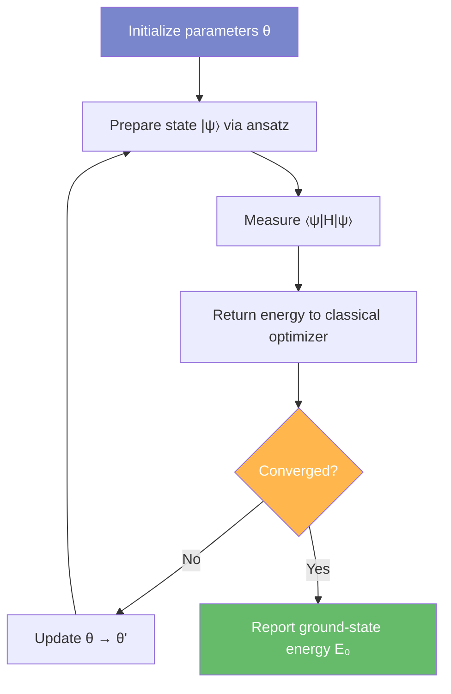

# Variational Quantum Eigensolver

The Variational Quantum Eigensolver (VQE) is a hybrid quantum-classical algorithm
for approximating the ground-state energy of a quantum system. Originally
proposed by Peruzzo et al. (2014), VQE combines parameterized quantum circuits
with classical optimization to find the lowest eigenvalue of a molecular
Hamiltonian.

Its shallow circuit depth makes it practical for near-term quantum devices in the NISQ era.

For a thorough treatment, see Tilly et al. (2022) and the
[Qiskit VQE tutorial](https://learning.quantum.ibm.com/tutorial/variational-quantum-eigensolver).

## Algorithm Overview

The VQE algorithm operates as an iterative loop between a quantum processor (or
simulator) and a classical optimizer:

1. **Initialization** - Select a molecular system, basis set, and ansatz.
   Initialize the variational parameters \(\theta\) (randomly or via
   Hartree-Fock pre-optimization).

2. **State Preparation** - Execute the parameterized quantum circuit (ansatz)
   to prepare the trial state \(\lvert \psi(\theta) \rangle\).

3. **Energy Measurement** - Evaluate the expectation value
   \(\langle \psi(\theta) | \hat{H} | \psi(\theta) \rangle\) by decomposing
   the Hamiltonian into a sum of Pauli operators. On the local simulator this
   can be done either by sampling a finite number of shots or by computing the
   expectation value exactly from the statevector (`--exact`).

4. **Classical Optimization** - Feed the measured energy back to a classical
   optimizer, which proposes updated parameters \(\theta'\). The pipeline
   supports multiple optimizers via
   [`scipy.optimize.minimize`](https://docs.scipy.org/doc/scipy/reference/generated/scipy.optimize.minimize.html) -
   see [Optimizers](../usage/optimizers.md) for details.

5. **Convergence Check** - Stop when the optimizer's own stopping criterion
   fires at the configured threshold (e.g., \(10^{-6}\)), or when the
   evaluation budget runs out. Otherwise, return to step 2. That threshold is
   not an error bar on the energy; each optimizer tests its own stopping
   criterion. Whichever way the loop ends, the run
   reports the lowest energy actually evaluated together with the parameters
   that produced it, not the optimizer's final point.

### Flowchart

```mermaid
flowchart TD
    A["Initialize parameters #952;"] --> B["Prepare state #124;#968;#9002; via ansatz"]
    B --> C["Measure #9001;#968;#124;H#124;#968;#9002;"]
    C --> D[Return energy to classical optimizer]
    D --> E{Converged?}
    E -->|No| F["Update #952; #8594; #952;#39;"]
    F --> B
    E -->|Yes| G["Report ground-state energy E#8320;"]

    style A fill:#7986cb,color:#ffffff
    style G fill:#66bb6a,color:#ffffff
    style E fill:#ffb74d,color:#ffffff
```

## Ansatz Construction

The **ansatz** is the parameterized quantum circuit that prepares the trial
state. It must be expressive enough to represent the ground state while
remaining shallow enough for noisy hardware.

Three ansatz types are available, all from Qiskit's circuit library, selected
with `--ansatz` (default `EfficientSU2`). Circuit depth is set with
`--ansatz-reps` (default 2). The entanglement topology is **not** a command-line
option: each ansatz is built with a fixed pattern, given in the table below. See
[`_build_ansatz()`](https://codeberg.org/piotrkrzysztof/quantum-pipeline/src/branch/master/quantum_pipeline/solvers/vqe_solver.py)
for the construction.

| | [EfficientSU2](https://docs.quantum.ibm.com/api/qiskit/qiskit.circuit.library.EfficientSU2) (default) | [RealAmplitudes](https://docs.quantum.ibm.com/api/qiskit/qiskit.circuit.library.RealAmplitudes) | [ExcitationPreserving](https://docs.quantum.ibm.com/api/qiskit/qiskit.circuit.library.ExcitationPreserving) |
|---|---|---|---|
| Rotation layer | \(R_Y\) and \(R_Z\) on every qubit | \(R_Y\) only, so all amplitudes stay real | \(R_Z\) on every qubit |
| Entangling layer | CNOTs in Qiskit's reverse-linear pattern | CNOTs in Qiskit's reverse-linear pattern | \(XX + YY\) rotations, all-to-all |
| Parameter count | \(2n(r+1)\) | \(n(r+1)\) | \(n(r+1) + r\,n(n-1)/2\) |
| Growth in qubits | Linear | Linear | Quadratic |
| Conserves particle number | No | No | Yes |
| Circuit starts from | \(\lvert 0 \rangle^{\otimes n}\) | \(\lvert 0 \rangle^{\otimes n}\) | The Hartree-Fock determinant, prepended as a fixed initial state |
| Parameters start at | Uniform \([0, 2\pi)\) | Uniform \([0, 2\pi)\) | A Gaussian jitter about zero: standard deviation 0.01 for `hf` (first energy within a few mHa of Hartree-Fock), 0.5 for `random` (first energy well above it) |
| Effect of `--init-strategy hf` | Runs the pre-optimization described below | Runs the same pre-optimization | Selects the narrow jitter (0.01) around the Hartree-Fock point; `random` selects the wide one (0.5) inside the same electron-number sector |
| Needs Hartree-Fock data | Only under `--init-strategy hf` | Only under `--init-strategy hf` | Always; the run fails without it |

Here \(n\) is the qubit count and \(r\) the repetition count. The reverse-linear
CNOT pattern used by the first two is Qiskit's default and reaches the same set
of states as all-to-all entanglement while using a number of CNOTs linear in
\(n\) rather than quadratic.

### EfficientSU2 (Default)

This is the default and by far the most-tested ansatz; every thesis experiment
used it. It is hardware-efficient rather than chemistry-derived: full SU(2)
coverage per qubit gives it high expressibility across a broad range of
molecular systems at a depth that scales linearly in qubits and repetitions.

It conserves nothing - not particle number, not spin - so the optimizer is free
to wander into states with the wrong electron count. That is what makes a
sub-FCI energy possible in principle (see
[Experimental Observations](#experimental-observations)).

### RealAmplitudes

Dropping the \(R_Z\) rotations halves the parameter count and restricts the
reachable states to those with purely real amplitudes. Expressibility is lower
than EfficientSU2's as a result, which suits systems whose ground state has
predominantly real coefficients and handicaps those that do not. Like
EfficientSU2 it conserves neither particle number nor spin.

Tested in v2.0.0 verification: SLSQP with RealAmplitudes (3 reps) on
H\(_2\)/STO-3G reached -1.111 Ha in 50 iterations.

### ExcitationPreserving

The \(XX + YY\) entangling blocks only move excitations between orbitals rather
than creating or destroying them, so the electron count is fixed for the whole
circuit. This rules out the unphysical states the other two can reach. It also
makes the circuit useless unless it starts in the right sector, which drives
three things the pipeline does automatically.

**It always prepends the Hartree-Fock state.** The circuit conserves whatever
particle number it is handed, and \(\lvert 0 \rangle^{\otimes n}\) is the
zero-electron state. Starting there, no choice of parameters and no number of
repetitions can reach the molecular ground state. The run therefore builds a
Hartree-Fock determinant
([`build_hf_initial_state()`](https://codeberg.org/piotrkrzysztof/quantum-pipeline/src/branch/master/quantum_pipeline/circuits/initial_states.py))
and prepends it as the circuit's fixed initial state, placing the right number
of electrons in the right orbitals before any parameterized gate runs. This is
independent of `--init-strategy`, which only changes the jitter scale (below).

**It uses all-to-all entanglement.** Adjacent-only coupling only slides
electrons between neighbouring orbitals, so the best reachable state is
Hartree-Fock itself. All-to-all coupling removes that limit at the cost of the
quadratic parameter growth in the table above.

**It starts from a jitter, not from zero.** At zero parameters the circuit gives
exactly the Hartree-Fock determinant, a stationary point (Brillouin's theorem) where the optimizer
would stay and report the Hartree-Fock energy. A small jitter breaks that,
and the scale is set in
[`constants.py`](https://codeberg.org/piotrkrzysztof/quantum-pipeline/src/branch/master/quantum_pipeline/configs/constants.py).

With all three in place, the ansatz reached chemical accuracy on H\(_2\) in
quick checks and improved with additional repetitions. This was not benchmarked
across the molecule set. Results predating this
configuration are not informative about the ansatz; see
[v2.0.0 Verification](#v200-verification).

### UCCSD (Not Implemented)

The Unitary Coupled Cluster Singles and Doubles ansatz applies single and double
excitation operators to a Hartree-Fock reference:

\[
\lvert \psi_{\text{UCCSD}} \rangle = e^{T(\theta) - T^\dagger(\theta)} \lvert \phi_0 \rangle
\]

It conserves particle number and spin by construction and its energy at
\(\theta = 0\) is exactly the Hartree-Fock energy, so improvement from there is
monotone. The pipeline does not implement it: the circuit depth is prohibitive
for NISQ devices.

## Parameter Initialization

The choice of initial parameters \(\theta_0\) has a large effect on VQE
outcomes. Because the VQE cost function is non-convex, a local optimizer
converges to the nearest minimum from its starting point, which may not be the
global minimum.

### Random Initialization

The default strategy initializes parameters from a uniform random distribution
over \([0, 2\pi)\). This is simple and unbiased, but it is the primary source
of poor convergence in the thesis experiments. Random starting points frequently
land in regions far from the ground state, and local optimizers cannot escape
the resulting local minima. The problem worsens with system size: more
parameters mean a larger search space and more local minima to get trapped in.

Sampling every parameter over a full period is also the worst case for
trainability. See
[`_compute_initial_parameters()`](https://codeberg.org/piotrkrzysztof/quantum-pipeline/src/branch/master/quantum_pipeline/solvers/vqe_solver.py)
for the implementation.

This is the starting point for EfficientSU2 and RealAmplitudes.
For ExcitationPreserving the circuit already contains the Hartree-Fock
determinant. There `hf` means a jitter of 0.01 around the Hartree-Fock point and
`random` a jitter of 0.5 inside the same electron-number sector; both are
recorded as requested.

Measured on H2/sto3g with COBYLA in convergence mode, seeds 1-3: `hf` ended 0 to
8.5 mHa below Hartree-Fock and stayed on that plateau. `random` reached the
correlated ground state (27 mHa below Hartree-Fock) in 2 of 3 seeds and a poor
minimum in the third.

### Hartree-Fock Initialization

Added in v1.4.0 and refined in v2.0.0, the `--init-strategy hf` flag starts
VQE from the classical Hartree-Fock solution instead of a random point.

**How it works:** A classical pre-optimization finds ansatz parameters that
prepare the Hartree-Fock state through the ansatz circuit, by maximizing state
fidelity between the ansatz output and the HF reference state. The
pre-optimization uses COBYLA with up to 10 attempts (different random seeds)
and a fidelity threshold of 0.9999. See
[`_compute_hf_initial_parameters()`](https://codeberg.org/piotrkrzysztof/quantum-pipeline/src/branch/master/quantum_pipeline/solvers/vqe_solver.py)
for the implementation.

**Why not just prepend the HF circuit?** Prepending a HartreeFock circuit to
EfficientSU2 and setting all parameters to zero does not work.

The fixed CX entangling gates in EfficientSU2 are not parameterized
and always act, regardless of rotation angles. At zero parameters the rotation
gates become identity, but the CX gates still alter the HF state. The
pre-optimization approach avoids this by finding parameters where the ansatz
itself produces the HF state.

**Current limitations:**

- The pre-optimization covers EfficientSU2 and RealAmplitudes. It falls back
  to random initialization, with a warning, only when no Hartree-Fock data is
  available.
- The pre-optimization itself takes time (COBYLA, up to 1000 iterations per
  attempt, up to 10 attempts), though this is typically small relative to the
  main VQE optimization.
- Fidelity degrades with system size.

**Verification results from v2.0.0 (H2, 6-31G basis, L-BFGS-B):**

| Init Strategy | Iterations | H2 Energy (Ha) | Outcome |
|---------------|-----------|----------------|---------|
| Random | 1029 | +2.101 | Poor local minimum |
| HF | 50 | -1.857 | Correct energy region |

These are electronic energies, reported before the nuclear repulsion
correction. The electronic Hartree-Fock reference for H2/6-31G is about
-1.847 Ha, so the HF-init run lands close to it while the random run sits far
above zero.

## Experimental Observations

### Thesis Experiments (v1.x)

The thesis experiments ran VQE with random parameter initialization and a
single optimizer (L-BFGS-B) across six molecules. The results illustrate both
the potential and the current limitations of the approach.

The optimizer ran for approximately 650 iterations (H\(_2\)) and 630 iterations
(HeH\(^+\)) on average for 4-qubit systems, and 1,500-2,700 iterations for
larger molecules (12-16 qubits). In most cases, the optimizer was terminated
without reaching the known ground-state energy - the runs show the optimizer
exploring the landscape and getting trapped in local minima.

#### Why the Results Fall Short

The pipeline initializes EfficientSU2 parameters from a uniform random
distribution over \([0, 2\pi)\). Because the VQE cost function is non-convex
and L-BFGS-B is a local optimizer, each run converges to the nearest minimum
from its starting point - not necessarily the global minimum.

- **Small molecules (H\(_2\), 4 qubits, 32 parameters):** the thesis runs show
  one of three H\(_2\) runs approaching the -1.117 Ha total HF/STO-3G energy
  (Szabo & Ostlund 1996, p.108) while the other two settle in shallower local
  minima.
- **Larger molecules (H\(_2\)O, 14 qubits, 112 parameters):** Random starting
  points produced relative errors of 9-25% in the benchmarking results.

EfficientSU2 does not preserve particle number or spin symmetry. The optimizer
can therefore explore states outside the correct particle-number sector, and a
VQE energy can in principle fall below the exact Full CI value. The variational
bound still holds, but against the wrong reference.
No confirmed case has turned up in the current runs.

Hardware-efficient ansatze are also susceptible to **barren plateaus** - regions
where gradients vanish exponentially with system size (McClean et al. 2018).

### v2.0.0 Verification

Version 2.0.0 tested a broader range of configurations (multiple optimizers,
both initialization strategies, multiple ansatz types). The full verification
table is in the [Changelog](../changelog.md#200). Key observations:

- **HF initialization beat random for EfficientSU2** in these H2 runs.
  COBYLA with HF init reached -1.836 Ha for H2 (vs. -1.555 Ha with random).
  L-BFGS-B and BFGS with HF init both reached -1.838 Ha.
- **Optimizer choice matters.** COBYLA and SLSQP performed well with random
  init; L-BFGS-B struggled more (likely due to barren plateau sensitivity
  in gradient-based methods).
- **Basis set + init interaction is significant.** L-BFGS-B with random init
  on 6-31G produced +2.101 Ha for H2 (a poor local minimum). The same optimizer
  with HF init on 6-31G reached -1.857 Ha.
- **The ExcitationPreserving row predates the fix.** Powell with
  ExcitationPreserving reached only -0.005 Ha for H2 in 30 iterations. At the
  time the circuit was built without a Hartree-Fock initial state and with
  adjacent-only entanglement, so it was confined to a sector that cannot contain
  the ground state. That number reflects the old configuration, not the ansatz;
  it has not been re-measured since.

#### Steps Planned

- **Adaptive ansatze (ADAPT-VQE)** - dynamically growing the circuit to lower
  energy at each step (Grimsley et al. 2019). Not yet implemented.
- **Multiple random restarts** - running VQE from several initial points and
  selecting the best result. Not yet implemented.

## Implementation in Quantum Pipeline

VQE simulations are executed through the
[`VQESolver`](https://codeberg.org/piotrkrzysztof/quantum-pipeline/src/branch/master/quantum_pipeline/solvers/vqe_solver.py)
class, which orchestrates the interaction between Qiskit's quantum circuit
primitives and the classical optimization backend. Key implementation details:

- **Hamiltonian construction** via PySCF driver integration
  ([`provide_hamiltonian()`](https://codeberg.org/piotrkrzysztof/quantum-pipeline/src/branch/master/quantum_pipeline/runners/vqe_runner.py)),
  supporting multiple basis sets and molecular geometries. The same driver call
  extracts the Hartree-Fock reference data that the ansatz and the reporting
  layer both use.
- **Qubit mapping** via Jordan-Wigner transformation, converting the
  second-quantized Hamiltonian to a qubit operator.
- **Ansatz selection** via
  [`_build_ansatz()`](https://codeberg.org/piotrkrzysztof/quantum-pipeline/src/branch/master/quantum_pipeline/solvers/vqe_solver.py) -
  EfficientSU2 (default), RealAmplitudes, or ExcitationPreserving, with
  configurable depth (`--ansatz-reps`). Entanglement topology is fixed per
  ansatz and is not configurable.
- **Parameter initialization** via
  [`_compute_initial_parameters()`](https://codeberg.org/piotrkrzysztof/quantum-pipeline/src/branch/master/quantum_pipeline/solvers/vqe_solver.py) -
  random uniform \([0, 2\pi)\), Hartree-Fock pre-optimization (EfficientSU2
  and RealAmplitudes), or a narrow (`hf`) or wide (`random`) jitter around the
  Hartree-Fock determinant for ExcitationPreserving.
- **Optimizer configuration** via the
  [optimizer config factory](https://codeberg.org/piotrkrzysztof/quantum-pipeline/src/branch/master/quantum_pipeline/solvers/optimizer_config.py),
  with eight optimizers having dedicated configuration (three with custom
  classes: L-BFGS-B, COBYLA, SLSQP). See
  [Optimizers](../usage/optimizers.md) for the full list.
- **Statevector simulation** with optional GPU acceleration through NVIDIA
  cuQuantum (see [GPU Acceleration](../deployment/gpu-acceleration.md)), running
  either with shot sampling or with exact expectation values.
- **Deviation from the Hartree-Fock reference** computed against the PySCF
  reference energy in the same basis and reported per molecule, as a signed
  difference in Ha and mHa plus a bounded score. Both sides share a basis, so
  this isolates ansatz and optimizer quality. It is a convergence and sanity
  indicator, not an accuracy measure: a run that matched Hartree-Fock exactly
  would have recovered no correlation energy at all.
- **Streaming telemetry** - iteration-level data (energy, parameters, timing)
  is published to Apache Kafka for real-time monitoring and post-hoc analysis.

For practical guidance on running VQE simulations, consult the
[Quick Start](../getting-started/quick-start.md) and
[Examples](../usage/examples.md) pages.

## References

1. Peruzzo, A. et al. *A variational eigenvalue solver on a photonic quantum processor.* Nature Communications 5, 4213 (2014).
2. McClean, J.R. et al. *The theory of variational hybrid quantum-classical algorithms.* New Journal of Physics 18, 023023 (2016).
3. Tilly, J. et al. *The Variational Quantum Eigensolver: A review of methods and best practices.* Physics Reports 986, 1-128 (2022).
4. McClean, J.R. et al. *Barren plateaus in quantum neural network training landscapes.* Nature Communications 9, 4812 (2018).
5. Grimsley, H.R. et al. *An adaptive variational algorithm for exact molecular simulations on a quantum computer.* Nature Communications 10, 3007 (2019).
6. Szabo, A. & Ostlund, N.S. *Modern Quantum Chemistry: Introduction to Advanced Electronic Structure Theory.* Dover Publications (1996).
7. Pachucki, K. & Komasa, J. *Schrodinger equation solved for the hydrogen molecule with unprecedented accuracy.* J. Chem. Phys. 144, 164306 (2016).
8. Preskill, J. *Quantum Computing in the NISQ era and beyond.* Quantum 2, 79 (2018).
