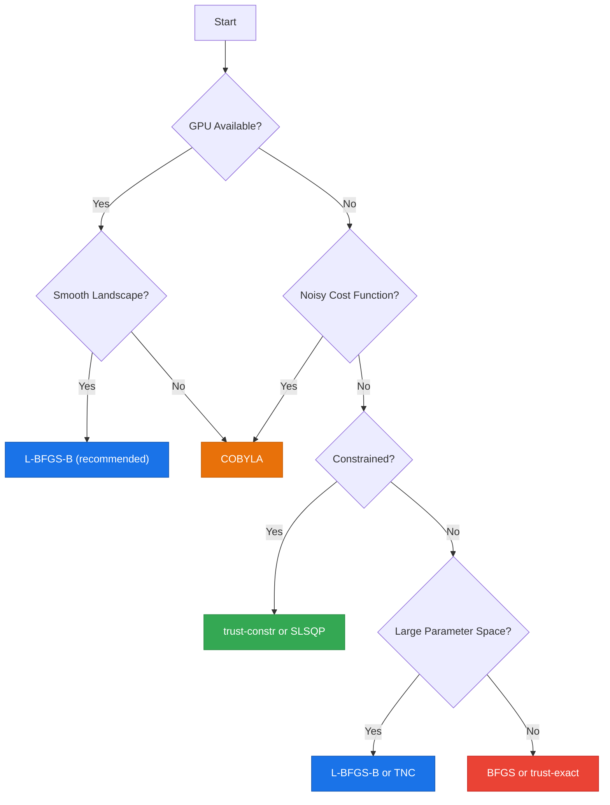

# Optimizers

Comprehensive guide to the classical optimizers available in the Quantum Pipeline for VQE parameter optimization.

---

## Overview

In the Variational Quantum Eigensolver (VQE) algorithm, a classical optimizer drives the search for the ground state energy of a molecular system. The optimizer proposes parameter values for the parameterized quantum circuit (ansatz), receives the measured energy expectation value, and iteratively refines the parameters to minimize the energy functional.

The optimization loop works as follows:

1. The optimizer proposes a set of parameters $\theta$.
2. The quantum simulator prepares the state $|\psi(\theta)\rangle$ using the ansatz circuit.
3. The energy expectation value $\langle \psi(\theta) | \hat{H} | \psi(\theta) \rangle$ is measured.
4. The measured energy is returned to the optimizer, which proposes updated parameters.
5. The cycle repeats until convergence or the iteration limit is reached.

By the variational principle, the computed energy is always an upper bound on the true ground state energy, which guarantees that the optimization converges toward the correct solution.

The choice of optimizer has a significant impact on convergence speed, final accuracy, and computational cost. The Quantum Pipeline supports 16 optimizers from [`scipy.optimize.minimize`](https://docs.scipy.org/doc/scipy/reference/generated/scipy.optimize.minimize.html), organized into four categories. Refer to the scipy documentation for mathematical details.

```bash
# Set the optimizer via command line
python quantum_pipeline.py -f molecules.json --optimizer L-BFGS-B
```

---

## Gradient-Based Optimizers

Gradient-based optimizers use derivative information (gradients) of the cost function to determine the search direction. They typically converge faster than derivative-free methods on smooth energy landscapes.

### `L-BFGS-B` - Limited-memory BFGS with Bounds

**Recommended default optimizer.**

L-BFGS-B is a limited-memory variant of the Broyden-Fletcher-Goldfarb-Shanno algorithm that supports bound constraints on parameters. It approximates the inverse Hessian matrix using a limited number of past gradient evaluations, making it memory-efficient for high-dimensional problems.

- **Type**: Quasi-Newton (gradient-based)
- **Memory**: Low (stores only a few vectors instead of the full Hessian)
- **Convergence**: Fast, superlinear convergence near the minimum
- **Best for**: GPU-accelerated simulations, smooth energy landscapes, large parameter spaces

```bash
python quantum_pipeline.py -f molecules.json --optimizer L-BFGS-B --gpu
```

!!! tip "Why L-BFGS-B is the Default"
    L-BFGS-B performs exceptionally well with GPU acceleration and provides the best balance of speed and accuracy for VQE workloads. It is the recommended choice for most use cases.

### `BFGS` - Broyden-Fletcher-Goldfarb-Shanno

The full BFGS algorithm maintains an approximation of the full inverse Hessian matrix. It provides excellent convergence properties but requires more memory than L-BFGS-B since it stores the complete $n \times n$ Hessian approximation.

- **Type**: Quasi-Newton (gradient-based)
- **Memory**: Moderate (full Hessian approximation)
- **Convergence**: Fast, superlinear convergence
- **Best for**: Small to medium problems where memory is not a constraint

```bash
python quantum_pipeline.py -f molecules.json --optimizer BFGS
```

### `CG` - Conjugate Gradient

The Conjugate Gradient method computes search directions that are conjugate with respect to the Hessian, avoiding the need to store it. This makes it suitable for problems where memory is limited.

- **Type**: Conjugate direction (gradient-based)
- **Memory**: Very low (no Hessian storage)
- **Convergence**: Medium, linear convergence rate
- **Best for**: Memory-constrained environments, medium-scale problems

```bash
python quantum_pipeline.py -f molecules.json --optimizer CG
```

### `Newton-CG` - Newton Conjugate Gradient

Newton-CG uses second-order (Hessian) information to compute the Newton step, solving the Newton system iteratively using conjugate gradients. This avoids forming the full Hessian explicitly.

- **Type**: Newton method (gradient + Hessian-vector products)
- **Memory**: Low to moderate
- **Convergence**: Fast, quadratic convergence near the minimum
- **Best for**: Problems where Hessian-vector products are available

```bash
python quantum_pipeline.py -f molecules.json --optimizer Newton-CG
```

### `TNC` - Truncated Newton with Bounds

The Truncated Newton Conjugate-gradient method is designed for large-scale optimization problems with bound constraints. It truncates the inner conjugate gradient iteration early, trading some accuracy for speed.

- **Type**: Truncated Newton (gradient-based, bounded)
- **Memory**: Low
- **Convergence**: Medium to fast
- **Best for**: Large parameter spaces with bound constraints

```bash
python quantum_pipeline.py -f molecules.json --optimizer TNC
```

---

## Trust-Region Methods

Trust-region methods define a region around the current point where a model of the objective function is trusted. They solve a constrained subproblem within this region at each step, providing robust convergence even on difficult landscapes.

### `trust-constr` - Trust-Region Constrained Optimization

A general-purpose trust-region method that supports equality and inequality constraints. It switches between different subproblem solvers depending on the problem structure.

- **Type**: Trust-region (constrained)
- **Memory**: Moderate to high
- **Convergence**: Robust, handles constraints well
- **Best for**: Constrained optimization problems, problems with parameter bounds

```bash
python quantum_pipeline.py -f molecules.json --optimizer trust-constr
```

### `trust-ncg` - Trust-Region Newton Conjugate Gradient

Combines trust-region framework with Newton-CG for the subproblem. Requires gradient and either full Hessian or a Hessian-vector product function.

- **Type**: Trust-region Newton
- **Memory**: Moderate
- **Convergence**: Fast, quadratic near minimum
- **Best for**: Smooth problems where Hessian or Hessian-vector product is available

```bash
python quantum_pipeline.py -f molecules.json --optimizer trust-ncg
```

### `trust-exact` - Trust-Region Exact Hessian

Uses the exact Hessian matrix to solve the trust-region subproblem. Provides the most accurate trust-region steps but requires computing the full Hessian.

- **Type**: Trust-region (exact)
- **Memory**: High (full Hessian required)
- **Convergence**: Very fast, quadratic
- **Best for**: Small problems where high accuracy is critical

```bash
python quantum_pipeline.py -f molecules.json --optimizer trust-exact
```

### `trust-krylov` - Trust-Region Krylov Subspace

Solves the trust-region subproblem using Krylov subspace methods. More efficient than `trust-exact` for larger problems as it avoids forming the full Hessian.

- **Type**: Trust-region Krylov
- **Memory**: Moderate
- **Convergence**: Fast
- **Best for**: Medium to large problems, balance between accuracy and efficiency

```bash
python quantum_pipeline.py -f molecules.json --optimizer trust-krylov
```

### `dogleg` - Dog-Leg Trust-Region

The dog-leg algorithm approximates the trust-region solution by combining the steepest descent direction with the Newton direction. It requires a positive definite Hessian.

- **Type**: Trust-region dog-leg
- **Memory**: Moderate (requires Hessian)
- **Convergence**: Fast for well-conditioned problems
- **Best for**: Problems with positive definite Hessian

```bash
python quantum_pipeline.py -f molecules.json --optimizer dogleg
```

---

## Derivative-Free Optimizers

Derivative-free optimizers do not require gradient information, relying instead on function evaluations alone. They are particularly useful when the cost function is noisy or gradients are unreliable.

### `COBYLA` - Constrained Optimization by Linear Approximations

COBYLA constructs successive linear approximations of the objective function and constraints, using a trust-region approach. It handles noisy cost functions well since it does not depend on gradient estimates.

- **Type**: Derivative-free, trust-region with linear models
- **Memory**: Low
- **Convergence**: Medium, linear convergence
- **Best for**: Noisy cost functions, shot-based simulations, constrained problems

```bash
python quantum_pipeline.py -f molecules.json --optimizer COBYLA
```

!!! tip "When to Use COBYLA"
    COBYLA is the recommended choice when running with noise models (`--noise`) or with low shot counts where energy estimates are inherently noisy. It does not rely on gradient information, making it robust to statistical fluctuations.

### `COBYQA` - Constrained Optimization by Quadratic Approximations

COBYQA is an improved successor to COBYLA that uses quadratic (instead of linear) approximations of the objective function. This generally provides better convergence while maintaining robustness to noise.

- **Type**: Derivative-free, trust-region with quadratic models
- **Memory**: Low to moderate
- **Convergence**: Medium, better than COBYLA in many cases
- **Best for**: Improved alternative to COBYLA, noisy cost functions

```bash
python quantum_pipeline.py -f molecules.json --optimizer COBYQA
```

### `Powell` - Powell's Method

Powell's method performs sequential one-dimensional optimizations along a set of conjugate directions. It is simple and does not require gradients, but it can be slow for high-dimensional problems.

- **Type**: Derivative-free, direction-set method
- **Memory**: Low
- **Convergence**: Slow for many parameters
- **Best for**: Simple problems, quick prototyping, small parameter spaces

```bash
python quantum_pipeline.py -f molecules.json --optimizer Powell
```

### `Nelder-Mead` - Simplex Algorithm

The Nelder-Mead simplex algorithm maintains a simplex of $n+1$ points in $n$-dimensional space and iteratively modifies it through reflection, expansion, contraction, and shrinkage operations. It is robust but converges slowly.

- **Type**: Derivative-free, simplex
- **Memory**: Low
- **Convergence**: Slow, no general convergence guarantees (can stagnate in higher dimensions)
- **Best for**: Robustness over speed, exploratory optimization

```bash
python quantum_pipeline.py -f molecules.json --optimizer Nelder-Mead
```

---

## Sequential Methods

### `SLSQP` - Sequential Least Squares Programming

SLSQP solves a sequence of quadratic programming subproblems to handle both equality and inequality constraints. It uses gradient information and provides good convergence for constrained optimization.

- **Type**: Sequential quadratic programming (gradient-based, constrained)
- **Memory**: Moderate
- **Convergence**: Fast for constrained problems
- **Best for**: Problems with explicit equality or inequality constraints

```bash
python quantum_pipeline.py -f molecules.json --optimizer SLSQP
```

---

## Custom Optimizer

### `custom` - User-Provided Callable

A user-defined optimization function passed as a callable. This allows integration of custom or third-party optimizers not included in scipy.

- **Type**: User-defined
- **Best for**: Research workflows requiring non-standard optimization strategies

```bash
python quantum_pipeline.py -f molecules.json --optimizer custom
```

!!! warning "Custom Optimizer"
    The `custom` option requires providing a callable implementation. It is intended for advanced users integrating their own optimization methods.

---

## Comparison Table

| Optimizer | Type | Speed | Convergence Quality | Best For |
|-----------|------|-------|---------------------|----------|
| `L-BFGS-B` | Gradient | Fast | High | **Default choice, GPU acceleration** |
| `BFGS` | Gradient | Fast | High | Small-medium smooth problems |
| `CG` | Gradient | Medium | Medium | Memory-constrained environments |
| `Newton-CG` | Gradient | Fast | High | Problems with Hessian information |
| `TNC` | Gradient | Medium | Medium | Large-scale bounded problems |
| `trust-constr` | Trust-Region | Medium | High | Constrained optimization |
| `trust-ncg` | Trust-Region | Medium | High | Smooth unconstrained problems |
| `trust-exact` | Trust-Region | Medium | High | Small high-accuracy problems |
| `trust-krylov` | Trust-Region | Medium | High | Medium-large problems |
| `dogleg` | Trust-Region | Medium | High | Well-conditioned problems |
| `COBYLA` | Derivative-Free | Medium | Medium | Noisy cost functions |
| `COBYQA` | Derivative-Free | Medium | Medium | Improved COBYLA replacement |
| `Powell` | Derivative-Free | Slow | Low | Simple prototyping |
| `Nelder-Mead` | Derivative-Free | Slow | Low | Exploratory optimization |
| `SLSQP` | Sequential | Fast | Medium | Constrained optimization |
| `custom` | User-defined | - | - | Custom optimization strategies |

---

## Selection Guide

Use the following rules to choose an optimizer for your workload.

### Decision Rules

**1. GPU available and smooth landscape:**

Use `L-BFGS-B`. It provides the best convergence speed with GPU acceleration and handles large parameter spaces efficiently.

```bash
python quantum_pipeline.py -f molecules.json --optimizer L-BFGS-B --gpu
```

**2. Noisy energy landscape (noise model or low shots):**

Use `COBYLA` or `COBYQA`. Derivative-free methods are robust to statistical noise in the cost function.

```bash
python quantum_pipeline.py -f molecules.json --optimizer COBYLA --noise ibmq_manila
```

**3. Constrained optimization:**

Use `trust-constr` for general constraints or `SLSQP` for sequential constrained optimization.

```bash
python quantum_pipeline.py -f molecules.json --optimizer trust-constr
```

**4. Large parameter space (many qubits, deep ansatz):**

Use `L-BFGS-B` or `TNC`. Both are designed for large-scale problems with efficient memory usage.

```bash
python quantum_pipeline.py -f molecules.json --optimizer L-BFGS-B --ansatz-reps 5
```

**5. Small problem, maximum accuracy:**

Use `trust-exact` or `BFGS` for the highest convergence quality on small circuits.

```bash
python quantum_pipeline.py -f molecules.json --optimizer trust-exact --basis sto3g
```

**6. Quick prototyping:**

Use `Powell` or `Nelder-Mead` for simple tests where convergence quality is not critical.

```bash
python quantum_pipeline.py -f molecules.json --optimizer Powell --max-iterations 20
```

### Summary Flowchart



---

## Performance Considerations

### Gradient Computation Overhead

Gradient-based optimizers require computing the gradient of the cost function with respect to all ansatz parameters. For $n$ parameters, this requires $O(n)$ additional circuit evaluations per iteration (using parameter-shift rules). However, the improved convergence rate typically compensates for this overhead.

### Iteration Count vs. Wall Time

An optimizer that requires fewer iterations may still take longer if each iteration is computationally expensive. For GPU-accelerated simulations, the overhead per iteration is low, making gradient-based methods (especially L-BFGS-B) the most efficient choice.

### Convergence Mode

When using `--convergence` mode, the optimizer runs until the energy change between iterations falls below the threshold. This pairs well with gradient-based optimizers that converge monotonically.

```bash
python quantum_pipeline.py -f molecules.json \
    --optimizer L-BFGS-B \
    --convergence \
    --threshold 1e-6
```

---

## Next Steps

- **Configure your simulation**: [Configuration Reference](configuration.md)
- **Choose a simulation method**: [Simulation Methods](simulation-methods.md)
- **See practical examples**: [Examples](examples.md)
