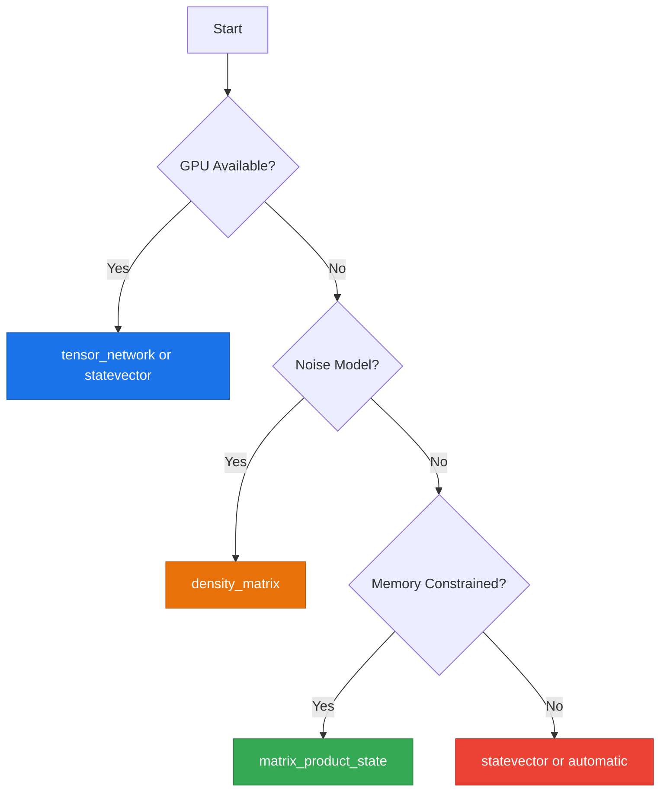

# Simulation Methods

Guide to the Qiskit Aer simulation backends available in the Quantum Pipeline for quantum circuit execution.

---

## Overview

When running VQE simulations locally (without IBM Quantum hardware), the Quantum Pipeline uses Qiskit Aer as the simulation backend. Qiskit Aer provides multiple simulation methods, each implementing a different mathematical representation of the quantum state. The choice of simulation method determines the accuracy, performance, memory usage, and GPU compatibility of your simulation.

For full details on each method, see the [Qiskit Aer documentation](https://qiskit.github.io/qiskit-aer/).

The simulation method is set via the `--simulation-method` flag:

```bash
python quantum_pipeline.py -f molecules.json --simulation-method statevector
```

The default method is `tensor_network`, which is optimized for GPU acceleration. When GPU is not available, `automatic` or `statevector` are recommended alternatives.

---

## Available Methods

### `automatic`

Automatically selects the most appropriate simulation method based on the properties of the quantum circuit being simulated. Qiskit Aer analyzes the circuit gates, qubit count, and noise model to determine the best backend.

- **GPU Support**: Partial (depends on selected method)
- **Memory Usage**: Varies
- **Accuracy**: Depends on selected method
- **When to use**: When you are unsure which method to choose, or when processing circuits with varying characteristics

```bash
python quantum_pipeline.py -f molecules.json --simulation-method automatic
```

!!! info "Auto-Selection Logic"
    The automatic method inspects the circuit for Clifford-only gates (selects `stabilizer`), checks if noise is present (may select `density_matrix`), and falls back to `statevector` for general circuits.

### `statevector`

Dense statevector simulation that maintains the full $2^n$-dimensional complex state vector for an $n$-qubit system. This is the most common simulation method and provides exact results for ideal (noiseless) circuits.

- **GPU Support**: Yes (via CUDA Thrust or cuStateVec backends)
- **Memory Usage**: High - requires $2^n \times 16$ bytes (complex128)
- **Accuracy**: Exact
- **When to use**: Default choice for ideal circuit simulation, especially with GPU acceleration

```bash
# CPU simulation
python quantum_pipeline.py -f molecules.json --simulation-method statevector

# GPU-accelerated simulation
python quantum_pipeline.py -f molecules.json --simulation-method statevector --gpu
```

!!! tip "Statevector with GPU"
    When combined with `--gpu`, the statevector method offloads state vector operations to the GPU using CUDA. This provides significant speedups for circuits with 15+ qubits, where the state vector is large enough to benefit from GPU parallelism.

### `density_matrix`

Dense density matrix simulation that represents the quantum state as a $2^n \times 2^n$ matrix. This representation can model mixed states and noise channels, making it the appropriate choice for noisy simulations.

- **GPU Support**: Yes
- **Memory Usage**: Very High - requires $2^{2n} \times 16$ bytes
- **Accuracy**: Exact (including noise effects)
- **When to use**: Simulations with noise models

```bash
python quantum_pipeline.py -f molecules.json \
    --simulation-method density_matrix \
    --noise ibmq_manila
```

!!! warning "Memory Scaling"
    The density matrix requires quadratically more memory than the statevector. For $n$ qubits, the density matrix has $4^n$ elements compared to $2^n$ for the statevector. This limits practical use to approximately 12-14 qubits on CPU. GPU acceleration can help with computation speed but does not change the memory scaling.

### `stabilizer`

Clifford simulator based on the stabilizer formalism. It can efficiently simulate circuits composed entirely of Clifford gates (H, S, CNOT, CZ, etc.) in polynomial time, regardless of qubit count.

- **GPU Support**: No
- **Memory Usage**: Low - polynomial in qubit count
- **Accuracy**: Exact (for Clifford circuits only)
- **When to use**: Circuits containing only Clifford gates (testing, error correction)

```bash
python quantum_pipeline.py -f molecules.json --simulation-method stabilizer
```

!!! warning "Clifford-Only Restriction"
    The stabilizer method will fail if the circuit contains non-Clifford gates (T, Rz, Ry, etc.). Since VQE ansatz circuits typically include rotation gates, this method is generally not suitable for VQE workloads. It is primarily useful for testing and error correction circuits.

### `extended_stabilizer`

An extension of the stabilizer method that can handle circuits with a small number of non-Clifford gates (primarily T gates). It decomposes the state into a sum of stabilizer states, with the number of terms growing exponentially with the number of T gates.

- **GPU Support**: No
- **Memory Usage**: Medium (depends on T-gate count)
- **Accuracy**: Approximate (controlled precision)
- **When to use**: Near-Clifford circuits with few T gates

```bash
python quantum_pipeline.py -f molecules.json --simulation-method extended_stabilizer
```

### `matrix_product_state`

Tensor network simulation using the Matrix Product State (MPS) representation. MPS efficiently represents states with limited entanglement by decomposing the state vector into a chain of tensors. This method scales well with qubit count for low-entanglement circuits.

- **GPU Support**: No
- **Memory Usage**: Low for low-entanglement circuits, grows with entanglement
- **Accuracy**: Approximate (controlled by bond dimension)
- **When to use**: Large circuits with limited entanglement, memory-constrained environments

```bash
python quantum_pipeline.py -f molecules.json --simulation-method matrix_product_state
```

!!! info "Bond Dimension"
    The accuracy and memory usage of MPS depend on the bond dimension, which limits the amount of entanglement that can be represented. For highly entangled circuits (common in VQE), the bond dimension may need to grow exponentially, reducing the advantage over statevector simulation.

### `unitary`

Computes and stores the full $2^n \times 2^n$ unitary matrix of the circuit. This is primarily useful for verifying circuit implementations and studying small circuits.

- **GPU Support**: Yes
- **Memory Usage**: Very High - requires $4^n \times 16$ bytes
- **Accuracy**: Exact
- **When to use**: Small circuits only (up to ~10 qubits), circuit verification

```bash
python quantum_pipeline.py -f molecules.json --simulation-method unitary
```

!!! danger "Extreme Memory Usage"
    The unitary method stores the full $2^n \times 2^n$ unitary matrix ($4^n$ elements), same scaling as the density matrix. GPU support is available but does not change the fundamental memory constraint. Impractical for circuits larger than approximately 10 qubits.

### `superop`

Superoperator simulation that represents quantum channels as matrices acting on vectorized density matrices. Useful for studying noise channels and quantum error processes.

- **GPU Support**: No
- **Memory Usage**: Extreme - requires $2^{4n} \times 16$ bytes (maps density matrices to density matrices)
- **Accuracy**: Exact (for noise channel characterization)
- **When to use**: Noise channel analysis, quantum process tomography

```bash
python quantum_pipeline.py -f molecules.json --simulation-method superop
```

### `tensor_network`

GPU-accelerated tensor network simulation using NVIDIA cuTensorNet from the cuQuantum library. This method represents quantum circuits as tensor networks and performs optimized contraction on the GPU.

- **GPU Support**: Yes (primary use case, requires cuTensorNet)
- **Memory Usage**: Medium - depends on circuit structure and contraction path
- **Accuracy**: Exact
- **When to use**: GPU-accelerated simulations of larger circuits

```bash
python quantum_pipeline.py -f molecules.json \
    --simulation-method tensor_network \
    --gpu
```

!!! tip "Default Method"
    `tensor_network` is the default simulation method in the Quantum Pipeline because it provides the best performance on GPU-equipped systems. It leverages cuTensorNet for optimized tensor contractions, which can handle circuits that are too large for dense statevector simulation.

---

## Comparison Table

| Method | GPU Support | Memory Usage | Accuracy | Best For |
|--------|-------------|--------------|----------|----------|
| `automatic` | Partial | Varies | Varies | General use, unknown circuits |
| `statevector` | Yes | High | Exact | **Ideal circuit simulation** |
| `density_matrix` | Yes | Very High | Exact | Noisy simulations |
| `stabilizer` | No | Low | Exact | Clifford-only circuits |
| `extended_stabilizer` | No | Medium | Approximate | Near-Clifford circuits |
| `matrix_product_state` | No | Low | Approximate | Low-entanglement circuits |
| `unitary` | Yes | Very High | Exact | Small circuit verification |
| `superop` | No | Very High | Exact | Noise channel analysis |
| `tensor_network` | Yes | Medium | Exact | **GPU-accelerated simulation** |

---

## GPU-Compatible Methods

The following methods support GPU acceleration via the `--gpu` flag:

| Method | GPU Backend | Requirements |
|--------|-------------|--------------|
| `statevector` | CUDA Thrust / cuStateVec | CUDA-capable GPU, qiskit-aer with GPU support |
| `density_matrix` | CUDA Thrust | CUDA-capable GPU, qiskit-aer with GPU support |
| `unitary` | CUDA Thrust | CUDA-capable GPU, qiskit-aer with GPU support |
| `tensor_network` | cuTensorNet | CUDA-capable GPU, cuQuantum libraries |
| `automatic` | Depends | May select a GPU-compatible method |

To enable GPU acceleration:

```bash
python quantum_pipeline.py -f molecules.json \
    --gpu \
    --simulation-method statevector \
    --optimizer L-BFGS-B
```

!!! warning "GPU Requirements"
    GPU acceleration requires:

    - NVIDIA GPU with CUDA support
    - CUDA Toolkit 11.2 or later
    - Qiskit Aer compiled with CUDA Thrust backend
    - For `tensor_network`: cuQuantum libraries (cuTensorNet)
    - For cuStateVec: Volta architecture or newer (Tesla V100, GeForce 20 series+)
    - Minimum 6 GB GPU memory recommended

The Quantum Pipeline Docker image (`Dockerfile.gpu`) includes all GPU dependencies pre-configured. See [GPU Acceleration](../deployment/gpu-acceleration.md) for setup details.

---

## Memory Considerations

Memory requirements scale exponentially with qubit count for most methods. The table below shows approximate memory usage for common qubit counts.

### Memory Scaling by Method

| Qubits | `statevector` | `density_matrix` / `unitary` | `superop` | `stabilizer` | `matrix_product_state` |
|--------|---------------|-------------------------------|-----------|--------------|------------------------|
| 10 | 16 KB | 16 MB | 16 GB | ~1 KB | ~10 KB |
| 15 | 512 KB | 16 GB | Impractical | ~2 KB | ~100 KB |
| 20 | 16 MB | Impractical | Impractical | ~3 KB | ~1 MB |
| 25 | 512 MB | Impractical | Impractical | ~4 KB | ~10 MB |
| 30 | 16 GB | Impractical | Impractical | ~5 KB | ~100 MB |

!!! info "Memory Formulas"
    For $n$ qubits: statevector requires $2^n \times 16$ bytes (complex128). The density matrix and unitary both store $2^n \times 2^n$ matrices ($2^{2n} \times 16$ bytes). The superoperator stores a $2^{2n} \times 2^{2n}$ matrix ($2^{4n} \times 16$ bytes), which is why it becomes impractical much sooner. MPS memory depends on entanglement (bond dimension) rather than qubit count alone.

### Practical Limits

- **CPU (64 GB RAM)**: Up to ~30 qubits with `statevector`, ~15 qubits with `density_matrix`
- **GPU (6 GB VRAM)**: Up to ~25 qubits with `statevector`, larger with `tensor_network`
- **GPU (24 GB VRAM)**: Up to ~28 qubits with `statevector`

The `matrix_product_state` and `tensor_network` methods can sometimes handle larger qubit counts by exploiting circuit structure, but this depends on the specific circuit properties.

---

## Selection Guide

### Default Recommendation

For most VQE workloads, use `statevector` or `tensor_network` depending on your hardware:

```bash
# GPU available - use tensor_network (default)
python quantum_pipeline.py -f molecules.json --gpu --simulation-method tensor_network

# CPU only - use statevector
python quantum_pipeline.py -f molecules.json --simulation-method statevector
```

### Decision Rules

**GPU available:**

Use `tensor_network` (default) or `statevector`. The tensor network method provides better scaling for larger circuits, while statevector may be faster for smaller circuits.

```bash
python quantum_pipeline.py -f molecules.json --gpu --simulation-method tensor_network
```

**Low memory environment:**

Use `matrix_product_state` for circuits with limited entanglement. For Clifford-only circuits, use `stabilizer`.

```bash
python quantum_pipeline.py -f molecules.json --simulation-method matrix_product_state
```

**Noisy simulation:**

Use `density_matrix` to accurately model noise channels and decoherence.

```bash
python quantum_pipeline.py -f molecules.json \
    --simulation-method density_matrix \
    --noise ibmq_manila
```

**Unsure or mixed circuits:**

Use `automatic` and let Qiskit Aer select the appropriate method.

```bash
python quantum_pipeline.py -f molecules.json --simulation-method automatic
```

### Summary



---

## Next Steps

- **Choose an optimizer**: [Optimizers](optimizers.md)
- **Configure your simulation**: [Configuration Reference](configuration.md)
- **See practical examples**: [Examples](examples.md)
- **Set up GPU acceleration**: [GPU Acceleration](../deployment/gpu-acceleration.md)
