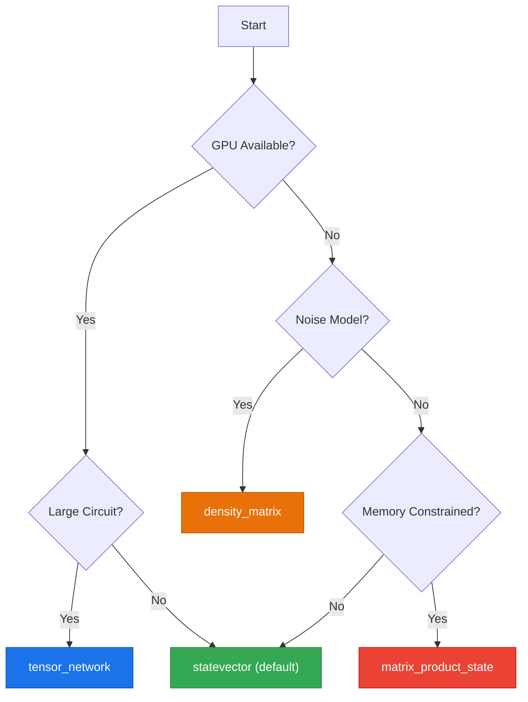

# Simulation Methods

Guide to the Qiskit Aer simulation backends available in Quantum Pipeline for quantum circuit execution.

## Overview

When running VQE simulations locally (without IBM Quantum hardware), the pipeline uses Qiskit Aer as the simulation backend. Qiskit Aer provides multiple simulation methods, each implementing a different mathematical representation of the quantum state. The choice of method affects accuracy, performance, memory usage, and GPU compatibility.

The simulation method is set via `--simulation-method`:

```bash
quantum-pipeline -f molecules.json --simulation-method statevector
```

The default is `statevector`. For GPU-accelerated workloads, `tensor_network` is an alternative that requires the `--gpu` flag (and cuQuantum libraries). When unsure, `automatic` delegates the choice to Qiskit Aer based on circuit properties.

For full details on each method, GPU options, and backend parameters, see the
[AerSimulator API reference](https://qiskit.github.io/qiskit-aer/stubs/qiskit_aer.AerSimulator.html).
The supported methods are defined in
[`quantum_pipeline/configs/settings.py`](https://codeberg.org/piotrkrzysztof/quantum-pipeline/src/branch/master/quantum_pipeline/configs/settings.py#L27).

## Available Methods

### `automatic`

Selects the best simulation method based on the circuit and noise model. Qiskit Aer analyzes the circuit gates, qubit count, and noise model to determine the appropriate backend. Falls back to `statevector` for general circuits.

- **GPU Support**: Partial (depends on selected method)
- **When to use**: When you are unsure which method to choose, or when processing circuits with varying characteristics

### `statevector`

Dense statevector simulation that maintains the full $2^n$-dimensional complex state vector for an $n$-qubit system. Provides exact results for ideal (noiseless) circuits. This is the default and most common method.

- **GPU Support**: Yes (via CUDA Thrust or cuStateVec backends)
- **Memory**: $2^n \times 16$ bytes (complex128)
- **When to use**: Default choice for ideal circuit simulation, especially with GPU acceleration

When combined with `--gpu`, statevector offloads operations to the GPU using CUDA. This provides meaningful speedups for circuits with 15+ qubits, where the state vector is large enough to benefit from GPU parallelism.

### `density_matrix`

Dense density matrix simulation that represents the quantum state as a $2^n \times 2^n$ matrix. Can model mixed states and noise channels, making it the appropriate choice for noisy simulations.

- **GPU Support**: Yes
- **Memory**: $2^{2n} \times 16$ bytes
- **When to use**: Simulations with noise models (via `--noise`)

!!! warning "Memory scaling"
    The density matrix requires quadratically more memory than statevector. This limits practical use to approximately 12-14 qubits on CPU. GPU acceleration helps with computation speed but does not change the memory scaling.

### `stabilizer`

Clifford simulator based on the stabilizer formalism. Efficiently simulates circuits composed entirely of Clifford gates (H, S, CNOT, CZ, etc.) in polynomial time, regardless of qubit count.

- **GPU Support**: No
- **Memory**: Low - polynomial in qubit count
- **When to use**: Circuits containing only Clifford gates (testing, error correction)

!!! warning "Clifford-only restriction"
    The stabilizer method fails if the circuit contains non-Clifford gates (T, Rz, Ry, etc.). Since VQE ansatz circuits typically include rotation gates, this method is generally not suitable for VQE workloads.

### `extended_stabilizer`

An extension of the stabilizer method that can handle circuits with a small number of non-Clifford gates (primarily T gates). Decomposes the state into a sum of stabilizer states, with the number of terms growing exponentially with the number of T gates.

- **GPU Support**: No
- **Memory**: Medium (depends on T-gate count)
- **When to use**: Near-Clifford circuits with few T gates

### `matrix_product_state`

Tensor network simulation using the Matrix Product State (MPS) representation. MPS efficiently represents states with limited entanglement by decomposing the state vector into a chain of tensors. Scales well with qubit count for low-entanglement circuits.

- **GPU Support**: No
- **Memory**: Low for low-entanglement circuits, grows with entanglement
- **When to use**: Large circuits with limited entanglement, memory-constrained environments

By default MPS does not truncate the bond dimension, so results are exact. With truncation enabled (`matrix_product_state_max_bond_dimension` or `matrix_product_state_truncation_threshold`), it becomes an approximation that trades accuracy for memory. For highly entangled circuits (common in VQE), the bond dimension may need to grow exponentially without truncation, reducing the advantage over statevector.

### `unitary`

Computes and stores the full $2^n \times 2^n$ unitary matrix of the circuit. Primarily useful for verifying circuit implementations and studying small circuits.

- **GPU Support**: Yes
- **Memory**: $4^n \times 16$ bytes
- **When to use**: Small circuits only (up to ~10 qubits), circuit verification

### `superop`

Superoperator simulation that represents quantum channels as matrices acting on vectorized density matrices. Useful for studying noise channels and quantum error processes.

- **GPU Support**: No
- **Memory**: $2^{4n} \times 16$ bytes - maps density matrices to density matrices
- **When to use**: Noise channel analysis, quantum process tomography

### `tensor_network`

GPU-accelerated tensor network simulation using NVIDIA cuTensorNet from the cuQuantum library. Represents quantum circuits as tensor networks and performs optimized contraction on the GPU.

- **GPU Support**: Yes (required - the CLI rejects this method without `--gpu`)
- **Memory**: Medium - depends on circuit structure and contraction path
- **When to use**: GPU-accelerated simulations of larger circuits that exceed dense statevector memory

## GPU-Compatible Methods

| Method | GPU Backend | Requirements |
|--------|-------------|--------------|
| `statevector` | CUDA Thrust / cuStateVec | CUDA-capable GPU, qiskit-aer with GPU support |
| `density_matrix` | CUDA Thrust | CUDA-capable GPU, qiskit-aer with GPU support |
| `unitary` | CUDA Thrust | CUDA-capable GPU, qiskit-aer with GPU support |
| `tensor_network` | cuTensorNet | CUDA-capable GPU, cuQuantum libraries |
| `automatic` | Depends | May select a GPU-compatible method |

GPU acceleration requires an NVIDIA GPU with CUDA support (toolkit 11.2+), and qiskit-aer compiled with the CUDA Thrust backend. The `tensor_network` method additionally requires cuQuantum libraries (cuTensorNet). For cuStateVec, Volta architecture or newer is needed (Tesla V100, GeForce 20 series+). Minimum 6 GB GPU memory recommended.

The Quantum Pipeline Docker image (`Dockerfile.gpu`) includes all GPU dependencies pre-configured. See [GPU Acceleration](../deployment/gpu-acceleration.md) for setup details.

## Selection Guide

For most VQE workloads, `statevector` (the default) works well on both CPU and GPU.


```mermaid
graph TD
    A[Start] --> B{GPU Available?}
    B -->|Yes| C{Large Circuit?}
    C -->|Yes| D[tensor_network]
    C -->|No| E["statevector (default)"]
    B -->|No| F{Noise Model?}
    F -->|Yes| G[density_matrix]
    F -->|No| H{Memory Constrained?}
    H -->|Yes| I[matrix_product_state]
    H -->|No| E

    style D fill:#1a73e8,color:#fff,stroke:#1557b0
    style E fill:#34a853,color:#fff,stroke:#2d8f47
    style G fill:#e8710a,color:#fff,stroke:#c45e08
    style I fill:#ea4335,color:#fff,stroke:#c5221f
```

## Next steps

- [AerSimulator API reference](https://qiskit.github.io/qiskit-aer/stubs/qiskit_aer.AerSimulator.html) for all backend options and method-specific parameters
- [Optimizers](optimizers.md) for optimizer choices
- [Configuration Reference](configuration.md) for full parameter documentation
- [Examples](examples.md) for practical usage examples
- [GPU Acceleration](../deployment/gpu-acceleration.md) for GPU setup
